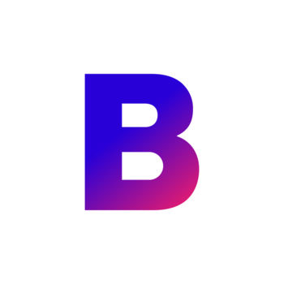

# 1.6 Further reading: Apps examples !!

---

In this section, you will find examples of different real apps that have been developped using different approaches: Native, Hybrid and Cross Platform. In addition to that, If you want to dive deeper into the differences between these approaches, we have included additional resources where you can find pros and cons of each platform.

**Native**

| App | Functionalities |
| ------ | ------ |
|  | Pinterest is an app that allows their users to find inspiration for their projects. It allows its users tos share images linked to tutorials of their projects and creations so others can replicate. |
|  | Is an art marketplace that allows their users to find and buy art from artists, galleries and different markets. It also uses augmented reality to show the user how a painting will look like in a desired location.|
|  | Podcasts is an apple designed app that allows their users to discover, listen, follow and download podcasts. |
|  | PlayStore is the official Andorid's app marketplace. |

**Hybrid**

| App | Functionalities |
| ------ | ------ |
|  | Instagram is a social network that allows users to interact through images.|
|  | Google's mail client |
|  | Evernote is a note taking app, that allows the user to store information, ideas and thoughts in searchable cards and notebooks.|

**Cross-platform**

| App | Functionalities |
| ------ | ------ |
|  | Slack is a platform that allows groups to track and orginize their conversations through channels. |
|  | Bloomberg is a news app specialized in business and financial news.|

**Aditional Resources**

- [Explanation of each one of the app development's approaches](https://dzone.com/articles/native-vs-hybrid-vs-cross-platform-how-and-what-to)

- [Comparison of the approcahes](https://railsware.com/blog/native-vs-hybrid-vs-cross-platform/), we specially recommend you the comparison table for a quick review of each approach.

