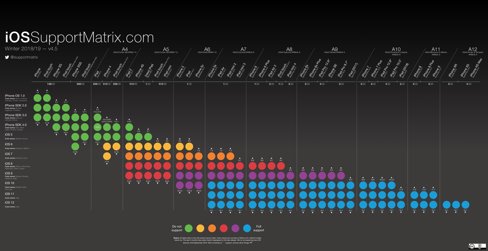

# 1.1 Fragmentation is the devil

---
Let´s use a fictional description about a successful app:

_ROCCZIO APPS is a mobile development company that has released a very cool and successful game for mobile devices three years ago: Hungry Porks. They have reached about 2 million downloads in the mobile markets, and now, ROCCZIO is planning a new release that could be downloaded only by users of Apple devices._

Assume you are in the ROCCZIO APPS development team and before making the new release you have to plan the devices matrix (i.e., the set of devices for testing the app) to be used in the testing phase. How many devices will you include in the test matrix? TIC TOC TIC TOC........TIC TOC TIC....

Take a look to the "iOS support matrix" by Dorian Roy, which is updated until iOS11: [iOS_Support_Matrix_v4.5](https://pbs.twimg.com/media/DwAL4iJX4AAd2B-?format=jpg&name=large).

_(Photo from https://pbs.twimg.com/media/DwAL4iJX4AAd2B-?format=jpg&name=large)_

Probably the real answer to the "devices matrix" is larger than you expected. However, you no dot have to assure the quality of your mobile app in all the iOS devices. Why? TIC TOC TIC TOC..

> "assure the quality of a mobile app" means: do a lot of work because there are several quality attributes that should be achieved to make the users happy and help you become rich (or at least famous); some of those attributes are mobile specific such as behavioral-consistency, accessibility, energy consumption.

One more question. Assume that you are also releasing the app for Android apps. How many devices will you include in the matrix?
> Hint: As of today (2020), Google has released 30 versions of the Android OS. The last one is called Android 11 Beta  which corresponds to the API level 30.

In the case of iOS, Apple has control over the devices, because Apple designs and produces their own devices. The release of a new OS is aligned (in most of the cases) with the release of a new device. In addition, the Apple fan culture and the planned/built-in obsolescence/deceleration of iOS devices introduce a replacement dynamic in which iOS users migrate quickly to new devices.

In 2020, according to the app store support page (https://developer.apple.com/support/app-store/) and as measured by June 17, 92% of the iOS devices use the latest OS version (iOS 13), 7% use iOS 12, and 2% use earlier versions. This is not bad at all because you might focus only on iOS 13 and iOS 12 to build your devices matrix. If you go back to the iOS Support matrix link, in the case you are supposed to support iOS11 and iOS10, you will see that **44 devices should be included in your devices matrix**. This is insane !!

Now think on the Android case, which is even worst. The AppBrain portal (https://www.appbrain.com/stats/top-android-sdk-versions reports that (as of August 8 2020) about 91% of the devices use 6 levels of Android (21-29) where Pie (29.1%), Oreo (20.1%), and Android 10 (19.9%) are the top used flavors. How many different Android devices are out there? Like in the "X files" series (A famous TV series in the 90's), the "truth is out there", and it is a sad and depressive truth because Google neither controls the devices manufacturing nor the OS modifications. Android is an open source operating system that can be customized by the OEMs (Original Equipment Manufacturer) such as Samsung, HTC, Huawei, LG, etc. So, if you combine the number of devices, the top-used versions, and the OEM customizations, you will find that the test matrix for the Android case is a **MESS**.

> Be careful with the difference between level and flavor in Android. While the flavor makes reference to the codename of the OS, the level refers to the specific version. A flavor can have different levels like in the case of Android Jelly Bean (versions 16, 17, 18) and Nougat (24, 25).

The fictional description at the beginning of the chapter and the answer illustrates a problem that is known in the software engineering community as **"fragmentation"**. It is not a particular problem for mobile devices, because fragmentation is also an issue for web apps. Why is it an issue algo for web apps? because you must test you web app responsiveness and JavaScript/CSS compatibility across different browsers with different resolution sizes. However, fragmentation is more complex in mobile devices.

In summary, in the mobile ecosystem, fragmentation makes reference to the fact that the combination of devices and OSs is a large number that directly impacts the test/support matrix in the two dominant mobile platforms (Android & iOS).

>Wait, this chapter is about the mobile ecosystem, and we have just mentioned "mobile ecosystem" again, but without giving you a definition. Keep calm and move to the next section.
