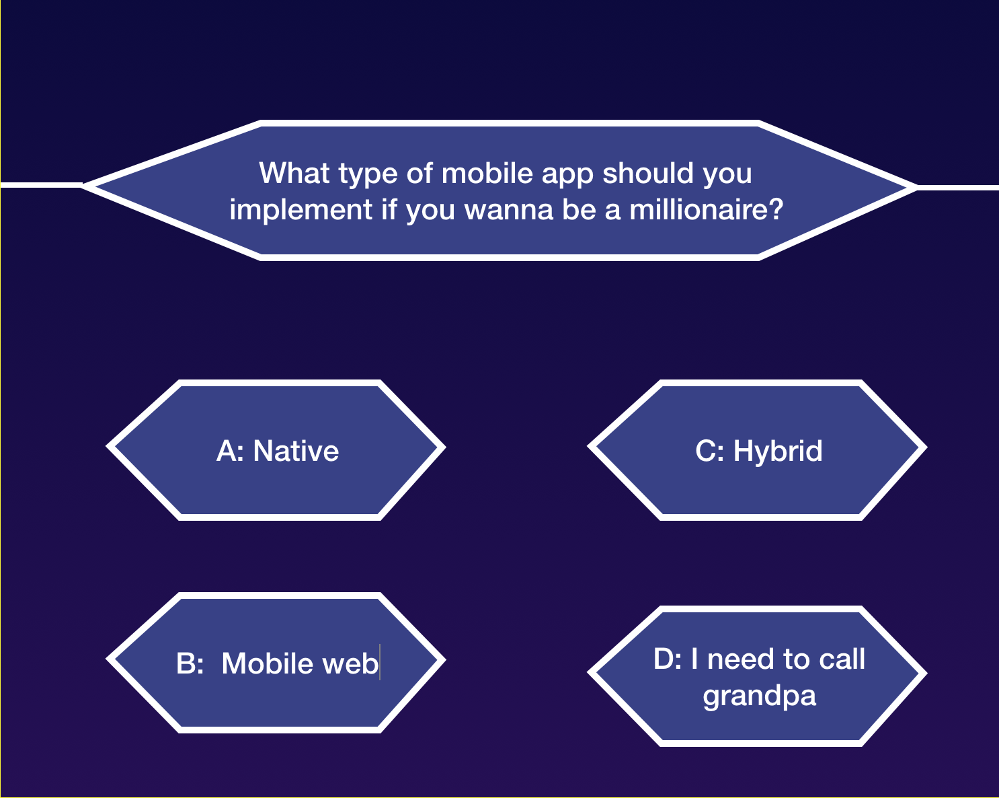

# 1.3 ... more than one type of app

---

In addition to native apps, there are other high-level categories of mobile apps: **mobile web** apps, and **cross-platform** apps. When you are in the process of creating a mobile app you have to make a first choice regarding the development platform: native, cross-platform, mobile web. But why are we talking here again about platforms? Well, because there are other development platforms (in addition to Android and iOS) and those are not native.

>Note that in the case of Android  development, the official platform provide us with native and cross-platform development. Android native apps can be created with Kotlin, Flutter/Dart, and Java, but we can also create cross-platform apps by usin [Kotlin/Native](https://kotlinlang.org/docs/reference/native-overview.html) and [Flutter/Dart](https://flutter.dev).

A **mobile web app**, is a web application suitable for being displayed in a mobile device resolution, i.e., the application is responsive and can be visualized in a browser running on a mobile device. This sounds pretty good in the sense that you can have both web and mobile versions, and you  do not need to create a version for each mobile platform (Android & iOS). A big difference between native and web mobile apps, is that native apps need to be installed on each device and are typically downloaded from a market; for using a mobile web app you just need a browser and a URL. Again, a web mobile app sounds like a very good choice because you do not have to deal with the mobile fragmentation problem. However, remember that there is no free lunch, and there are some limitations in mobile web apps.

Mobile web apps are very limited in terms of accessing the resources in the devices, because they are not programmed using the native APIs. Because the apps run on the browser, then you have access only to the features/capabilities provided by the browser. In addition, mobile web apps require internet connection for accessing web resources. On the other side, native apps are the best solution for offline usage and features.

> A potential solution for the offline problem in web apps is  to follow the "progressive" apps guidelines. You can read more about it here https://developers.google.com/web/progressive-web-apps/

_What is the best choice between native and mobile web apps?_ The answer is... it depends on what you wanna do. Web mobile apps are a good option for prototyping initial versions of an app or if you already have a web app and wants to prepare the  mobile version quickly. But remember that with a web app you do not have access to the native APIs.

> So, is there a better choice? We would not say a better choice; We would say there is a third type of app that is in between native and web mobile apps: **Hybrid and Cross-platform apps**.
