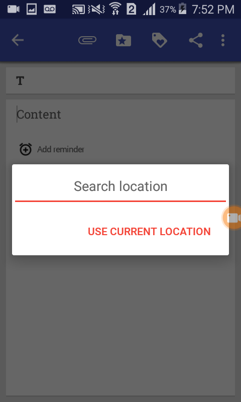

# 10.1 Eventual Connectivity on Mobile Apps
\(By Claudia Bedoya, Camilo Escobar-Velásquez, Michael Osorio\)

---

_(Photo by andrew welch on [Unsplash](https://unsplash.com/photos/Q0-tDhBoZ4U))_

Now that you understand the magnitude of the problems generated by bad connectivity handling (e.g. users replacing your app), we need to focus on how to solve them in our mobile apps.

## Context Model - Diagram

First, we need to talk about the context model. You previously read something about Context Model/Diagram/Canvas in [Chapter 4](../chapter4.html) and _you shall not pass_ this point until fully understand that concept.

## Data Handling

#### Installed Data

This way of handle data relies on always having all the data locally on the devices. This type of apps rarely connects to the internet to update its content; most of this app's usage is offline. Try to think of one app that might be following this practice ... yes we are thinking of the same example ... a retro console emulator.

#### Permanent Cache

In this case, along with the installation or first execution, the app downloads all the data that requires to work. This data remains in the device until the user removes it or is updated on-air. For all the gamer readers, this is how most of the games work: you open the game for the first time and waits at least 20 seconds for the game to start working.

#### Temporal cache

Now we store the data locally, but after some time and due to expiring policies, the app erases it. An example of this behavior can be found in news apps. They show some news and store them for a certain amount of time, but after a while, the app tries to download recent news and erase the old ones.

#### Without Cache

In this case, data is always retrieved from a backend service and there are no store policies. Why wouldn't someone want to have a cache?

## Parameters to select data handling strategy

It is really important to identify which data handling practice you should use for your app. For example, you wouldn't be so happy if your email app downloads all emails with its attachments in order to correctly work.

1. **First use of the app**: Does my app require to have certain files to work? Does my application require that my user selects some options at first to let me know which information should I download?
2. **Expected offline/online behavior**: Do I want my users to be connected all the time? Do I handle some important info that must always be available?
3. **Data expiring policies**: Does my data expires constantly? The info I handle does not expire? 
4. **Frequency of data generation**: How often the data should be updated? Do I have a dataset that doesn't change in the time? e.g., Stock market. 
5. **Storage limits**: how much storage can I use for my app? What information should I really store in the user device?

## Data Fetching Strategies

#### Launch-Time:

Data is downloaded when the application is opened. Usually, this happens while the app shows a progress notification or splash. This behavior _"blocks"_ the GUI while the data is downloading and can be found in Games.

#### Background and launch time:

Data is downloaded after the application is opened. Unlike the previous strategy, GUI is not blocked and users can work with cached data while the download completes. Usually found in social media apps when they are opened for the first time.

#### Pull:

Data is downloaded when the user asks for it. An example of this behavior can be found in email apps that don't allow to set a fetch timer. Also, can be found in social media apps that allow users to request more recent content.

#### Expiration police/Periodical

Data is downloaded from time to time. The time interval can be defined by the user. Also found in email apps like Gmail or Outlook. 

#### Notification based

The backend service/server informs the app that new data can be downloaded. This behavior can be found on Twitter when it shows that are new tweets to read.

#### Verification based

The mobile app continuously queries the backend to ask for new data. An interesting example is Stock market apps that should constantly refresh the data.

## Connectivity Antipatterns

### 1. Blocked Application

In this category, we classified scenarios where the app gets blocked (or crashes) due to a connectivity problem. This type of issue usually happens when the user is trying to perform an action requiring network or Internet connection and the GUI is blocked as a response to the lack of connectivity. The app and/or the device does not respond to the user’s commands and it is necessary to restart the app or to wait for a long time until it unblocks itself.

##### 1.1. Completely Blocked

On one hand, **_Completely Blocked (CB)_** refers to the case when it is necessary to restart the app after it gets blocked. This case implies a crash, which means that the app stops and needs to be loaded again. For instance, the mobile app AntennaPod (which is a podcast manager and player) has a feature for listening to podcasts via streaming. This functionality requires an Internet connection. When it is turned off and the user tries to listen to a podcast, the app gets blocked until a message pops up saying "AntennaPod isn't responding. Do you want to close it?". It entails that the only option for the person is to restart the app.

##### 1.2. Partially blocked

On the other hand, the **_Partially Blocked (PB)_** low-level type covers the cases in which the app does not respond to commands given by the user but just for a short time. After waiting, the app just keeps working normally and sometimes displays a message indicating that something happened. An example of this issue can be found in the PressureNet app. PressureNet helps to automatically detect changes in atmospheric pressure, forecasting local weather activity. Among its features, there is the possibility of searching for a location. When the user does it without an Internet connection, the app stops receiving commands and, after a while, shows a message saying "Timed out waiting for a response from server" but the app does not crash.

### 2. Stuck Progress Notification

The **_Stuck Progress Notification_** type is exhibited when a progress notification gets locked (not necessarily blocking the app) because of a connection problem. An example of this behavior can be found in the Stepik application: if a user has already downloaded a section of a course, and then tries to refresh the lessons (when there is no connection), a circle progress bar appears at the top of the view. Because of the lack of connectivity, the app is not able to check if there is an update in any lesson, and the circle progress bar is shown until the user goes to another window.

### 3. Non-informative message

An **_Non-Informative Message_** appears in an app showing generic, unclear or inconsistent messages (regarding connectivity issues) when there is a connection problem. Examples of NIMs are  "An error occurred" or "\<SomeRandomException>: <Android\_exception\_trace>".

##### 3.1. Generic message

The **_Generic Message (GM)_** type describes those scenarios when a user is performing an action in the app, there is a connectivity problem and a message is presented asserting that something happened, but the message does not tell anything about the problem, how to solve it or what is going to happen with the action that the user was carrying out. For example, Prey app. Because the errors handling mechanism in the app is very generic (i.e., it does not distinguish different types of error), Prey does not have a catch block for specific exceptions. Therefore, a generic message is shown to the user.  As can be seen in the previous image, the app throws a general exception called _PreyException_ with the string _error\_communication\_exception_, which contains the message: "Prey couldn't connect to the web Control Panel. Check your settings and try again". This message has no information about (i) why wasn't able to login (the app is not connected to the Internet), (ii) how to solve the issue, nor (iii) what is going to happen after the connection recovers.

##### 3.2. Message with Exception Trace

Instances of **_Message with Exception Trace (MET)_** happen when there is an exception trace displayed in the app as a result of a connectivity problem. An example of this issue is in the K-9 Mail app. When the inbox is reloaded but there is no connection, a text label appears with the message ``UnknownHostException:Unabl''. It is clear that this message comes from an Exception thrown by the code. These kinds of messages are not clear about what is happening with the app or the specific context triggering the error.

##### 3.3. Inconsistent Message

**_Inconsistent Message (IM)_** groups the cases when the app reports the execution of an action that from the user perspective is not related to the action triggered. In these cases, it is worth noting that despite performing the correct action, the message shown by the app suggests that another action was executed. For instance, Openshop.io 1.0 exhibits this issue when a user tries to see the "Terms" section without connectivity. When a user accesses the Terms section with an Internet connection, it displays info related to the terms when buying clothes and accessories. Conversely, when the user attempts to perform the same action without an Internet connection, the app states that the content  (i.e., the terms section) is empty (in the same place where the terms should be listed). This message is inconsistent because there is actual content to display. However, due to the lack of connectivity, it could not be retrieved, and the user ended up thinking that the section is just empty.

### 4. Lost Content
A **_Lost Content_** issue happens when (i) an app does not have connectivity, (ii) it shows empty, incomplete, or blurred content where it is supposed to be, and (iii) the app does not report anything about a connectivity problem.

##### 4.1. Blank Map

**_Blank Map (BM)_**  refers to the case when an app provides a map functionality and, due to lack of connectivity, the map is blank (i.e., does not show any layer of the map). One example is C:Geo; this application allows users to see a ``Live Map'', however, when a user selects this option --- due to lack of connectivity--- the app shows a blank space where the map is supposed to be displayed.

##### 4.2. Blurred Map

The **_Blurred Map (BMA)_** type describes those scenarios when the app provides a map functionality and when there is no connection, the map is blurred (_i.e.,_ the map shows at least one layer). This behavior was found in RunnerUp. The only occurrence of this behavior is generated using the MapBox Library. As depicted in the previous image, the app shows a layer of the map, but when a user zooms in, the map does not load more information (due to lack of connectivity), and it does not notify the connectivity issue.

##### 4.3. Lost Functionality

The **_Lost Functionality (LF)_** type describes those scenarios when a feature that requires an Internet connection is blocked, missed, or hidden when there is no connectivity, but the user is not notified about the case. One example from Omni Notes is depicted in previous figures. When a user selects the location option and there is an Internet connection, a dialog is displayed; however, if the same feature is invoked without connection the dialog does not appear, and there is no notification about the connectivity error. In this specific case, after losing connection, the application decides to use the latest registered location.

##### 4.4. Blank Image

The **_Blank Image (BI)_** low-level type covers the cases in which the app uses external images inside the application and due to connectionless state, the app shows a blank image (or empty content) where the image is supposed to be. OpenGur app shows a grid with images by using the Android-Universal-Image-Loader library. However, if the app is launched without Internet no image is loaded in the grid (see the previous image) and the user is not notified about the connectivity issue.

##### 4.5. Lost Text

The **_Lost Text (LT)_** low-level type covers the cases in which a text section is not available due to connectionless state. Another example can be found in the Habitica app; when a user tries to enter the `Shops'' option without connection, the application shows an empty view. Specifically, Habitica uses Retrofit library when retrieving the 'Shops' option information.

##### 4.6. User Content

**_User Content (UC)_** type describes a scenario in which due to lack of connection, the content generated by the user is lost. This behavior was found only in Habitica \textit{(v1.1.6)}, in particular for chat. When a user sends a message without an Internet connection, the message does not appear on the screen and it is not saved to be sent later when the connection is restored.

### 5. Non-existent Result Notification

The app does not show any result or message indicating that (i) the action carried out by the user or by the system was performed successfully (or not), or (ii) the user must execute a retry/refresh action.

##### 5.1. Nonexistent notification of progress while downloading content

The **_Nonexistent notification of progress while downloading content (NNDS)_** type refers to the case when an app provides a download option, but it does not show any message for the user to know the state of the download. An example of this can be seen in the previous image; this screenshot of the Stepik app shows how the queue of downloads does not show in any way the current state of the download.

##### 5.2. Nonexistent notification of an issue while downloading content

The **_Nonexistent notification of an issue while downloading content (NNDP)_** type describes those scenarios when an app provides a download option and does not inform users when downloads fail. For example, the FanFiction Reader app allows users to check manually if there are updates for the books downloaded before. However, if the user refreshes the book without connectivity, the application tries to check for new chapters but it fails and then it does not notify the user about the failure (which could make the user think the latest version is already downloaded.)

##### 5.3. Nonexistent notification for an action performed successfully

The **_Nonexistent notification for an action performed successfully (NNAPS)_** low-level type covers the cases in which an app successfully performs a connectivity-related action, but does not inform the user about the result. For instance, the Surespot messaging app \textit{(v70)} does not inform users when a message was delivered successfully as can be seen in \sfigref{sfig:nrnnnapsexample} (conversely to WhatsApp and Facebook Messenger that indeed notify when the messages were delivered.)

##### 5.4. Nonexistent notification of problem when performing an action

**_Nonexistent notification of problem when performing an action (NNPPA)_** refers to those scenarios when an app had a problem while performing a connectivity-related action and it does not inform users about the issue. For example, with the Good Weather app users query weather conditions for a specific location. However, when they try to search for a location without an Internet connection, the application is unable to invoke external services for locations that match the queries and it shows an empty list as illustrated in the previous image.

##### 5.5. Nonexistent notification of retrying an action

The \textit{Nonexistent notification of retrying an action (NNRA)} low-level type covers the cases in which a user must retry an action due to connection state, but she is not notified about it. For instance, TramHunter \textit{(v1.7)} invokes an external service each time a ``Tram Station' is selected to show buses/trams schedule. However, as shown in \sfigref{sfig:nrnnnraexample}, if there is no connection, then the application does not show any message warning that the action must be retried later because there is no Internet connection.

### 6. Redirection without connectivity check

It occurs when an app does not check the connection before redirecting a user to a different view, in which an Internet connection is required. For example, redirecting to a browser when there is no Internet connection.

##### 6.1. Redirection to a web page without connectivity check

**_Redirection to a Web Page without Connectivity Check (RWPC)_** describes those scenarios when an app needs to redirect users to the browser in order to open a web page. An example of this case is in QKSMS. This app lets users send and receive SMS and MMS messages. When a user tries to donate with PayPal through QKSMS, it redirects the user to a web page in a browser. If there is no connection, after a while waiting for a response, the browser displays a message declaring that there is no connectivity.

##### 6.2. Redirection to a different app without connectivity

A **_Redirection to a Different App Without Connectivity (RDAC)_** happens when an app redirects users to another app using Intents, but the second app requires connectivity for performing the requested action. For example, in the My Expenses app, users can "Tell a friend" about their My Expenses usage. This feature redirects to the messaging apps on the phone (_e.g.,_ WhatsApp) without checking the connectivity state. Most of the messaging apps (chats) require an Intenet connection. Thus, the responsibility of telling the user that there is no connection relies on the communication apps. From the usability perspective, this is not the ideal case because the app starting the redirection should inform the user about the connection state.

### 7. Unavailable Functionality after Connection Recovery

This category of issues appear in mobile apps when the following series of events occur: (i) a user performs an action in the app (with connectivity) and everything works as expected; (ii) the user performs the same action again but this time without connectivity; (iii) the action is not performed because it relies on having a connection (and it is the expected behavior); (iv) the user turns on the required connection (or the connection is back) to perform again the action; (iv) the functionality is no more available or does not work anymore.  Note that this is similar to **_Lost Functionality (LF)_**, however, while **_LF_** happens when there is no connectivity, in the case of **_UFCR_** the functionality is "lost" after recovering connectivity.

This type of issue is very specific; we found only one instance of UFCR in the Habitica app. Therefore, to enhance the issue explanation, it is worth understanding the expected behavior: when a user tries to register, Habitica displays a loading notification between the text fields and the buttons (displacing the buttons) while the registration process is being performed. However, in an optimal connectivity state, this process is fast enough for the user not seeing this notification before accessing the application.

Now, the event sequence executed to found the issue consists of three steps. First, the user registers successfully in the app using an Internet connection. Second, the user tries to register without connection. 
This time the application displays a message in which a problem is reported (as expected). Third, the registration process is triggered again, but this time just after establishing an Internet connection. At this moment, the application tries to register the user but fails.

### 8. Unclear Behavior

This category refers to the cases when an app can have different or unexpected behaviors (as a consequence of connectivity issues)  and the reasons are not clear (from the user point of view).

##### 8.1. Random actions

The **_Random Actions (RA)_** type describes those scenarios in which an application, after executing the same feature, has different results/responses in a random way because of a connectivity issue. An example of _RA_ is in QKSMS when users try to send a message without an Internet connection and then the connection is established again. The following steps describe in a detailed way this situation in QKSMS: (i) a user tries to send an SMS without a network connection;  (ii) the app reports to the user that the message was not sent; (iii) the network connection is established. At this point, two things can happen: (a) a message appears saying that an error occurred and the message could not be sent, or (b) the message is unexpectedly sent.

##### 8.2. Unclear events sequence

The **_Unclear Events Sequence (UES)_** type is exhibited in a situation when the application, under the same scenario, has different results/responses after performing the same action multiple times. An example of this happens in Wire. Wire is a messenger app in which users are allowed to send messages and different types of information. When a user tries to send multiple messages to a contact without connectivity, the app shows different behaviors. First, a message of error with a "Resend" option is displayed. After sending a few messages, a message saying "Sending..." is displayed. This situation confuses the user because the app seems to have different behaviors depending on the number of times that an action is performed.

### 9. Unexpected Result from Background process

An **_Unexpected Result from Background Process (URBP)_** issue happens when the following sequence of events occur: (i) the user attempts to perform an action without connection and the app does not execute it; then (ii) the user turns on the connection and the application executes the already triggered events. Galaxy Zoo app exhibits a clear example of this bad practice when a user attempts to download a galaxy image when it does not have an established connection. In this scenario, the user clicks the "Download" option and, due to connectionless state, the download is not executed. The issue lies in the fact that the application shows a progress notification that is hidden before the user can see it (due to the error), and also it does not inform that the request will be queued to be executed when a connection is established. Therefore, if the user clicks several times (let's suppose 9 times) when it recovers its connection 9 "download requests" will be executed.

We consider it as an issue that can have implications on resources consumption because background processes can consume a lot of device resources. Also because the user is not notified by the app about the background execution.

### 10. Browser Embedded Incorrectly

This last category of issues represents the scenarios in which the app redirects the user to an activity with embedded content and it does not work because there is no connection.

##### 10.1. Local webpage Embedded Incorrectly

The low-level type **_Local Webpage Embedded Incorrectly (LWEI)_** characterizes the scenarios in which the app opens an Android Activity that has an embedded WebView, but the web content is not displayed because of the lack of connectivity. We detected an instance of this type in the FBReader app, a free ebook reader. When a user attempts to see the content in the main view of the app without an Internet connection, the images do not appear on the screen. Instead, there are empty rectangles ---one for each image--- (see the previous image). This happened because the app shows local web pages that point to web resources hosted outside the phone.  As there is no internet connection, the content cannot be retrieved and an empty space is displayed. Because the WebView is embedded and it is rendering a local page, the WebView does not show the error and the user does not realize that it is trying to show web content.

##### 10.2. External Webpage Embedded Incorrectly

The **_External Webpage Embedded Incorrectly (EWEI)_** low-level type is exhibited in scenarios when the app opens and Android Activity with an embedded WebView that points to an external source (URL) and it does not work because it has no Internet connection. The RedReader app, an unofficial, open-source client for Reddit has an example of this situation. When a user tries to access an article without connection, the app shows an embedded page with an error stating "Web page not available. The webpage could not be loaded because: net::ERR\_INTERNET\_DISCONNECTED" as in the previous image. The scenarios classified in this type are problematic because, first of all, the error message shown by the WebView is not friendly; and the user has to wait for a time-out until the notice.

##### 10.3. Map File Embedded Incorrectly

The **_Map File Embedded Incorrectly (MFEI)_** type happens when the app opens an Android activity with a local map (_i.e.,_, there is a local file with the map information) and it does not work because there is no connectivity. An example of this issue was detected with Forecastie app. Forecastie is an app for checking surrounding weather conditions. It has a feature for seeing a ''weather map''. When there is no internet connection the map is not loaded and a blank view is displayed as in the previous image. This is confusing because there is no signal of an error, and the required information of the map is not being displayed to the user. We found this type just in the scenario described above.

