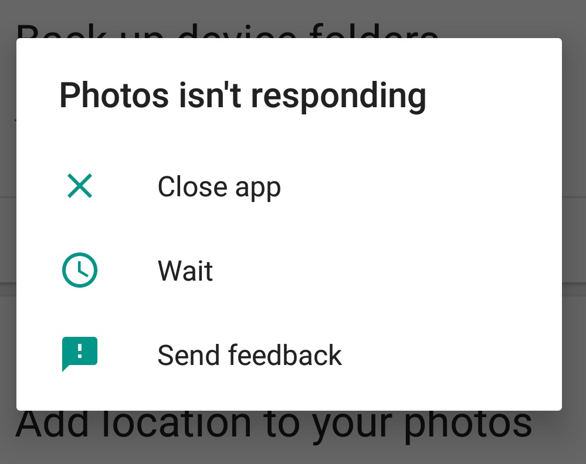

# 11.1 As fast as a snail
\(By Mario Linares-Vásquez\)

_(Free image by Jingxuan Chi on [Unsplash](https://unsplash.com/photos/whEKnXAq-34))_
___

Mobile apps are gesture-driven, which means that the interaction between the user and the app is mostly done through gestures performed on the phone's display. In addition, mobile devices are an "essential" element for humans. Therefore, users always expect mobile apps to react quickly to their commands !!. So, it is a best practice to know and apply the "best practices" for creating mobile apps that react as fast as possible to users' commands. First, let's talk about one of the most common problems that impact apps' performance: GUI lagging and ANR errors.

Mobile apps, by default, follow a single thread policy. It means that the same thread is in charge of listening for external events, painting the GUI, and executing any operation the app code dictates. This thread is called main thread or GUI thread. So, it is like when you are listening and replying to your best friend (face to face) but at the same time you have to finish a differential equations midterm; at some point in the conversation you will not reply to your friend as fast as she/he expects. Long-term or computational expensive tasks, when executed on the main thread, impacts apps' responsiveness, because when the thread is busy with a long task there is no room for reacting to other events form the GUI or the system. 

>¿Have you experienced a lag when talking to somebody? Probably yes. 

Running time consuming tasks on the main thread leads to two problems: **GUI lags** and **ANR errors**. The former can be identified in the GUI because the transitions and animations are not smooth as expected or because the GUI does not respond as fast as expected; the frame rate in Android is 16 ms to assure nice UI drawing, therefore, any long tasks on the main thread can itenfere on the 16ms frame rate. In summary, you can see lags or delays in the GUI and it does not look natural, the app is frozen by a very short period. The ANRs (Application Not Responding) errors are more intrusive because in this case the application hangs for a while, therefore, it does not respond to any event from the events; the consequence for an ANR is an annoying dialog that shows up in the display, like the one depicted below:

In the case of Android apps, the dialog is thrown by the operating system when it detects that the GUI does not respond in 5 seconds. ANRs are also generated in Android apps when a broadcast receiver has not finished its execution within 10 seconds.

> You can read more about ANRs an GUI lags in Android apps in the following articles from the Android developer guide [Keeping your app responsive](https://developer.android.com/training/articles/perf-anr), [ANRs](https://developer.android.com/topic/performance/vitals/anr), [Slow Rendering](https://developer.android.com/topic/performance/vitals/render).

