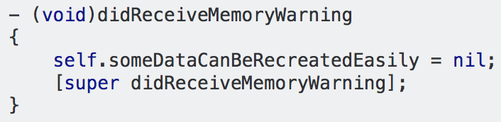

# 11.2 Memory bloats
\(By Mario Linares-Vásquez\)

___

Memory is perhaps one of the most valued resources in a mobile device (after energy) and one of the biggest headaches for mobile developers. The mobile operating systems have very specialized mechanisms for memory management aimed at assuring that there are no memory greedy apps (in the device) that can shutdown the OS. Therefore, it is good for you to know the best practices what will help your apps to not be tagged (by the users and the OS) as a memory greedy app.

The term **Memory bloat** refers to an excessive consumption of memory in a software system. Common causes of memory bloats are complicated/huge data structures, strong references, cyclic references, not using good practices for dealing with images and bitmaps, excessive/unnecessary declaration of objects (e.g., inside loops), among others. If you want to be a successful mobile development, then you should be a master/ninja/guru in memory management.

Memory bloats can lead to OutOfMemoryErrors (OOM) that force the app to crash without mercy. The amount of memory available for an app is dynamically allocated and it depends on (i) the memory capacity in the device, and (ii) the amount of apps running in the phone (in background or foreground). Therefore, an OOM error occurs when your app is allocating more memory than the one assigned to the app in the heap. Because this is a forbidden operation, then app crashes or the OS decides to kill your app. 

> Read about the basic memory management concepts in the Android OS [HERE](https://developer.android.com/topic/performance/memory-overview).

Since API level 14, Android has the [`ComponentsCallback2`](https://developer.android.com/reference/android/content/ComponentCallbacks2) interface which allows developers to do finer memory management. It can be used with Activities, Services,  ContentProviders, and the Application class. The interface has the `onTrimMemory` public method, which should be used by developers to release memory based on current memory constraints and.  This will help app responsiveness and could prevent the process to be killed by the Os. The callback method will be automatically invoked by the OS depending on the memory constraint levels. A similar mechanism in iOS is available as a callback method in  controllers: [`didReceiveMemoryWarning`](https://developer.apple.com/documentation/uikit/uiviewcontroller/1621409-didreceivememorywarning). This callback is invoked by the OS when the amount of memory is low. You can override this method to dispose of not critical resources as cached images or data that can be recreated (user-entered data, network data), but never deallocate elements that are shown on the screen. 

 
> Take a look to the [`ComponentsCallback2`](https://developer.android.com/reference/android/content/ComponentCallbacks2) documentation.

In Android apps, the available memory can be also queried via the `ActivityManager` class.  Adapting (programatically) your app behavior is a nice feature that users appreciate, therefore, querying available memory and reacting to it is a MUST in modern mobile apps. For example, checking the memory available to decide whether to load a high-resolution version of a photo or a low-resolution one, is an example of adaptation feature. To this you can use the [`ActivityManager.MemoryInfo`](https://developer.android.com/reference/android/app/ActivityManager.MemoryInfo) class

> Check the [Manage your app´s memory](https://developer.android.com/topic/performance/memory#CheckHowMuchMemory) article to learn to check (programatically) how much memory is available in your Android app.