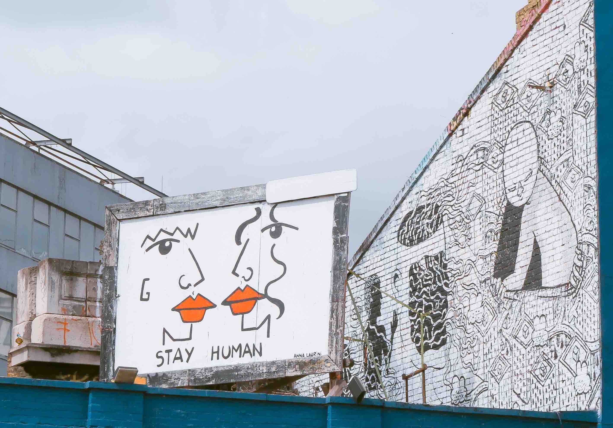

# 2.3 Design for everybody

---

_(Free photo by Toa Heftiba on [Unsplash](https://unsplash.com/photos/aht9I6SOu2A))_

Watch the Apple video available [HERE](https://www.apple.com/105/media/en/accessibility/2016/2c27194c_cf72_4f59_bbdb_9b87728c0082/films/feature/accessibility-feature-en-20161018_1280x720h.mp4). No worries, it is short (1:42 mins)

What do you think about the video? Isn't it a powerful one? YES, it gives people a different perspective of what means to design apps that allow people with disabilities to produce awesome videos like the one you just watched. And yes, the lady in the video was the producer.

According to the "World Report on Disability" (2011)[^1] of the World Health Organization (WHO), _"[a]bout 15% of the world's population lives with some form of disability [...]"_. The disability statistics portal maintained by Cornell University[^2] reports that _"12.9 percent of females of all ages and 12.7 percent of males of all ages in the US reported a disability"_. The Colombian case is not far from the US numbers. The *Discapacidad Colombia* project[^3] reports that, in 2015, around 3 million of Colombians had a disability.

¿Should we design apps for everybody? As designers, we should be inclusive; we should stay human and design apps for everybody. This means that we should care about accessibility, usability, and user experience. Mobile apps should be universally designed.

> _"Universal Design is the design and composition of an environment so that it can be accessed, understood and used to the greatest extent possible by all people regardless of their age, size, ability or disability. An environment (or any building, product, or service in that environment) should be designed to meet the needs of all people who wish to use it. This is not a special requirement, for the benefit of only a minority of the population. It is a fundamental condition of good design. If an environment is accessible, usable, convenient and a pleasure to use, everyone benefits. By considering the diverse needs and abilities of all throughout the design process, universal design creates products, services and environments that meet peoples' needs. Simply put, universal design is good design."_[^4]

¿Would you like to watch another inspiring story before going to the next section? Watch Patrick Lafayette´s story [HERE](https://images.apple.com/media/lae/accessibility/stories/2017/29a0761a_bb3a_4baf_82a0_eb1206143ea1/films/patrick/accessibility-patrick-cc-lae-20170518_1280x720h.mp4). More accessibility stories by Apple are available at [https://www.apple.com/lae/accessibility/stories/](https://www.apple.com/lae/accessibility/stories/).

[^1]: http://www.who.int/disabilities/world_report/2011/report/en/
[^2]: http://www.disabilitystatistics.org/
[^3]: http://discapacidadcolombia.com/
[^4]: http://universaldesign.ie/What-is-Universal-Design/

