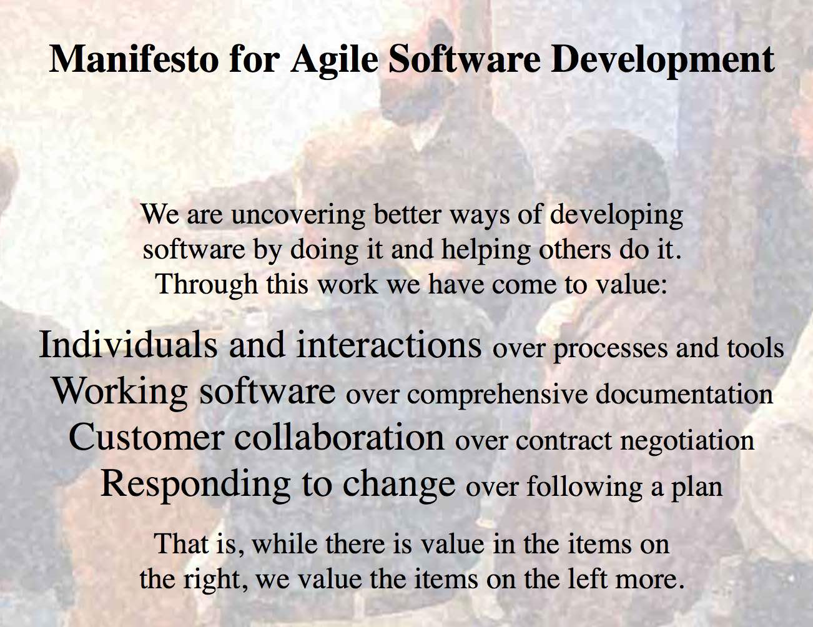

# 2.1 A taste of design thinking

---

Before starting with an explanation of what **design thinking** is, watch the ["What is Design Thinking?"](https://www.youtube.com/watch?v=gnWj97CEjeo}) video from the Stanford Graduate School of Business.

>Very short, right? Probably at this point you still do not understand what design thinking is, but, there are two key phrases in the teaser video you should remember:  
1. _"TO FIND IDEAS AND DISCOVER INNOVATIVE WAYS OF SOLVING PROBLEMS"_; and  
2. _"IT'S HUMAN CENTRIC"_

Are software systems human centric? Let me paraphrase. Should software systems be human centric? The answer is "it depends", because not all the software systems are intended to be used by humans. However, in most of the cases, software systems have GUIs (desktop, web, or mobile) or command line interfaces for user interaction. Even the systems that only have APIs as entry points are to be invoked by humans (i.e., the developers using the API). Those systems should be human centric. Note that having a GUI does not mean that a system has been designed thinking on the user needs (think on the design fails reported in [Victorija's article](https://www.boredpanda.com/poor-design-decisions-fails/)).

One starting point for designing software which is **human centric** are the agile methods. Probably you have already had a taste of agile methodologies, which emerged in 1990 as a revolutionary way for developing software, when compared to the classic, heavy and burochratic methods such as waterfall and the Unified Process (UP). One of the foundations of agile methodologies is their focus on people (i.e., users, product owners, developers, etc.)  over processes and tools. Read the agile manifesto that is depicted in the following screenshot:

_(Screenshot from http://agilemanifesto.org)_

Read also the [principles](http://agilemanifesto.org/principles.html) behind the agile manifesto.
 
After reading both, the manifest and the principles, you can feel a nice vibe regarding agile methodologies because they really care about people. Agile methodologies like SCRUM and XP strongly promote the continuous interaction with users, strategies for effective communication (e.g., white boards, face-to-face discussions, and open offices), and the usage of work environments that provide the team with emotional salary. Although this is a step towards designing and developing human-centric software, agile methodologies do not focus on the specific techniques to use when designing software.  Here is where **design thinking** gets on the stage. 

>Watch the  [How It Works: Design Thinking](https://nb-no.facebook.com/IBM/videos/ibm-design-thinking-how-it-works/894221764001440/) video by the IBM Think Academy.

Design thinking is a process developed at Stanford University that aims at "finding ideas and discovering innovative ways of solving problems" by putting yourself on the user shoes and thinking from "inside the box" (yes, inside the box). Design thinking combines methods from different disciplines, such as engineering, business, architecture, and, obviously, design. 

>Note that as engineers, we are used to think in a holistic way, i.e., to think about a system as a whole. This makes us think normally from "outside-the-box" and see problems from "outside". 

Design thinking is "human centric", therefore, special atention is paid to designing products (or solutions) that are to be used by **people (who belong to a culture) and under specific contexts.** It is a method for developing innovative ideas, which is oriented to understand user needs by making the users an active part in the process. In addition to looking for innovative solutions, the goal is also to propose solutions that satisfy user needs in the best way.

>This sounds very interesting to gather/elicitate requirements for software systems. 

Design thinking is not restricted to disciplines related to design, engineering, or manufacture, because it can be applied also to decision making processes and strategy. As mentioned in the videos, it is intended "to find ideas and discover innovative ways of solving problems", which makes it useful for any discipline. **So, why not use it for software development?**
