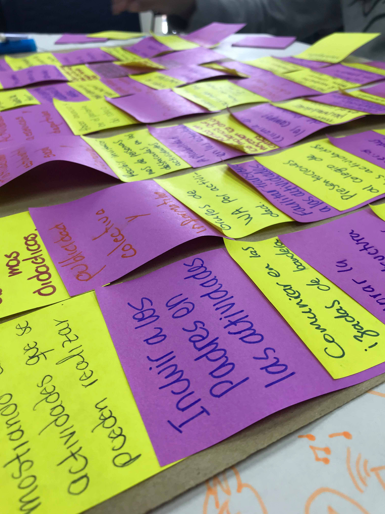

# 2.2 The five steps: Empathize, define, ideate, prototype, test

---

An easy way to understand design thinking is to see the creation of solutions from designers' perspective. In software engineering, we are already familiar with iterative and incremental processes, in which early prototyping over short iterations promotes rapid feedback from stakeholders and prevents delivering a product that does not satisfy stakeholder needs. So, understanding the design thinking process is going to be a "piece of cake". 

The design thinking process consists of 5 steps: **empathize**, **define**, **ideate**, **prototype**, and **test**. These resemble the linear steps of a development iteration, right? At least prototype and test sound like implementation and testing, respectively. But what about empathize and ideate? Watch the ["Stages of Design Thinking"](https://vimeo.com/194419309) video from the FHIL youtube channel to understand each step.

According to the University Innovation Fellows training (2017), there are three great stages in the Design Thinking process: (i) identify opportunities, (2) generate novel solutions, and (iii) make ideas real. These three stages are defined as follows[^1]:

### Identify opportunities: empathize and define
One key part of the design thinking approach is to start gaining a deep understanding of the perspective of the people involved in the area of opportunity we are exploring, i.e., **put ourselves in the user's shoes**. This is called *empathy*. 

The first step is to talk to the people relevant to the opportunity you are exploring. You must understand what they do, how they do it and why. You should try to obtain all the data on these matters. According to the Interaction Design Foundation (2018), there are numerous techniques that can help you to get a better understanding of a user:
* *Photo and Video User-based Studies*. In these studies, users are photographed or filmed either in their natural environment or in focus groups. This technique helps you to identify different types of users and common characteristics, and to remember feelings or behaviors evoked during the sessions.
* *Personal photo and video journals*. In this method, the user is in charge of recording his activities during a specified period. The main advantage is that you will not interfere in the users' activities.
* *Interviews*. You must be prepared in advance to conduct the interview; otherwise, this could yield to minimal or irrelevant results. A well-prepared and well-conducted interview can help you to understand the users' needs, problems, desires and goals.
* *Engaging with "Extreme Users"*. This method provides a broader look of the users' needs and desires. The inclusion of "extreme users" in your empathizing step improves the chances of your design not being frustrating for users[^2].
* *Diaries*. You can give a diary to the user and ask them to write down their experiences and feelings during a specified period. Later you will have a structured narration to work with.
* *Analogous Empathy*. Comparing the problem with other problems and solutions in different fields creates an "inspirational board". It helps the design team to generate new insights.
* *Bodystorming*. Bodystorming is the act of physically experiencing a situation in order to immerse oneself fully in the users’ environment. This will put you in the users' shoes and boost the feelings of empathy, thus letting you to come up with the most fitting solutions[^2].

Once you have collected information by following any of the strategies above, you will pull out, with your team, pieces of data that you find interesting, surprising, or even contradictory. Based on these, you will craft **insights** that might help you frame opportunities to improve the area you are exploring (UIF, 2017). Those opportunities should be framed as "how might we" questions. For example: _"how might we teach people to leave the left side of the stairs empty for guys in a rush?"_; _"how might we motivate students to read the mobile app development book?"_; _"how might we allow deaf people make music"_; _"how might we help blind people to call a cab in Bogotá"_.

> What is an *insight*? Read more about it [here](https://www.slideshare.net/umarghumman/what-is-an-insight-34449790 "here").
 
### Generate novel solutions: ideate

_(Photo by Diana Solano)_

Once you have framed opportunities (in the form of a "How Might We…" question), it is time to generate solutions for those opportunities. This is where creativity comes in. 

First of all, quantity does matter. You should meet with your team and generate as many ideas as possible. The team's attitude should be to accept any idea ---no matter how crazy it may sound---, because that leads to less inhibition and self-censoring and increased flow of ideas. The key is follow the *divergence-convergence* pattern. Divergence is a simple but powerful tool in creative thinking, as it allows people to explore a wide search space without limitations (like in a brainstorming session). The "chaos" introduced by divergence is then settled with a convergence step in which the designers put the pieces together in the form of a potential solution.

You don't have to come up with the perfect idea right away. Most of the deas that end up being really successful are a combination of other ideas that initially do not sound that great. What you need is to generate lots of ideas. Ultimately, your ideas will evolve and be evaluated later (during prototyping and testing).

### Make ideas real: prototype and test

_(Photo by Diana Solano)_

>¿How will you assure that your idea is _**the** idea_? In short, you will have to prototype, get feedback, and fix, ... and prototype, get feedback, and fix. 

When your goal is to come up with innovative solutions for an opportunity you have identified, you will be creating things that are unheard of and new. Prototyping is a way of making your ideas tangible, so that you can easily communicate what they are about, and quickly find out if they are promising and you should devote more time and resources to them.

> There are three prototyping techniques for apps: (i) sketching in paper or whiteboards, (ii) digital prototyping using software tools for building products ---that are interactive--- without coding, and (iii) native prototyping by coding the app.
 
Prototyping is also a cheap and rapid way for learning facts that can gathered only by experimentation. In the process of building and testing prototypes, your ideas will evolve from being abstract and vague to more concrete and clear to communicate.

 
[^1]: University Innovation Fellows. Design thinkig training, 2017.

[^2]: Ditte Mortensen. Stage 1 in the Design Thinking Process: Empathise with Your Users, Interaction design foundation, 2017.

