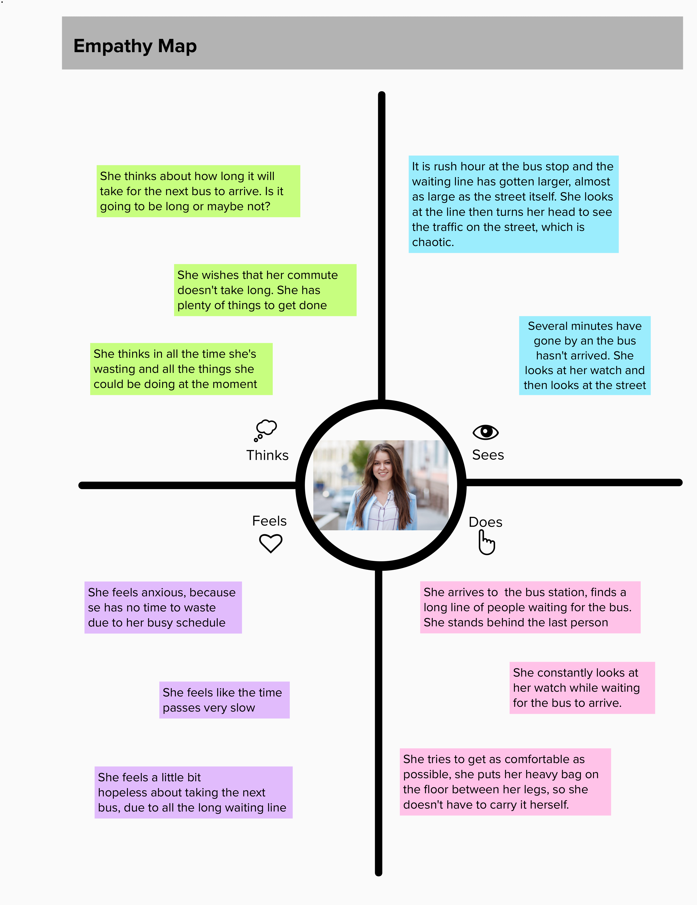

# 3.1 Empathize with users
___

First of all, we need to understand our users. We need to learn about them to design useful and appropriate solutions, because not understanding the user's needs is one of the biggest mistakes we can do.

We are used to thinking that the better solutions are the ones with the highest technical quality or the ones faster to implement. But none of that matters if the design solution can not be applied to the users' context.

> Read about the history of the Google Buzz product and think about  why is was not a successful one: [Google Buzz - wikipedia](https://en.wikipedia.org/wiki/Google_Buzz)

But, how do we get to understand the users' context? What tools can we use to get to real problems and propose solutions to them? Our perception of the users we will target can be biased by our previous experiences or acquired knowledge. In that sense when beginning our design process we will have  "hypotheses" about our users. Hypotheses need to be validated, so we need to have tools that help us to describe and validate the hypotheses we have during a design process.

There are many tools to understand the users. Let's check one that is called **empathy map**, which is a canvas for describing users from the point of view of what they _think_, _see_, _feel_, and _do_:

_(Click on the image to open an editable template)_

Lets take a look to each component in an empathy map:

**1. What does the user think?** (Top-left quadrant) Write down about how the things/situations are now and how the user would like them to be.
Write down about how the user thinks the things/situations should be different in a certain way and why it is important. In this part of the map try to answer questions like _what are her/his thoughts about current situations? what are the motivations and goals? How are the current situations impacting their motivations/needs/goals?_

_Example: She wishes that her commute does not take long. She would like to be able to avoid wasting her time when waiting at the bus station_

**2. What does the user see?** (Top-right quadrant) Write down about the observations, facts, and sources of information that support what the user thinks. This is also a space for describing what the user perceives from the context and  environment.  In this part of the map try to answer questions like _What has the user seen in their context? What has the user heard about current situations? What are the user perceptions about the situations?_

_Example: While she is waiting for a bus, she can hear people complaining about how long the line is. There is no clear information about arrival times_

**3. What does the user feel?** (Bottom-left quadrant) Write down here about the user emotions and what makes her/him feel in this way.

_Example: She always feels frustrated because there is no way to know the waiting and arrival times for the buses_

**4. What does the user do?** (Bottom-right quadrant) This is about personal facts. Write down about what the user actually does, his/her activities and frequency.

_Example: She arrives to the bus station at 8 am every weekday and it takes her about 30 minutes to hop on a bus_

**5. Who is the user?**. This is the circle at the center of the map. Add there a photo of the user (if you are allowed to do it) or a picture that represents the user. You can also write a brief description there.

The empathy map can help us identify how the users interact with their context and can lead us to important insights within the situations in which the user is in. It is also a tool that promotes collaborative work in the design team.

We should do at least one empathy map for each user related to the situations we are analyzing.

Tools like empathy maps helps us to validate the hypotheses we have about the users, and collect valuable information to understand them better, but users are not the best way to define the interaction of people with the platform. So the empathy maps a first step for collecting information about the "personas" of interest (yes personas). Because we could end up with a bunch of empathy maps, but we can not focus on each one of the users,  we need to go further and group similar users into one definition so that we can design our solutions based on those definitions. That is the reason why we will talk about **Personas** in the next chapter.
