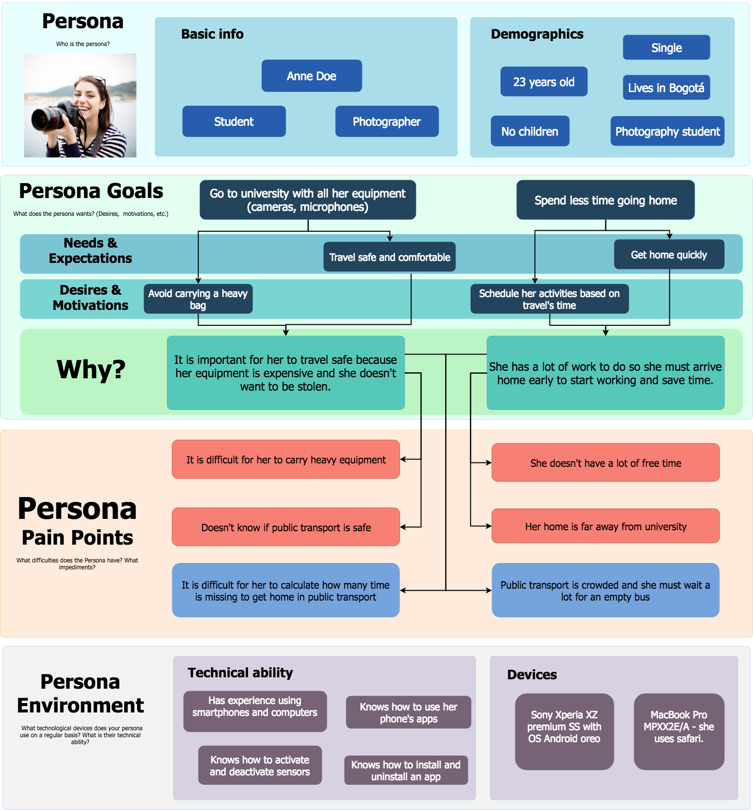

# 3.2 Personas? Users? What is the difference?
___

Read the following article from usability.gov about [Personas](https://www.usability.gov/how-to-and-tools/methods/personas.html "Personas"). Afterwards watch the video by Gregg Bernstein at [YouTube](https://www.youtube.com/watch?v=B23iWg0koi8)

At this point it should be pretty clear the meaning of "persona", and their role in a product/service design process. However, if you skipped the article or the video we will briefly describe what a persona is.

> Remember that questions related to the article or video may show up in a quiz or midterm (with a high probability)

A persona is a fictional profile that represents a particular audience segment (i.e., a users group). It is a way to personify your users with the purpose of promoting collaborative work in your team around a given persona. A "persona" helps you to empathize and to create "hypotheses" about a set of representative users that will contribute to identify situations problems that are suitable for being improved/fixed. Note that we say "representative users" because we should not focus on each user from which we have gathered data. For instance, if while doing user research you collected information form 100 people, if would be time consuming and very risky to try to focus the design process on each one of the 100 users. Therefore, we need to built personas as a set of profiles that are representative of the whole population under analysis. If we were talking in math/engineering terms, a persona is like the [medoid](https://en.wikipedia.org/wiki/Medoid) in an equivalence class (yes, the description sounds very nerdy).

So, a persona has a profile, but it is not enough to include in the profile her hobbies, age, name, profession, etc. Remember that you have to empathize and understand your users, and, you have to define testable ideas about how they behave. The empathy maps are a first step for that purpose. Thus, empathy maps are a valuable source of information for defining personas.

A persona should represent not only demographics but also motivations, desires, expectations, needs, frustrations, and technical ability (e.g., how comfortable a persona is with using technology). There are several templates for filling-up a persona description. A persona profile is a serious thing that requires user research, i.e., it must be created based on data collection and observation practices (e.g., surveys, interviews, focus groups, usability testing). From the collected data, there should emerge hypotheses describing your users, then you should use hypotheses to create personas.

Although there are several template for documenting personas, we suggest you to include the following into a persona profile:

- **Persona:** a generic title (e.g., Senior Manager)
- **Photo:** fictional photo; it can be also a good sketch
- **Fictional name:** e.g., Mario Linares
- **Demographics**: age, academic degree, marital status, number of children, profession, etc.
- **Goals:** Why she/he will use the app/product? what does she/he want to do? whata are her/his goals? Include here, desires, motivations, expectations, needs.
- **Pain points:** What are the persona difficulties? What is stopping she/he for doing what she/he wants? It is expected to have a one-to-many mapping between the goals and pain points.
- **Technical ability:** How comfortable is she/he with using technology? What is her education level?
- **Devices:** specific devices (not only mobile) she/he uses

Here you will find a good example of a persona. Click on the example to get access to the template to create a persona:

_(Click on the image to open an editable template)_

Now, the big question. How many personas should you define? Well, there is no golden number here, some authors recommend to create 3 to 5 personas, some others recommend to create no more than three. It is up to you depending on the user clusters/groups you found. However, something less than 3 shows that the scope of your system is very narrow.

Once you have empathy maps and personas you count with valuable information for establishing hypotheses about your users and how they behave. Note that both artifacts should be used to identify how far your hypotheses are from the reality. Therefore, use both artifacts to promote the discussion with the design teams and the users. Design sessions, interviews, and observation practices can be used to validate the persona hypotheses.

What is next? Empathy maps and personas will help you to establish hypotheses about the problems and situations that could be fixed and improved. The next step is then to describe key scenarios that describe potential avenues for improvement with the PAS list (PAS means  Problems-Alternatives-Solutions).
