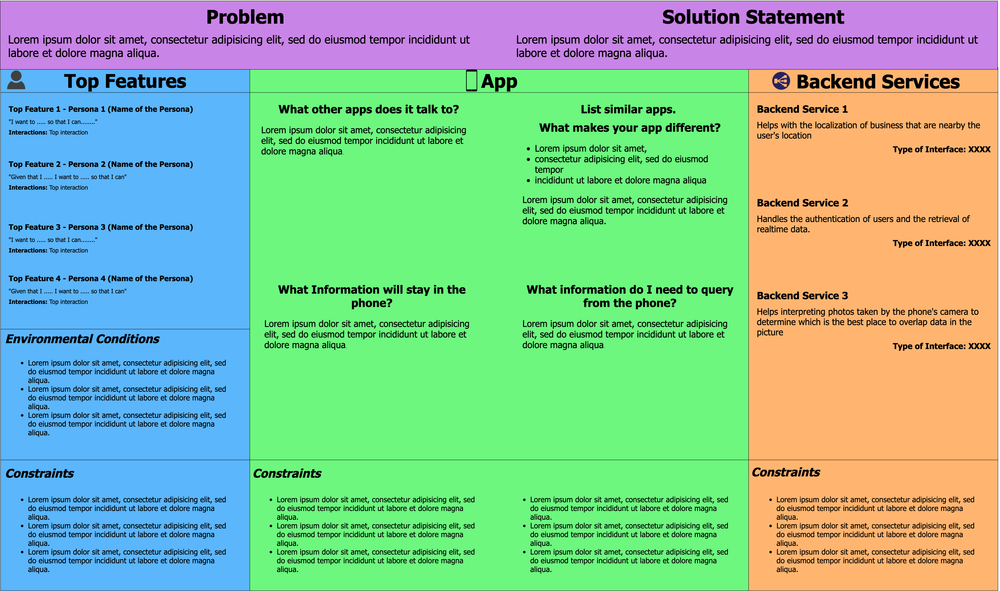

# 3.4 The context canvas
---

We have worked on the Personas of the app, now is time to understand the context in which this Personas will use the app.
To that end we have design a tool, we call it the **amazing, wonderful, and powerful "Context Canvas"**. _How different is it when compared to the system context diagram?_ The context canvas is tailored to mobile apps, therefore, it is more specific and provides more information than the classic system context diagram. Is important to understand that all the design tools should be related, which means that when you write something in the context canvas you need to think about the Personas that you already defined. Sometimes, the context canvas will make you realize that something that you defined in the Persona's stage is wrong, so go change it and come back to the context canvas. The design process is not a straight line, is an iterative cycle.

Lets dive into the topic of this section. The context canvas is organized in three columns, that describe aspects related to the personas, the app, and the backend services required by the app. Its purpose is to help you to identify how your app interacts with the context, i.e., (i) how the app is used by the personas and how is the interaction (e.g., via gestures, sensors), (ii) how the app interacts with the device and other apps in the device, and (iii) how the app interacts with the backend services.  The context canvas is also a design artifact very useful to identify quality/contextual scenarios and the constraints imposed on the app. Click <a href="https://viewer.diagrams.net/?tags=%7B%7D&highlight=0000ff&edit=_blank&layers=1&nav=1&title=Context%20canvas#Uhttps%3A%2F%2Fdrive.google.com%2Fuc%3Fid%3D1G_ZxWF_UcpT8yUvj4PrvZgfoJ3WDosMU%26export%3Ddownload" target="_blank"> here</a> to access the template to do your own context canvas.

Check the following example. Click on it, to see it in better detail:

**0. Problem and solution statement.** Before starting with the canvas you should have an initial idea about what is the problem. Briefly describe the problem at the top of the canvas, and then justify your solution. One way to justify it is by following this template: _We are (project name), and are developing a way to solve the problem, focusing on (target population) and with the purpose of (expected outcomes/results)_; e.g., we are _the software design lab_ and want to solve the problem of _automated attendance check in classes_; we will focus on _undergrad students and professors_, and our purpose is to _reduce the paper waste of attendance lists and automate the attendance reporting_.

**1. Personas.** The first step for creating a context canvas is to use the Personas profile to define your app top-features. Those top-features should be the ones that provide the highest value to each persona. To this, for each persona, select one or two pain points that can be improved/solved by features provided by your envisioned app. Then, describe the top-features using the following templates:
 

_Template 1: (need), (expected outcome). (*interaction)_

or

_Template 2: (precondition), (need), (expected outcome). (*interaction)_

 

> An _interaction_ is a description of an action made on the phone by the Persona. Clicking, swiping, shaking or turning the phone are some examples of possible interactions. The interaction should help you visualize the sensors that your app should use from the perspective of the intentions of the personas. A feature should always include an action to be valid.

Lets take a look to some examples of features description based on the templates:

_I want to identify objects in my gallery, so I can send photos of my dog to my son without going over all the photos. (Clicking the screen)_

_Given that I previously saved my preferences, I want to identify the safest path for my trip, so I can get home by bike (Using voice commands)_

The first example is an instance of Template 1, and the second one is an example of Template 2. The sentences with "I want" describe the (needs), and the ones with "so I can" describe the (expected outcomes). Note that there is an extra element in Template 2  (i.e., precondition) that describes the previous/current situation of the persona that allows the goal achievement.

There is an extra section in the "Personas" column for describing the specific situations/conditions where and when the app could be used (i.e., environmental conditions): in an elevator, in a place with bad network signal, in a place with a lot of light, with limited visibility, etc. This conditions talk about the environment, they refer to something outside the user control.

**2. Your app.** The second column is for describing the app and its interactions with the devices and other apps (in the device). To this, you will describe the interactions by answering to the following questions:

- **What other apps my app talks to?** - This should be a list of apps needed to make my app work, or apps from which I can take information that will be crucial. This question asked for only apps. (e.g., calendar, maps, contacts, etc...).
- **What information will stay in the phone?** - This should be a list of the information that will need to be stored in the phone, because is so crucial that I cannot risk not having it available. Or because I will need to store it while the phone gets internet, and it can be sent to an online storage.
- **What information do I need to query from the phone?** - This should be a list of information that I need to get from the phone, and specifically from the phone system. The first question was about apps, this question is about sensors and the OS.
- **What makes my app different from other similar apps?** - This should be a list of apps that have similar functionalities. List them an tell the main difference between them and yours. The apps listed can have all or some of the functionalities of your app or even only the same public. The intention of this question is to understand what is already on the market and how are you going to make a difference.

**3. Backend services** Modern mobile apps rely heavily on backend services to (i) reuse existing functionality, (ii) use remote storage strategies, and (ii) to avoid running computationally expensive tasks on the device. In this block of the context canvas you should write all the required backend services specifying the _name_, _the purpose for using the service_, and _the type of interface consumed by the app to talk to the service_ (e.g., REST API, RMI client, code API, enterprise bus).  following:

> One example of backend service description is: _Machine learning engine at AWS. AWS will be used to execute remotely and asynchronously the convolutional model for recognizing dogs in the photos uploaded with the phones. The communication between the app and the tensorflow engine is through the Keras code API (i.e., the API is invoked in the app code)._

**Constraints** Note that each information block (i.e., column) in the context canvas has a "constraints" box. It is because, when designing the solution we have to consider every constraint from the backend, the app execution environment (i.e., the devices, APIs and the OS), and the personas.
