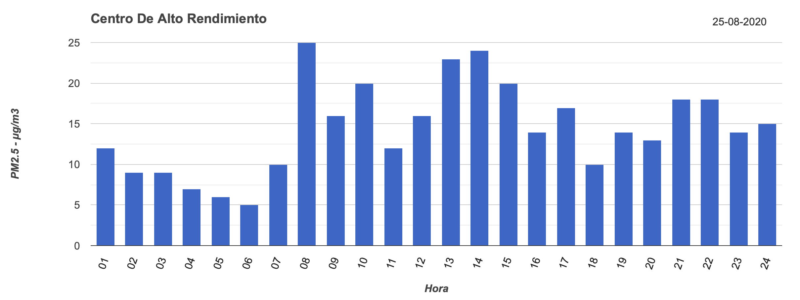

# 4.2 From data to information and knowledge
___
In the last section we introduced to you the idea of an analytics engine that takes data collected by an app and other sources and transform it to information/knowledge. That is pretty simple, right?... mmm we know that it isn't, so we are going to start asking you if you remember what data is? and what about information and knowledge?. In this section we meant to briefly remind you about these terms and how those are useful in our context.

In daily life we talk about data, information and knowledge as if these terms were synonyms, specially the first two, but this is a misconception; it is like if you said that morning, afternoon and night were the same. To understand the differences between data, information and knowledge we are going to review two very basic examples. Please, take a moment and try to answer these questions: What are these strings and numbers in the following image?

  

What are these numbers in the following image?

  

Probably you can't answer these questions, this is because we didn't give you any context and any possible order about these strings and numbers, well.. this is data.  

**Data**  *per se* tells us nothing, because it is just individual elements without a context. A general and more formal definition is data are "objective facts or observations, which are unorganized and unprocessed and therefore have no meaning or value because of lack of context and interpretation."[^1]. 

Continuing with our examples, what happens if we organize the data and give you some clues, can you tell us something about the following table? 

  
<figcaption align="center">Table 1</figcaption>

What about the following table?

  
<figcaption align="center">Table 2</figcaption>

We are pretty sure that you can tell us a little bit more than before. But just in case, here is an interpretation about the tables: the first table represent grades from students, the second represent measures from an environmental sensor in some location on earth. So, now we can say something about the data presented, that is why it is called information. 

**Information** is useful, it is organized and contextualized data. A more formal definition: "information is data that is endowed with meaning and purpose"[^2]. With information you can answer interrogative questions such as *Who*, *What*, *Where*, *When* and *How Many*, for example who is the student that has a grade of 1,4? *(Lena)* or What measurement has a value of 25 in the environmental sensor? *(8)*, how many measurements of the environmental sensor are between 15 and 25? *(10)*.

Now we have a *context* and we can answer simple W-questions. But what if we told you, please tell us which students have grades that are above the history average grades from that class or that are above the history average grades from the school? or which students approved the course?; what about this one: which levels for the environmental sensor are favorable?. Until now and without any more information you can't answer this, you do not have anything that helps you, nor expertise neither know-how about these topics.

So, we are going to carry on with our examples and give you some external information:

* The grades are from a primary school in Germany. And in its academic grading systems considers 1 as excellent,  6 as insufficient and more than 4 as not sufficient.

* The grades are from a History course and the average grade from this course is 3,6 and the school's average is 2,8.

* The environmental sensor is located in Bogotá and it measures the particulate matter that is lower than 2,5 micro aerodynamic diameters (PM-2,5).

* Each measurement corresponds to a particular hour (e.g 1 is a measurement that was taken at 1am and so on).

<figcaption align="center">(Data and screenshot from RMCAB Bogotá)</figcaption>

  

* A favorable value for PM-2,5 is between 0 and 10.[^3]

Now if you try to answer the aforementioned questions you can do it.  This is because now you have external information, the know-how from others, this synthesis and analysis of information is called knowledge. 

**Knowledge** "is a fluid mix of framed experience, values, contextual information, expert insight and grounded intuition that provides an environment and framework for evaluating and incorporating new experiences and information."[^2]. It helps you to know how to use the information and allows you to take decisions and generate **wisdom**. Some possible decisions in our examples could be: we have to focus on the students that are above 4 if we want them to pass the History course; or we can use the environmental sensor's values to avoid some points at some time because of the pollution. 

With this briefly explanation we want you to notice that **Data** is the base of **information** and **knowledge**/**wisdom**. But only data tell us nothing, we have to process and enrich it with context, meaning and another external sources if we want to be able to take decisions or gather insights from data. 

 
 
[^1] Rowley, Jennifer; Richard Hartley. Organizing Knowledge: An Introduction to Managing Access to Information.2006. Ashgate Publishing, Ltd. pp. 5–6. ISBN 978-0-7546-4431-6.

[^2] Wallace, Danny P. Knowledge Management: Historical and Cross-Disciplinary Themes.2007. Libraries Unlimited. pp. 1–14. ISBN 978-1-59158-502-2.

[^3] Secretaría Distrital de Ambiente. Red de monitoreo de calidad del aire de Bogotá. August 25th, 2020. http://201.245.192.252:81/Report/HourlyReports?id=1&UserDateString=2020-08-25