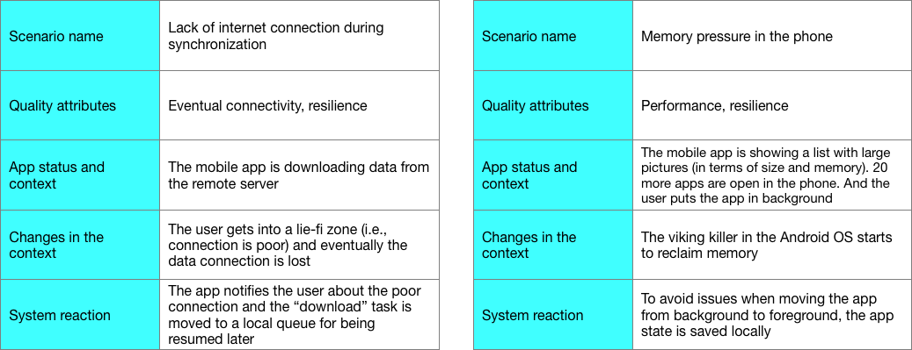

# 4.6 On the scene: describing how personas interact with your app

___

So far, you know the context canvas and the VD map. Both provide you with a high overview of the information needs for the mobile app and analytics engine, as well as a general view of the constraints for you app. The context canvas also includes personas and an initial list of features the personas are interested on. However, there is still something missing here: scenarios.

A scenario is a clear and "concise description of a situation that a system is likely to face in its production environment along with a definition of the response required of the system" [^1]. This sounds pretty similar to a user story or a use case, however, there is a very important difference: "a situation that a system is likely to face in its production environment". A scenario is a description of how the system should work from the functional and non-functional viewpoints, assuming the system is in its real environment.

There are two type of scenarios: functional scenarios and quality attribute scenarios (or simply quality scenarios). You **MUST** document both, and in particular the latter because the high impact that quality attributes have on mobile apps (e.g., eventual connectivity). Remember that your solution might involve web apps, dashboards, etc, so, scenarios should be defined for the mobile part, the web part, the desktop part, etc.

Scenarios definition is aligned with the design thinking philosophy of feeling like the use of being in the user shoes. There are three key elements that should be in a scenario definition: (i) **what the persona is doing**, (ii) **the system reaction**, (iii) **the execution context (or context at runtime)**. Remember that the internal state (e.g., variables states) of an app is also part of its context. Lets take a look in the definition of both types of scenarios:

**Functional scenarios** are described like user stories (easy cake), i.e., functional scenarios are focused more on how a persona uses the app. So, functional scenarios are very similar to the features described in the canvas. However, those scenarios are more verbose, and contain more "real" data and context. When describing the functional scenarios you must impersonate a persona. You can use the same templates we described previously for listing features in the context canvas. Functional scenarios must describe a path followed by a persona through single or multiple features.

**Quality scenarios** should be described from a potential race condition: what if the phone is running out of memory? what if the luminosity is very low? what if a lot of data is pushed to the server? what if the user is blind? what if...? Your scenarios must cover all the quality attributes related to your app (i.e., accessibility, usability, performance, eventual connectivity, resilience, availability, scalability, security, internationalization, GUI responsiveness, etc.).

> What info from the personas profiles and context canvas can you use to derive quality scenarios? Remember to put yourself in user's shoes, so, use the profiles and any other artifact available (e.g., journey maps and interviews) to identify scenarios that can have an impact in a quality attribute (e.g., performance, battery consumption, accessibility) or that can show a "corner case". Also image how a persona is going to use the app.

Quality scenarios are described using the following template:

- Scenario name
- Quality attributes involved in the scenario
- App status and context
- Changes in the context (includes what the persona is doing)
- System reaction to the changes in the context

Let's see some examples of quality scenarios:

  

> At this point you have already know different artifacts that would help you to design a software system that include mobile apps and devices: personas profile, context canvas, business questions and VD map, scenarios. Is it enough for starting the prototyping phase? Well, remember that modern applications heavily relly on GUIs. So, you still need to design the UI (User Interface) and UX (User Experience) of your app. In the next chapter you will learn more about it.

 
 
[^1] Nick Rozanski and Eoin Wood. Software Systems Architecture. Addison-Wesley
