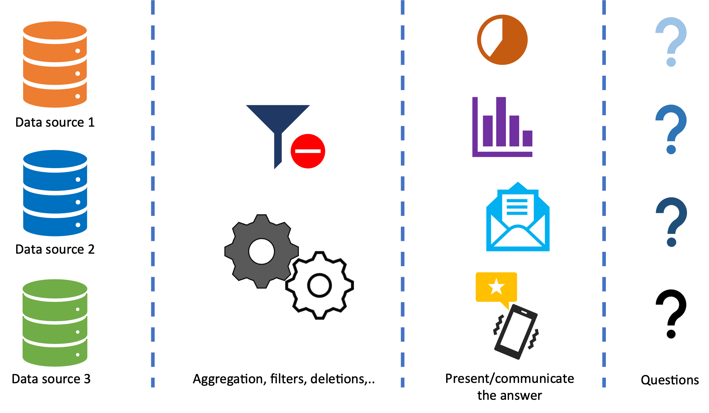
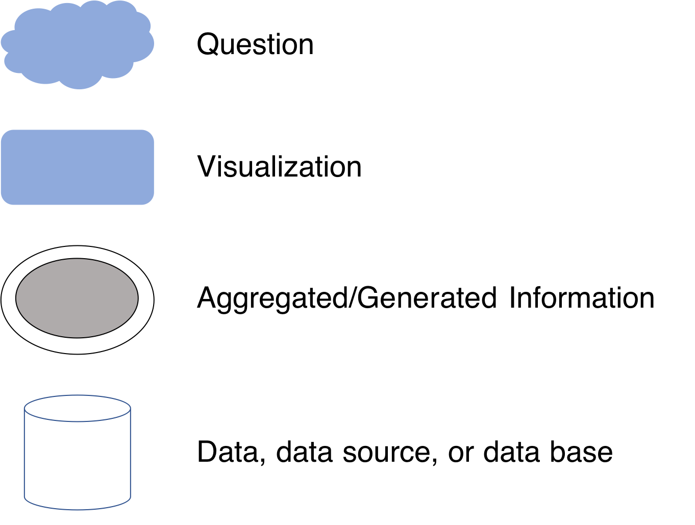
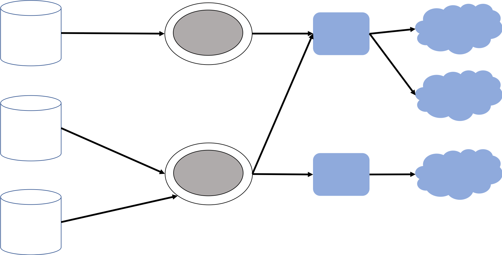
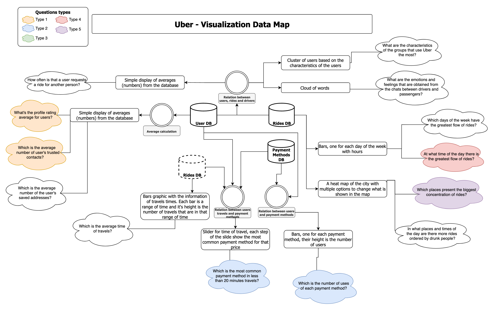

# 4.5 The Visualization-Data map
___

Well... by now you may have some questions (if not, for now do not worry). But you have to ask yourself these questions, where and what is our **source** of information?, what type of **aggregation or processing** we have to do with the original data to transform it to knowledge?, how are you going to **present** the answers? how are you going to **communicate** to the users in  type-2 questions?.

  

Maybe, you wonder what is the best way to design the data flow between the data collected from different sources and the desired information/knowledge? Bottom-up? or Top-down? Well, it depends. A Bottom-up approach requires to first identify the data sources and then to go-up and aggregate the data sources until you identify what information/knowledge can be generated with the existing data. A Top-down approach starts with the definition of the information/knowledge should be displayed/reported and then swim-down (like in a heap) until all the source data is identified.

We say it depends because the best way depends on the context, your way of thinking, and the available information. There are even cases in which you need to mix both top-down and bottom-up. However, an easy way to start is by following some of the best practices recommended by models like CRISP-DM. You can start by determining the "business objectives" and a simple way for defining the objectives is to make a list of the questions that should be answered with the analytics engine. For example, if you are designing an app for bikers, some of the questions supported by the analytics engine are: *what are the most frequent paths followed by bikers?*, *What are the rush hours in Bogotá for bikers? What are the most dangerous routes/zones for bikers?*, etc.. .

> If you are going to create an app like uber or Cabify, what questions would you like to answer with a back-end analytics engine?

<!--You must define as many questions as possible; there is no golden number regarding how many questions you should write, but a list with 40 or 50 questions is a good start.

Once you have the questions, then you can draw a visualization-data map (VD map). A VD map shows the data flow between data sources, aggregated information, and visualizations that will answer the business questions (yes, the list of 40-50 questions). The graphical components of the VD map are depicted bellow. -->

  

**Given the questions** you expect to answer with your analytics engine, in a first iteration of the map each question is represented by a _question_ node; the question **can be answered with** a chart, message, notification, or a textual report that is the _visualization_ node. Then you have to identify **what information**, what sources you need to answer the question, _raw data_ node. Then, you have to identify **what type of processing** you need to do from this raw source to make possible the visualization, with a _aggregated/generated information_ node, this node can represent, filtering information, deleting information, adding information, calculating averages, maximums and minimums, etc..

> Note: that thee arrow direction goes the source of information to the aggregation node, to the visualization elements, and the from this elements to questions nodes.

  

As you may notice some questions have  different color, each color represent a different type of question type1-type*). Some of the questions have not been classified, can you do it?, give it a try.

<!--Normally you will want to model the most data flow possible related to your application, and that will lead you to a really big VD map So, an important step in creating the VD map should be to prioritize the visualizations that you want to create.

In that way, you would be able to display not only the flow of the data, but the importance of each flow. With a prioritize VD Map you can take better decisions on how to implement the system to get the information that is more important.

A way to prioritize the VD Map is to mark the _visualization nodes_ with colors, giving the colors an importance level. The following is an example of a VD Map for the Uber app. Click on it to get a template for your VD Maps:  
-->

  

If you want a clean template to create a VD-Map click <a href="https://viewer.diagrams.net/?tags=%7B%7D&highlight=0000ff&edit=_blank&layers=1&nav=1&title=Vd_map_template#Uhttps%3A%2F%2Fdrive.google.com%2Fuc%3Fid%3D14JyIF8_bfZOHdnI2cdEKK0F3VNMO1VVf%26export%3Ddownload" target="_blank">HERE</a>

 At this point it is possible that some data was modeled by you as information nodes. The key heuristic here is that any data collected by the phone or extracted from a existing data base or service should be modeled with a _data_ node; therefore, any information derived from the existing/collected data should be modeled with an _information_ node.

## Tips

At this point you can also use the Sam and twin data (Sam2) technique. Once you have the questions imagine that Sam2 appears again and for each question he ask you and give you some information, like the following:

### For the data source nodes

* Do I need information that I already have?
    * If not, then you must put a dotted line, instead of a continuous line to the data source element.
    * If yes, then you must draw the data source as a continuous line.
* Do not forget to put the name of the source in the node

### For the aggregation nodes

* Do you need to filter/omit some data? yes, you need to specify a filter process
* Is the answer presented as  a percentage? a sum? an average? then, you must perform the respective operation
* Be sure that the raw data received as an input is enough (remember that you can have more than one source of information for aggregation node); if your input data is not enough you must rethink your data sources.

### For the visualization nodes

* You have a lot of ways to present/communicate the answers.
* Is your question a type 2 one?
    * If yes, you probably have to search a way in which the answer is presented to the user in her device, like a push notification, a change in the app interface, a text, a message, a recommendation, etc.
    * If not, you have to ask what type of data are you going to present. Is it text? a continuous number? a discrete number? os is it a list? some categories? Well, then you have to choose the best way to present it, for example, if it is a list and you want to be able to see the list, then you can present it as a plain text with bullets. On the other hand, if you have continuous numbers during a period of time a line chart would be appropriate.

* Be sure that the visualizations can be done with **only** the information given by the aggregation node, if you need more information than this, then you must change/update the aggregation node.

### For the question nodes

* Do not forget to color each cloud with the respective color based on the question type.
* Be sure that the question is being answered by the visualization linked to it.
