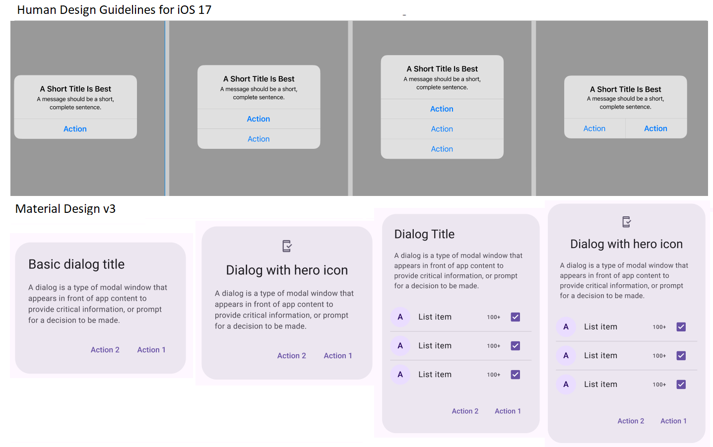

# 5.1 _'Good to Go:'_ Let's explore the Design Systems
___
Let's remember that design systems are fundamental tools aimed at creating consistent and effective user experiences in any software product.
So, first, let's ask ourselves ... Are design systems just for operating systems?

The answer is no. Design Systems exist not only for platforms or operating systems, but also for companies that want to have a recognized brand that can be identified by any client or user. For example, some well-known ones are [IBM Carbon Design System](https://carbondesignsystem.com/), [Decathlon Design System](https://www.decathlon.design/), and [Airbnb Design System](https://airbnb.design/). In these Design Systems, companies define their appearance and identity for any software product. First, the branding: logo, colors, typography, icons, style of illustrations or photographs. Second, all the components such as buttons, inputs, titles, cards, dialogues, chips, dropdowns, navigations, animations, etc. And finally, the way to distribute and use all these components: the patterns, layout, grid, margins, sizes, locations, etc.

_(Taken from Airbnb Figma Community UI Kit by [Isabella Scheier](https://www.figma.com/community/file/1206705782258966386))_

In this way, if the company has several software products, such as web pages, marketplaces, mobile apps (smart phone and smart watch), and/or why not? ... XR apps (like in the case of Apple with Apple Vision Pro), etc. All these products will be designed with the same "shared language" and guidelines, and the new designers and developers won't have to reinvent the design, but they will also use the Design System to maintain the identity, consistency, and user experience.

Many Design Systems are open and allow designers to use them as a reference. This implies that they can also use the software components and modify colors and some properties to adjust them to their product and brand. For example, IBM Carbon is Open Source and has an open community, both in design and implementation of the components. In this way, we can find Figma resources of each Design System (also called UI Kits) to use as a reference:

- [Figma Community UI Kit by Isabella Scheier](https://www.figma.com/community/file/1206705782258966386)
- [Figma Carbon Design System by IBM and others](https://www.figma.com/community/file/1157761560874207208)

Now you already know that big companies create their own design systems, as this helps them with consistency, UX, and scalability (of their app designs).

So... when you have your own startup or work in a large company, you will know what a design system is, how to use it, and why it's important. However, now, when designing your app for the course, you won't create a complete design system from scratch. Instead, you will use Material Design (by Google) or the Human Interface Guidelines (by Apple) as a basis for creating your app's identity.

## Why use a Design System in your Mobile App?

We were discussing the challenge of creating a generic design that can function seamlessly across both Android and iOS platforms. In order to find solutions and strive for some consistency between designs, we must begin by familiarizing ourselves with the iOS and Android design systems.

The design systems of Android and iOS are not just sets of static guidelines; they are dynamic tools designed to *streamline the design process* and *enhance the user experience*. These systems provide a range of pre-designed components, such as buttons, navigation bars, and typography, along with guidelines on their usage and behavior.

By adopting these systems, designers and developers can ensure that their applications adhere to the design standards set by Android and iOS, ensuring a **cohesive and familiar appearance for users**. Additionally, they facilitate the implementation of best design practices and help to mitigate usability and accessibility issues.

First, let's see the available components in each Design System, and in the next section, we will talk about how to use these foundations and put our own touch on the design to customize it and give our applications an identity.

**Material Design System**
As we mentioned earlier, Material Design has its own base UI components. They are implemented and available for development in [Android, Flutter, and Web](https://m3.material.io/develop) and can be accessed for designing mockups using tools like [Figma with the UI Kit](https://www.figma.com/community/file/1035203688168086460).

**Human Interface Guidelines**
In the case of Apple, there are the Human Interface Guidelines available, which provide guides for different platforms, from Apple Watch, iPhones, and iPads to Apple VisionOS. You can consult specific [Guidelines for iOS](https://developer.apple.com/design/human-interface-guidelines/designing-for-ios) and also use the [Figma UI Kit](https://www.figma.com/community/file/1248375255495415511) to create your own mockups.

### The components

Some components available in each Design system are:

> Note that there are some differences between GUI components depending on the platform. It is important because it is a challenge to maintain consistency between platforms, as you can see in Section [The platforms war: Android UI components vs iOS UI components](chapter5/GUI-components-comparison.md)

#### Buttons

Buttons help people take actions, such as sending an email, sharing a document, or liking a comment.

>There exist many types of buttons, not just the typical rectangle. For this reason, you can find many options within each design system. As each one has its own metaphor, they may look different; however, you can use similar types for each platform. For example, if you use icon buttons in Android, search for their counterpart in iOS.

_(Taken from Figma UI Kits of [Material Design v3](https://www.figma.com/community/file/1248375255495415511) and [Human Interface Guidelines for iOS 17](https://www.figma.com/community/file/1248375255495415511))_

#### Progress indicators
Progress indicators inform users about the status of ongoing processes, such as loading an app, submitting a form, or saving updates. They communicate an app’s state and indicate available actions, such as whether users can navigate away from the current screen.

_(Taken from Figma UI Kits of [Material Design v3](https://www.figma.com/community/file/1248375255495415511) and [Human Interface Guidelines for iOS 17](https://www.figma.com/community/file/1248375255495415511))_

#### Date pickers
Time pickers help users select and set a specific time and date.

_(Taken from Figma UI Kits of [Material Design v3](https://www.figma.com/community/file/1248375255495415511) and [Human Interface Guidelines for iOS 17](https://www.figma.com/community/file/1248375255495415511))_

#### Dialogs / Alerts

Dialogs (in Android)  / Alerts (in iOS) provide important prompts in a user flow. They can require an action, communicate information for making decisions, or help users accomplish a focused task.

_(Taken from Figma UI Kits of [Material Design v3](https://www.figma.com/community/file/1248375255495415511) and [Human Interface Guidelines for iOS 17](https://www.figma.com/community/file/1248375255495415511))_

#### Menus

_(Taken from Figma UI Kits of [Material Design v3](https://www.figma.com/community/file/1248375255495415511) and [Human Interface Guidelines for iOS 17](https://www.figma.com/community/file/1248375255495415511))_

#### Cards
In Material Design, Cards are versatile containers, holding anything from images to headlines, supporting text, buttons, lists, and other components.
There are not cards available in teh Design system of iOS. How ever you can create ypur own component, in your own design system.

>It implies that if you want to mantain consistency with iOS, you need to create a component similar to Cards, but following design guidelines of iOS . This also happens with tooltips and carousels.

_(Taken from Figma UI Kits of [Material Design v3](https://www.figma.com/community/file/1248375255495415511) and [Human Interface Guidelines for iOS 17](https://www.figma.com/community/file/1248375255495415511))_

There are many components that you can see and consult in each Design System, such as [Material Design v3](https://www.figma.com/community/file/1248375255495415511) and [Human Interface Guidelines for iOS 17](https://www.figma.com/community/file/1248375255495415511). There, you can create your own mockups by copying each component and modifying colors and composition in each view/screen.
Refer to Section [Designing GUI Mocks](chapter5/Designing-GUI-Mocks.md) for some advice on starting to design your own app.

