# 5.2 Designing-GUI-Mocks
___

Now that you understand the two dominant design metaphors and design systems for mobile apps, it is time for getting your hands dirty, by creating some GUIs.

But... we are engineers. We don't know about designing graphic interfaces, at least not the real ones... that is what you could be thinking. And the answer is YES! For most of us, we do not know about graphic design. Even so, we can create some good and real graphic interfaces to show a mockup of the app that we are working on.

_(Free picture from [https://www.pexels.com](https://www.pexels.com/photo/white-printer-paper-196645/). Creative Commons Zero (CC0) license)._

We can consider two main concepts in GUI design. The first one is UX, which focuses on perception and the sensations evoked by the product for the user. It encompasses interaction design, navigation, and all aspects related to User Experience (UX). The second concept is UI, which concentrates on the product's visual appearance, including branding, colors, layout, and graphic design... all the visual components that compose the User Interface (UI).

_(Taken from [synapseindia.com](https://www.synapseindia.com/technology/ui-ux-design-company.html))._

To design each element, we can use some models. First, the **UX model**; it represents the design of the navigation flow in the app. It answers the questions of _what_ we are going to show and _where_ we are going to show it. For example, it includes the location of the "buying" button, the distribution of the products, and architectural information such as the navigation bar and its content.
The second is the **UI model**, that is _how_ I want the user to see the things defined in the UX model. The final product of a UX Model is a **Wireframe** of the application, while the final product of the UI Model is a **Mockup** of the application. Check this article for more information about the difference between UX and UI [_What is the difference between UI and UX?_](https://www.figma.com/resource-library/difference-between-ui-and-ux/)

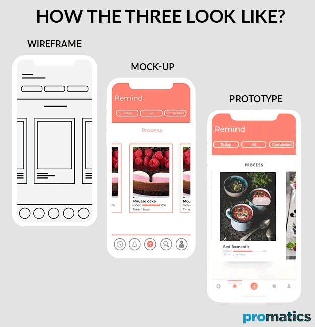

_(Taken from [Promatics.com](https://www.promaticsindia.com/blog/wireframes-vs-mockups-vs-prototype-how-they-differ-from-each-other) )_

Usually, the bigger challenge is to go from the UX model to the UI model. And here are some tips and tools that can help you to create your own amazing design!

You will use a design system and modify or customize some components using colors, fonts, icons, and/or illustrations.

# Tips for Creating Valuable UX
### Grid
You can place each element on the screen without measurements or proportions... but this is not a good idea. That's why we advise you to use a grid, a tool that will allow you to make design decisions regarding the positioning of interface elements and their margins.

Grids have been used since web development for defining the layout of elements on different screen sizes or breakpoints. However, it's a good practice for designing how elements will be distributed on mobile and thus improve the UX. You can use this technique starting from the creation of your wireframes.

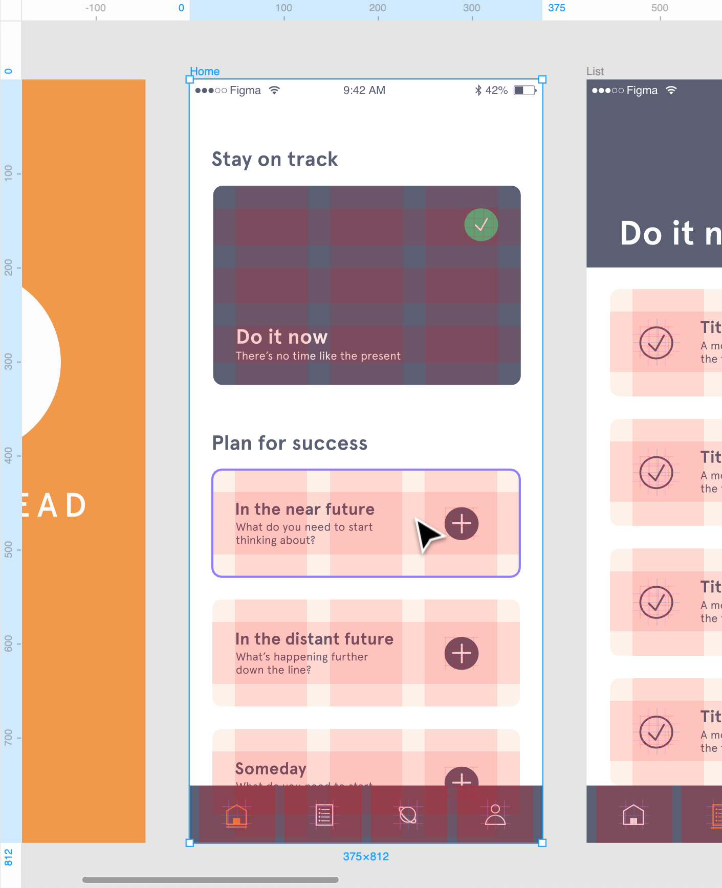

_(Taken from [Figma Learn](https://help.figma.com/hc/en-us/articles/360040450513-Create-layout-grids-with-grids-columns-and-rows) )_

### Values
Think about the values ​​you want to convey in your app; this will help in selecting the color palette and the type of illustrations. For example, if we want to convey 'elegance,' we will use colors like black and photography.

We will delve into this further in the following tips, but it can be ideal to consider this from a UX perspective and abstract it into UI.

# Tips for Creating Amazing UI
## Branding
Logos identify a brand. Typically, when creating a web/mobile app, we start from a brand design, which will facilitate the selection of typography and colors.
However, if we start from scratch, as in the case of the course, you can create your own logo to give a realistic touch to your applications. For this, we advise using applications like [Tailor Brands](https://www.tailorbrands.com/) and [Canva](https://www.canva.com/es_co/crear/logos/), which automatically generate logos. Alternatively, you can use flat-style illustrations from [Flaticon](https://www.flaticon.com/).

Just remember that less is more... don't complicate your logo too much. Take a look at this example of the evolution of the Burger King logo.

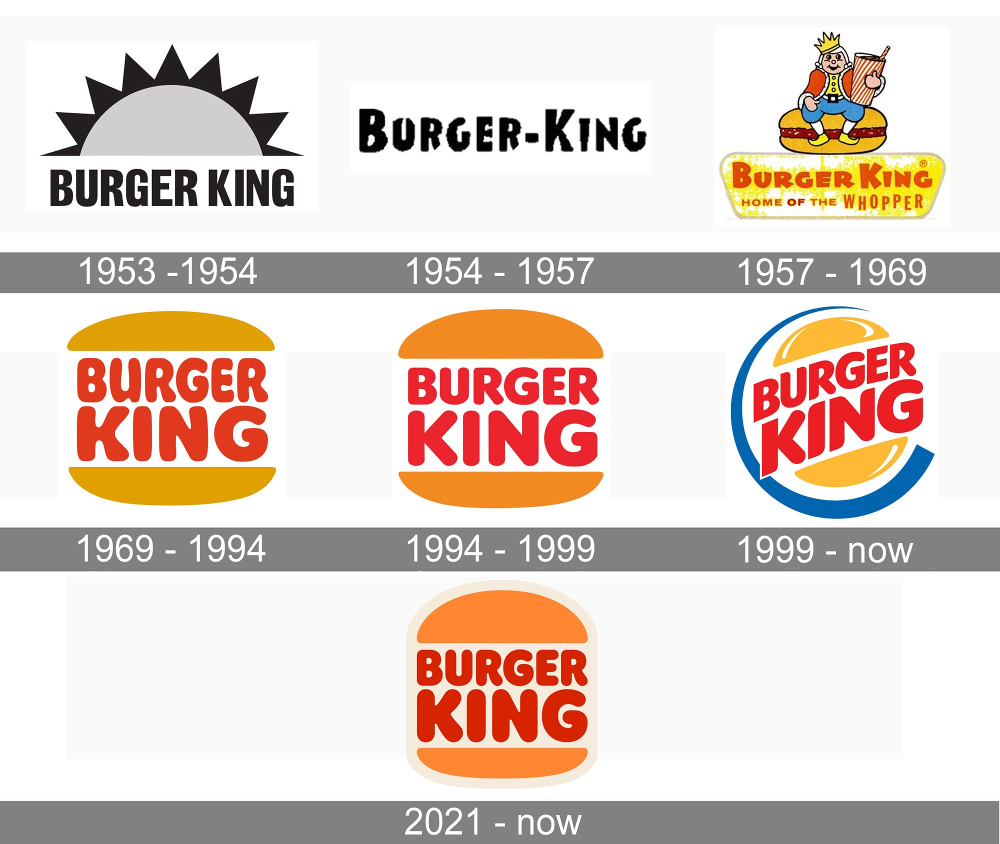

_(Taken from [1000Logos](https://1000logos.net/burger-king-logo/) )_

Additionally, in your logo, you will use the main colors of the application. Take a look at this example of the app [SeneCare](https://thesoftwaredesignlab.github.io/Senecare/) 

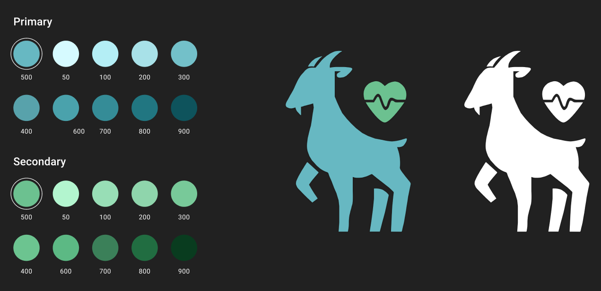

_(Taken from [SeneCare](https://thesoftwaredesignlab.github.io/Senecare/) )_

### Colors

You can choose random colors for your app and continue with the other work, but that's not a good idea. Choosing a color palette is a very important decision, and it depends on visual aesthetic facets such as the colorfulness, the emotions you want induce in your user (e.g., hope, passion), and the craftsmanship. In the field of color theory there are several strategies for defining a color palette (e.g., harmonies, monochromatic sets, etc.)

 > If you wanna learn more about color palettes generation check the following links: [Color Harmony: Why Hulk Wears Purple Pants](https://zevendesign.com/color-harmony-hulk-wears-purple-pants/), [How to design with monochromatic colors](https://www.canva.com/learn/monochromatic-colors/)

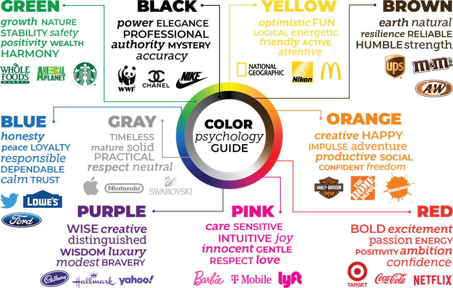

_(Taken from [shamrockcompanies.com](https://shamrockcompanies.net/the-psychology-of-color-in-brand-marketing/) )_

When choosing your color palette, keep in mind:

- Colors have meaning and psychology.
- It's important to select a color palette that identifies the site.
- Colors should enhance readability.
- Colors should help convey hierarchy.
- Colors will assist in highlighting important elements (interactions, conversion, sales...)

There are tools that can help you visualize and create your own color palettes and there are other tools that can help you choose the right colors. Here we list the ones that we used before (coolors is the coolest one):

- [Coolors](https://coolors.co/)

- [Adobe ColorCC](https://color.adobe.com/es/create/color-wheel/)

- [Color Palette](https://material.io/guidelines/style/color.html#color-color-palette)

- [FlatUI Color Picker](http://www.flatuicolorpicker.com/)

- [Color tool](https://material.io/color/#!/?view.left=0&view.right=0)

### Fonts

Selecting the right font is also a challenging task. Usually, you need to choose just two fonts. The first one should align with the brand, convey the intended values, and allow for highlighting titles and sections with greater hierarchy. We recommend searching for fonts based on what you want to convey. For example, in tools like [Dafont](https://www.dafont.com/es/) or [Google Fonts](https://fonts.google.com/), we can find these types of fonts for the second selection:

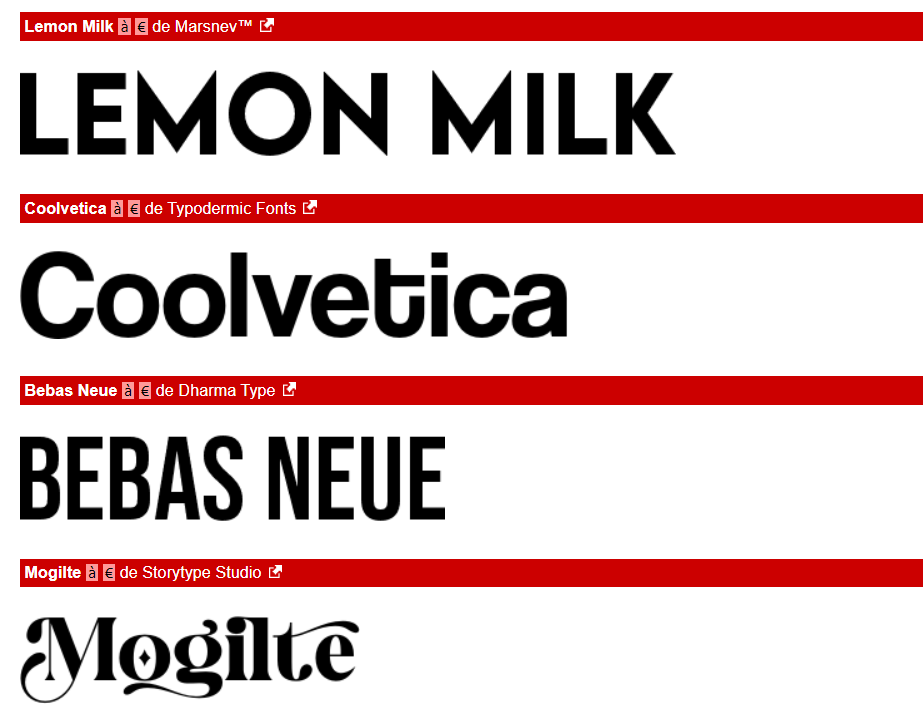

_(Taken from [Dafont](https://www.dafont.com/es/) and [Google Fonts](https://fonts.google.com/))_

The second font is for normal texts, notifications, dialogues, etc. It needs to be readable, basic, and in a sans-serif style, so it can be the default font in your platform's design system (e.g., Roboto for Android and San Francisco for iOS).

In the case of SeneCare, its main font is [Poppins Bold 700](https://fonts.google.com/specimen/Poppins), and its secondary font is [Roboto](https://fonts.google.com/?query=roboto)

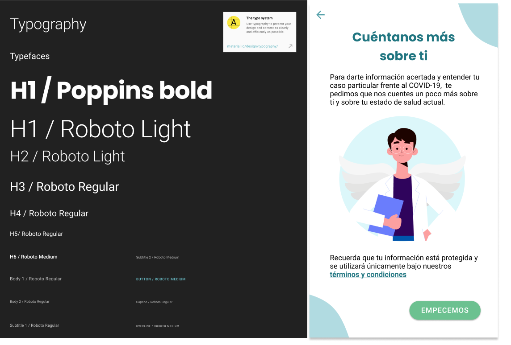

_(Taken from [SeneCare](https://thesoftwaredesignlab.github.io/Senecare/) )_

Other resources to find your fonts:

- [Font Pair - Helps you pair Google Fonts together](https://fontpair.co/)
- [Dafont](https://www.dafont.com/es/)
- [Google Fonts](https://fonts.google.com/)
- [Font Joy](http://fontjoy.com/)

## Graphic elements
The last tip, but not least, is about the use of graphic elements such as icons, illustrations, and photography. These elements will add an identity touch and contribute to consistency if selected strategically. Why? Well, just like fonts or colors, you should select a type for each of the graphic elements. For example, look at how many different types of icons you could use for the app's "home":

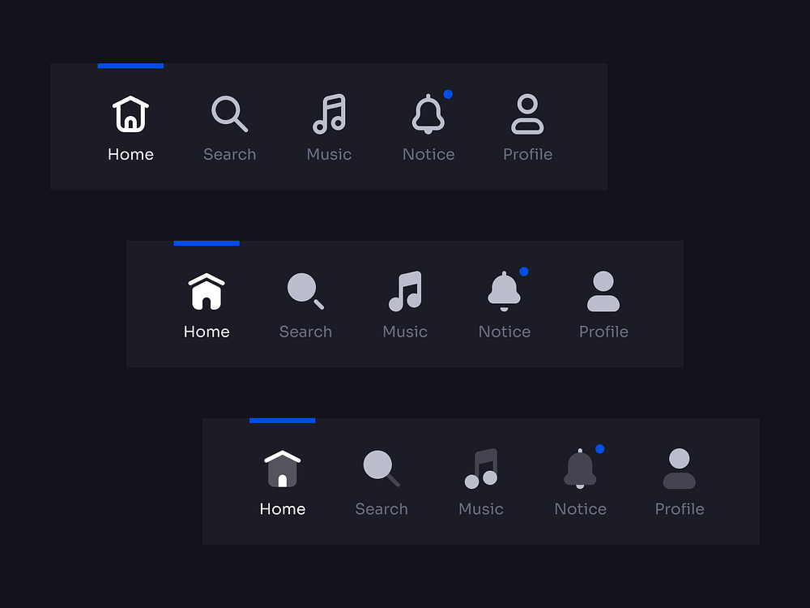

_(Taken from [Dribble by Dima Groshev](https://dribbble.com/shots/15518229-Tab-Bar-Navigation-Universal-Icon-Set-v2-0))_

So, if you decide to use 'filled' icons, use them throughout the entire app, but don't change the icon for each section, as this will affect consistency.

The same applies to illustrations and photography... but let's explore the types of art that exist in each case, so you can have a clear view and make a wise choice.

### Icons
There are many types of icons, but the important thing is that when you select the graphic style that best aligns with your app, stick with that and don't add several types.

Some well-known trends and types include:

#### Basic icons (filled and outline)

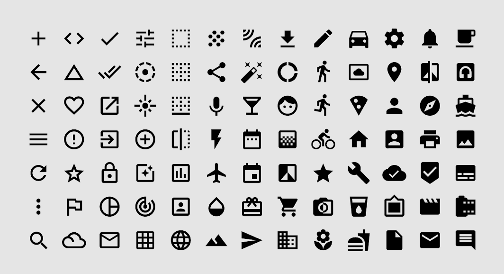

_(Taken from [Material Design](https://m2.material.io/design/iconography/system-icons.html#design-principles))_

> You can change the basic icons color, using your color palette. Usually with primary color, but it depends on the hierachy of the UI element that have the icon (ex: navigation, buttton, forms, etc)

#### Icons with shapes in color

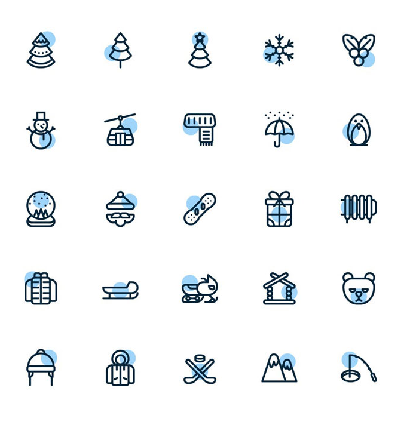

_(Taken from [Designshack](https://designshack.net/articles/trends/icon-design/))_

### Full-color icons

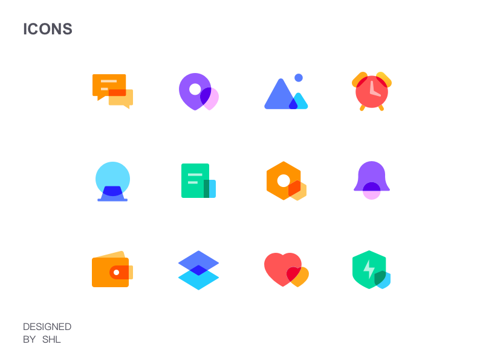

_(Taken from [Dribble by Lei S](https://dribbble.com/shots/6435172-Simple-Colour-Icon))_

You can find exportable icons to Figma and development tools at:
- [https://iconos8.es/icons](https://iconos8.es/icons)
- [https://m2.material.io/design/iconography/system-icons.html](https://m2.material.io/design/iconography/system-icons.html)
- [https://www.flaticon.com/](https://www.flaticon.com/)
- [https://fontawesome.com/](https://fontawesome.com/)

### Images

Like with the icons, there are many types of images that you can use. For example, photographs, 3D illustrations, vectors, or cartoons.

We recommend you to use a maximum of two types of images and to stick to the same type to maintain consistency.
Let's take a look at some examples of types.

#### 3d illustration

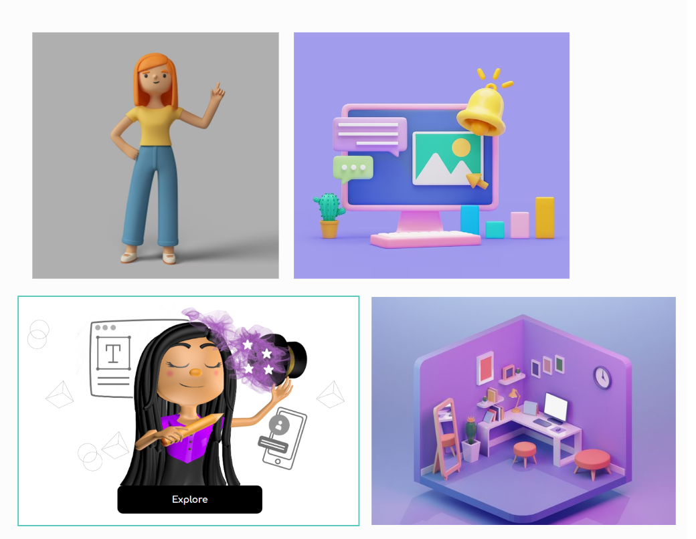

_(Collage by [Behance sources](https://www.behance.net))_

You recognize this:

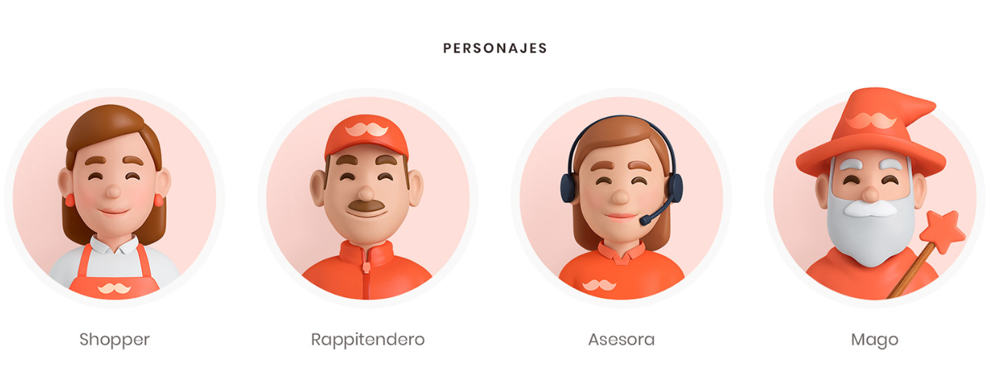

_(Taken from [Behance by Pablo Vargas](https://www.behance.net/gallery/100884771/Rappi-Elementos-3D/modules/581672407
))_

Which app uses this 3d art?... Yes! Rappi. Can you see how the art allows users to identify brands? ;)

#### Vector Illustrarions (2d)

_(Taken from [Freepick by Storyset](https://www.freepik.es/autor/stories) )_

You can consult many art styles and trend in:
- [2D / 3D illustrations, shapes, and photography (free and paid): ](https://www.freepik.com/)
- Free photos: [https://www.pexels.com/](https://www.pexels.com/) and [https://pixabay.com/](https://pixabay.com/)
- Flat illustrations (flat art): [https://www.flaticon.com/](https://www.flaticon.com/)

Consult resource for inspiration and references in:
- [Behance](https://www.behance.net/search/projects/mobile%20ui%20design)
- [Dribble](https://dribbble.com/tags/mobile-ui-design)

Note that in SeneCare, we only use vector images, which aim to convey a friendly language to explain each interaction or given information.

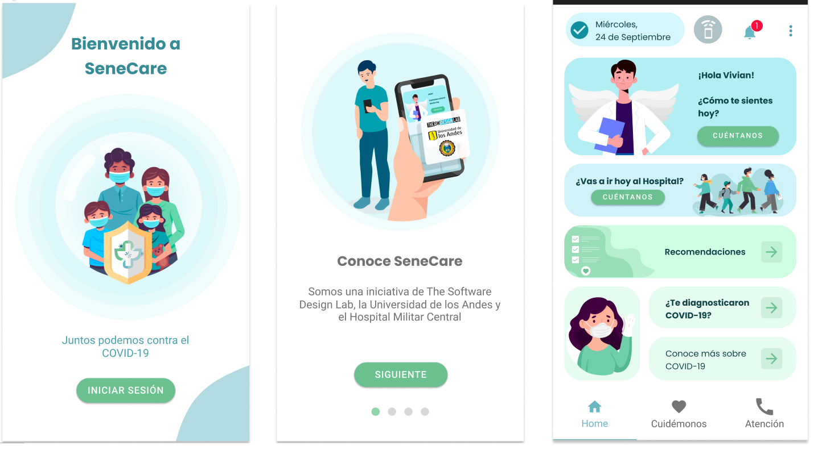

_(Taken from [SeneCare](https://thesoftwaredesignlab.github.io/Senecare/) )_

