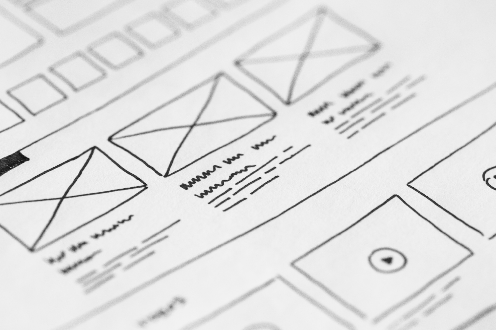

# 5.2 Designing-GUI-Mocks
___

Now that you understand the two dominant design metaphors and design systems for mobile apps, it is time for getting your hands dirty, by creating some GUIs.

But... we are engineers. We don't know about designing graphic interfaces, at least not the real ones... that is what you could be thinking. And the answer is YES! For most of us, we do not know about graphic design. Even so, we can create some good and real graphic interfaces to show a mockup of the app that we are working on.

_(Free picture from [https://www.pexels.com](https://www.pexels.com/photo/white-printer-paper-196645/). Creative Commons Zero (CC0) license)._

We can consider two main concepts in GUI design. The first one is UX, which focuses on perception and the sensations evoked by the product for the user. It encompasses interaction design, navigation, and all aspects related to User Experience (UX). The second concept is UI, which concentrates on the product's visual appearance, including branding, colors, layout, and graphic design... all the visual components that compose the User Interface (UI).

_(Taken from [synapseindia.com](https://www.synapseindia.com/technology/ui-ux-design-company.html))._

To design each element, we can use some models. First, the **UX model**; it represents the design of the navigation flow in the app. It answers the questions of _what_ we are going to show and _where_ we are going to show it. For example, it includes the location of the "buying" button, the distribution of the products, and architectural information such as the navigation bar and its content.
The second is the **UI model**, that is _how_ I want the user to see the things defined in the UX model. The final product of a UX Model is a **Wireframe** of the application, while the final product of the UI Model is a **Mockup** of the application. Check this article for more information about the difference between UX and UI [An App Entrepreneur’s Guide to Mobile UX and UI Design](http://www.launchpadapps.com.au/blog/mobile-app-ux-ui-design/)

_(Taken from [Promatics.com](https://www.promaticsindia.com/blog/wireframes-vs-mockups-vs-prototype-how-they-differ-from-each-other) )_

Usually, the bigger challenge is to go from the UX model to the UI model. And here are some advices and tools that can help you to create your own amazing design!

You will use a design system and modify or customize some components using colors, fonts, icons, and/or illustrations.

