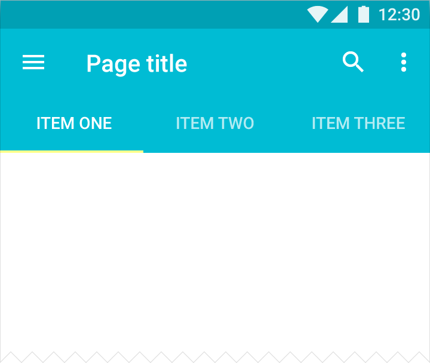
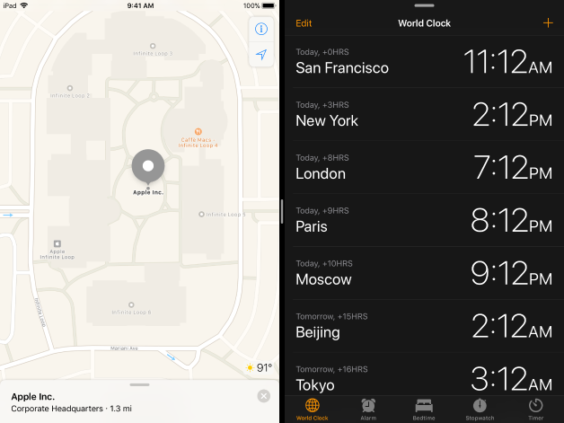
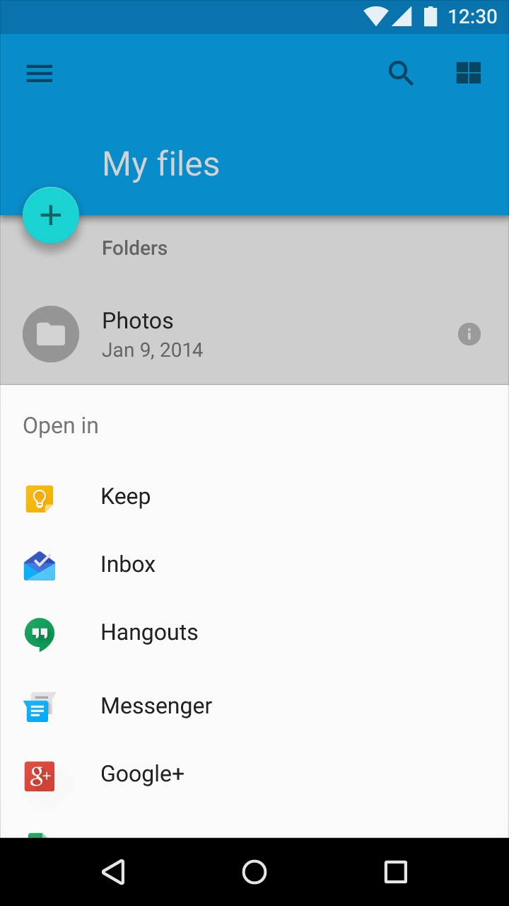
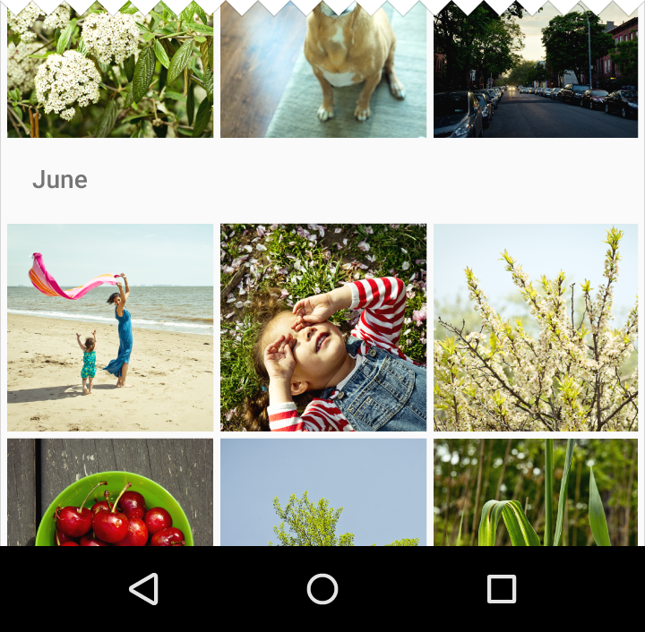

# 5.1 The platforms war: Android GUI components vs iOS GUI components
___

We were talking about the difficulty of having a generic design that is expected to work in both Android and iOS metaphors. So, in the following table you will find a comparison of some of the GUI components from Android and iOS metaphors. These are common components used in many applications and we want you to have an idea of how different or similar the components are. In each line of the table you can find an example (picture) of the component, a component description, and a link to a webpage in which you can see more information about each component.

| Component        | Android Component|iOS Component  |
|-----|:-------------:|:-------------:|
| Bottom Navigation Bar |  (ScreenShot from: [Material io](https://material.io/components/images/content/57018c7e5e35e656acbdca49193b1f11.svg))  It is called **Bottom Navigation Bar**, normally located on the bottom part of the screen. In some cases it could be found in the top of the screen if there is another element that is in the bottom part. If the device is a tablet, the bar is located in the left side of the screen. Check [Bottom Navigation Bar](https://material.io/guidelines/components/bottom-navigation.html) Material Guideline for more information.|   (ScreenShot from:[Apple Human Interface Guidelines](https://developer.apple.com/ios/human-interface-guidelines/images/TabBar.png))  It is called **Tab Bar**, also located in the bottom part of the screen. Is always visible unless the keyboard is activated. Check [Tab Bar](https://developer.apple.com/ios/human-interface-guidelines/bars/tab-bars/) Human Interface Guidelines.
| Actions Bar |   (ScreenShot from:[Material io](https://storage.googleapis.com/material-design/publish/material_v_12/assets/0Bx4BSt6jniD7RTFrbmpoWjRrY00/layout-structure-appbar-structure1.png))  It is called **App Bar** and you can use it to display the application menus. Usually, it includes the name of the _activity_ in which the user is in the moment. It has action buttons like search, save or return. If the application have a **Navigation Drawer**, the hamburger icon  is used, in the left top corner, to access it. Check [App Bar](https://material.io/guidelines/layout/structure.html#structure-app-bar) Material Guideline for more information.|  (ScreenShot from:[Apple Human Interface Guidelines](https://developer.apple.com/ios/human-interface-guidelines/images/NavigationBar.png))  It is called **Navigation Bar** and contains the buttons related to relevant actions for the _view_ in which the user is. The actions like search, add, or edit are located in the right side. And the navigation button to go to the previous view is on the left side. If you are in the first view, nothing should be in the left side of the bar.Check [Navigation Bar](https://developer.apple.com/ios/human-interface-guidelines/bars/navigation-bars/) Human Interface Guidelines.
| Search Bar |    (ScreenShot from:[Material io](https://material.io/guidelines/patterns/search.html#search-in-app-search)) It is not an additional component; you can use the search feature as part of the **App Bar**. When you click on the icon, the elements of the **App Bar** are replaced by a **Search Bar**. Check [Search Bar](https://material.io/guidelines/patterns/search.html#search-in-app-search) Material Guideline for more information.|   (ScreenShot from:[Apple Human Interface Guidelines](https://developer.apple.com/ios/human-interface-guidelines/images/SearchBar_Prominent.png)) The **Search Bar** in iOS is an additional component that is commonly located under the **Navigation Bar**. Check [Search Bar](https://developer.apple.com/ios/human-interface-guidelines/bars/search-bars/) Human Interface Guidelines.|
| Phone Status Bar |  (ScreenShot from:[Android](https://www.android.com/versions/oreo-8-0/))  It shows important information of the state of the phone, like the battery charge level and the time. Is normally always in the top of the phone unless multimedia content is shown. Since _Lollipop_, the color of this bar changes based on the _theme_ colors of each application.|   (ScreenShot from:[Apple Human Interface Guidelines](https://developer.apple.com/ios/human-interface-guidelines/bars/status-bars/))  It  shows important information of the state of the phone. The status bar is normally always in the top of the phone unless multimedia content is shown. Check [Status Bar](https://developer.apple.com/ios/human-interface-guidelines/bars/status-bars/) Human Interface Guidelines.
| Phone Navigation Bar  |    (ScreenShot from:[Android](https://i.stack.imgur.com/aXV7K.png))  It is called **Navigation Bar** or **Android Navigation Bar** and it is available only in phones that do not have those buttons outside of the screen. The buttons in the navigation bar allows you to return to the last _activity_, go to the main phone menu, and check all the active apps.|This type of bar does not exist in Apple devices.
| Tabs  |   (ScreenShot from:[Material io](https://storage.googleapis.com/material-design/publish/material_v_12/assets/0B6Okdz75tqQsOUdyb0FjQTJTdlk/components-tabs-usage-mobile3.png))  The Tabs can be used to filter the results of a search or to divide content in the same _activity_. There should not be more than 4-5 tabs in a GUI. Check [Tabs](https://material.io/guidelines/components/tabs.html) Material Guideline for more information.| (ScreenShot from:[Apple Human Interface Guidelines](https://developer.apple.com/ios/human-interface-guidelines/images/Split_View.png))  **Split Views**  and **bottom tab bars** (already described before) are the counter part of the Android tabs for iOS. Split views manage the presentation of two side-by-side panes of content, with persistent content in the primary pane and related information in the secondary pane. Check [Split Views](https://developer.apple.com/ios/human-interface-guidelines/views/split-views/) Human Interface Guidelines.
| Action Panels |  (ScreenShot from:[Material io](https://storage.googleapis.com/material-design/publish/material_v_12/assets/0Bzhp5Z4wHba3VW9HUDhtTE5XZVk/components-bottomsheets-usage2.png))  They are called **Bottom Sheets** and are an alternative to simple menus and dialogs; bottom sheets can show content from another application and you can even use them to share content between apps. Check [Bottom Sheets](https://material.io/guidelines/components/bottom-sheets.html) Material Guideline for more information.| (ScreenShot from:[Apple Human Interface Guidelines](https://developer.apple.com/ios/human-interface-guidelines/images/Action_Sheets.png))  They are called **Action Sheets**. They are alerts generated as a response to an action, which allows the user to start a task or confirm an action. In small windows they apear moving up from the bottom of the screen. In bigger screens they apear as a pop-up. Check [Action Sheets](https://developer.apple.com/ios/human-interface-guidelines/views/action-sheets/) Human Interface Guidelines.
| Sharing Panels |  (ScreenShot from:[Material io](https://storage.googleapis.com/material-design/publish/material_v_12/assets/0Bzhp5Z4wHba3UzA3RDctV2k0YUk/components-bottomsheets-modal2.png))   The **Bottom Sheets** can be used as sharing panels.| (ScreenShot from:[Apple Human Interface Guidelines](https://developer.apple.com/ios/human-interface-guidelines/images/Activity_View.png))  They are called **Activity Views**. An activity is a task, such as Copy, Favorite, or Find, that’s useful in the current context. They are normally used to show actions to share content. Activity views are visualy similar to an **Action Sheet**, but in this views you can use icons and default taks. Check [Activity Views](https://developer.apple.com/ios/human-interface-guidelines/views/activity-views/) Human Interface Guidelines.
| Dialogs |   (ScreenShot from:[Material io](https://storage.googleapis.com/material-design/publish/material_v_12/assets/0Bzhp5Z4wHba3UzA3RDctV2k0YUk/components-bottomsheets-modal2.png)) They are called **Dialogs** and allow you to present a floating window on top of the actual activity. A dialog usually has two buttons, one positive and one negative, but you can create an xml file (i.e., a layout file) and inflate it inside the component to obtain personalized results. Check the [Dialogs](https://material.io/guidelines/components/dialogs.html) Material Guidelines for more information.| (ScreenShot from:[Apple Human Interface Guidelines](https://developer.apple.com/ios/human-interface-guidelines/images/Alerts.png))  They are called **Alerts** and contain important information of the application or the system status. Usually, they ask for an user answer (Accept / Cancel, Allow / Don’t Allow…). They appear in the middle of the screen. The alerts visual appearance can not be personalized. Check [Alerts](https://developer.apple.com/ios/human-interface-guidelines/views/alerts/) Human Interface Guidelines.
| Grid Lists  |   (ScreenShot from:[Material io](https://storage.googleapis.com/material-design/publish/material_v_12/assets/0Bx4BSt6jniD7ZVpFMDhCbXlXaEk/components-grids-behavior1.png)) The **GridList** is designed to organize the content in a list, with or without an specific order. The elements of the list are usually of the same size. Check [Grid Lists](https://material.io/guidelines/components/grid-lists.html) Material Guideline for more information.|  (ScreenShot from:[Apple Human Interface Guidelines](https://developer.apple.com/ios/human-interface-guidelines/images/Alerts.png))  They are called **Collections** and are designed to show the content in a orderer set, like pictures in a grid. Check [Collections](https://developer.apple.com/ios/human-interface-guidelines/views/collections/) Human Interface Guidelines. Grids can be also created by arranging components in nested [stack views](https://developer.apple.com/documentation/uikit/uistackview).
| Image Containers  |    They are called **Image Views** and show an image. The image can be the whole screen or just part of it. You can define a specific size proportion or use the original size of the image. Check [Image View](https://developer.android.com/reference/android/widget/ImageView.html) documentation for more information.|  (ScreenShot from:[Apple Human Interface Guidelines](https://developer.apple.com/ios/human-interface-guidelines/views/image-views/))  They are also called **Image Views** and show a whole screen image. You should try to ajust the dimensions of the image to fix the screen dimensions. Check [Collections](https://developer.apple.com/ios/human-interface-guidelines/views/image-views/) Human Interface Guidelines.
| Pagers Views  |     It is called **ViewPager** and allows you to navigate between pages like in a book. A ViewPager does not have advance animations, it simplily comes whit a scroll to the right, left, up or down. You can add animations by  defining them in XML.  Check [View Pager](https://developer.android.com/reference/android/support/v4/view/ViewPager.html) documentation for more information.|  (ScreenShot from:[Apple Human Interface Guidelines](https://developer.apple.com/ios/human-interface-guidelines/views/pages/))  They are called **Pages** or **Page View Controllers** and allow you to navigate between pages of content, like calendars or documents. They support two types of transitions: Scroll or page-curl. Check [Pages](https://developer.apple.com/ios/human-interface-guidelines/views/pages/) Human Interface Guidelines.
| Scroll View  |     It is called **ScrollView** and allows you to show content that does not fit in the visual area of the screen, and have to be navigated using scroll, zoom, pinch, drag, flick, or other interactions.  Check [View Pager](https://developer.android.com/reference/android/widget/ScrollView.html) documentation for more information.|  (ScreenShot from:[Apple Human Interface Guidelines](https://developer.apple.com/ios/human-interface-guidelines/images/Scroll_View.png))  It is called **Scroll Views** and allows you to show content that does not fit in the visual area of the screen, and have to be navigated using scroll, zoom, pinch, drag, flick, or other interactions.  Check [Scroll Views](https://developer.apple.com/ios/human-interface-guidelines/views/scroll-views/) Human Interface Guidelines.
| Lists  |   (ScreenShot from:[Material io](https://developer.apple.com/ios/human-interface-guidelines/views/tables/)) There are multiple ways of implementing a list; the most common way of doing it is using **List View**, but the use of that component has a negative impact in the application performance, that is why Android encourage developers to use **Recycler Views** instead. Check [ Lists](https://material.io/guidelines/components/lists.html) Material Guideline for more information.|   (ScreenShot from:[Apple Human Interface Guidelines](https://developer.apple.com/ios/human-interface-guidelines/views/tables/)) They are called **Tables** and show organized data in lists and groups. The content is shown in one column and is scrollable. Check [Tables](https://developer.apple.com/ios/human-interface-guidelines/views/tables/) Human Interface Guidelines. You can also create the "list view" appearance by using stack views.
| Text Boxes  |   (ScreenShot from:[Material io](https://material.io/guidelines/components/text-fields.html)) In the most recent versions of Android, this component is called **Text Field**. Besides letting the user type a string of characters, it has integrated methods for animations an error messages. Check [ Lists](https://material.io/guidelines/components/text-fields.html) Material Guideline for more information.|   (ScreenShot from:[Apple Human Interface Guidelines](https://developer.apple.com/ios/human-interface-guidelines/views/text-views/)) It is called **Text View** and lets you show paragraphs of text with styles (Bold, Italic, Underscore, etc...). If the text is editable, the keyboard activates when the user selects the text view. Check [Text Views](https://developer.apple.com/ios/human-interface-guidelines/views/text-views/) Human Interface Guidelines.
| Pickers |  (ScreenShot from:[Material io](https://storage.googleapis.com/material-design/publish/material_v_12/assets/0B3321sZLoP_HVWZOVkdRQlJEdDg/components-pickers-date1.png))   They are implemented by inflating an XML layout inside a **Picker**. The operating system includes some predefined XMLs, like the TimePicker XML and the DatePicker XML. Check [ Picker](https://material.io/guidelines/components/pickers.html) Material Guideline for more information.|  (ScreenShot from:[Apple Human Interface Guidelines](https://developer.apple.com/ios/human-interface-guidelines/controls/pickers/))  They are called **Pickers** and always includes at least a list from which the user can select up to one item. The operating system includes the DatePicker that can include an hour picker. Check [Picker](https://developer.apple.com/ios/human-interface-guidelines/controls/pickers/) Human Interface Guidelines.|

There are many more UI components. Take a look to the following webpages to learn more about them:

- [Material io - Catalog of components (Android)](https://material.io/components/android/catalog/)
- [Material io - Guidelines (Android)](https://material.io/guidelines/)
- [Android developer's documentation](https://developer.android.com/)
- [Apple Human Interface Guidelines](https://developer.apple.com/ios/human-interface-guidelines/overview/themes/)
- [Apple developer's documentation](https://developer.apple.com/develop/)
