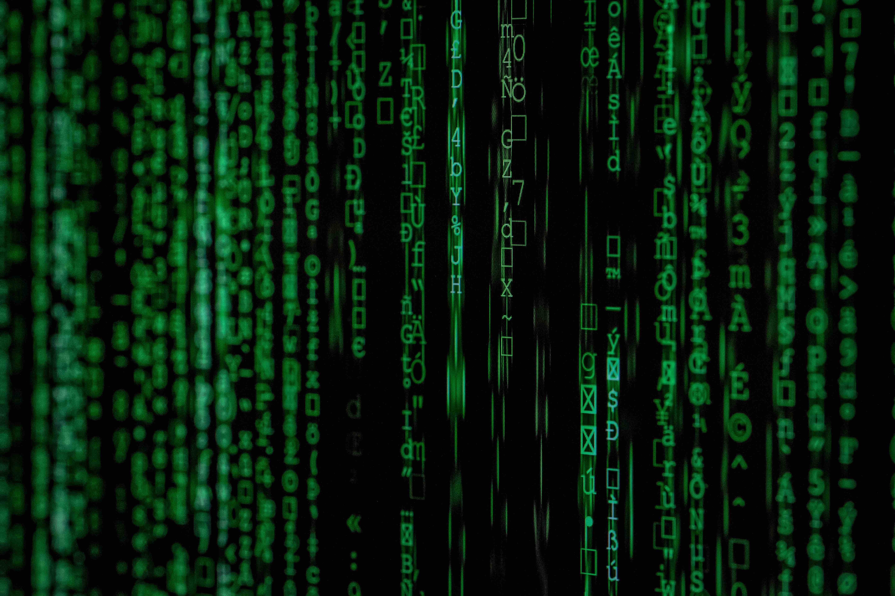
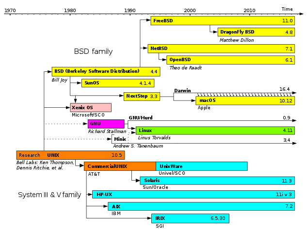

# Chapter 6: About mobile operating systems ... and other deamons
\(By Mario Linares-Vásquez\)

---

_(Free photo by Markus Spiske on [Unsplash](https://unsplash.com/photos/iar-afB0QQw))_

>Once upon a time, everything was hardware, but the hardware itself was nothing. One day, the hardware met the OS and fall in love.... with the OS. Since then, hardware and OS have been living together until the end of the times.

Wow !!! Such a poem !!! Operating systems are the bosses that control everything in a computing system. And mobile devices are not the exception. Operating systems are the jewel of software development because of their complexity, and because without them, there is no way to use modern hardware-based computing systems. The development of Operating Systems has inspired and promoted several foundational concepts in computer science, software development, networking, distributed systems, among other fields. Unfortunately, studying the evolution of Operating Systems is out of scope in this book, however, in this chapter we will focus only on mobile operating systems. In particular, the operating systems for the two dominant mobile platforms: Android and iOS. We will also briefly see how Flutter works under the hood.

> Briefly check the [timeline of operating systems](https://en.wikipedia.org/wiki/Timeline_of_operating_systems) to have an overview of the operating systems evolution. Did you find Android and iOS on the list?

 
Both mobile OSs (i.e., Android and iOS) are "relatives" because they have an old ancestor in common: UNIX.

_(Image from [Wikipedia](https://en.wikipedia.org/wiki/Darwin))_

Did you find Android and iOS in the UNIX family figure? Go to next section to discover what is the existing relationship between Android and iOS.
