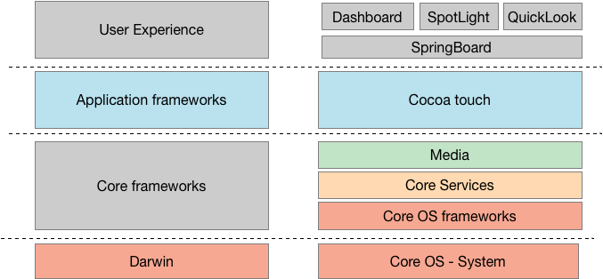
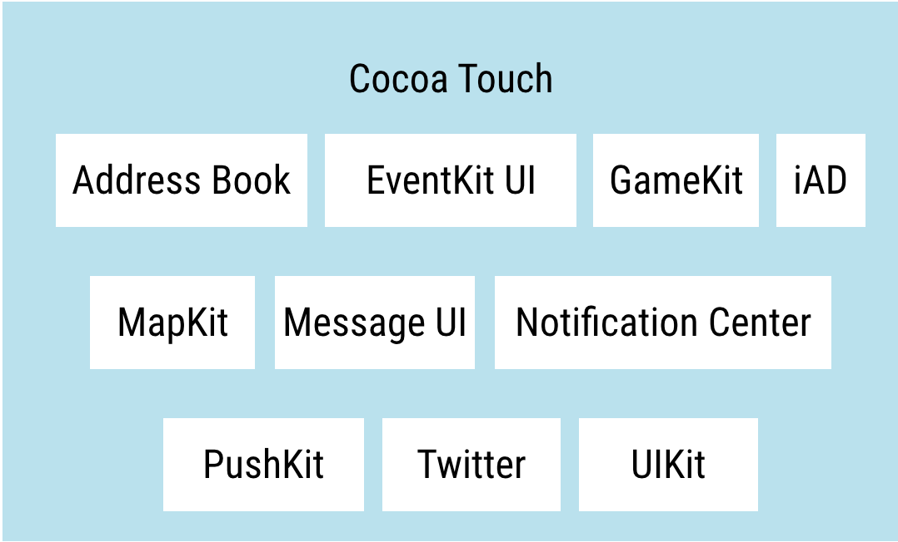
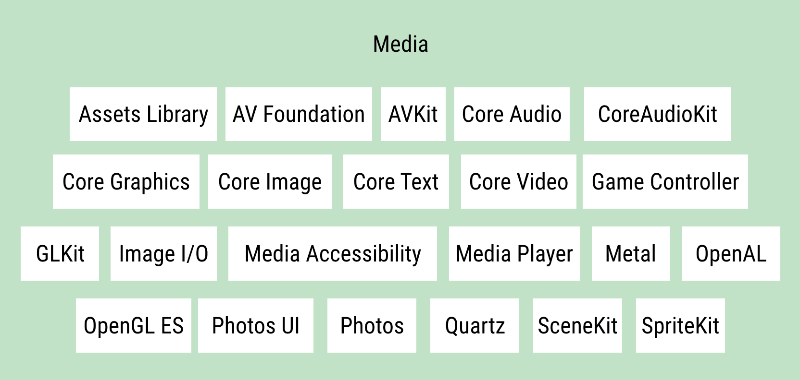
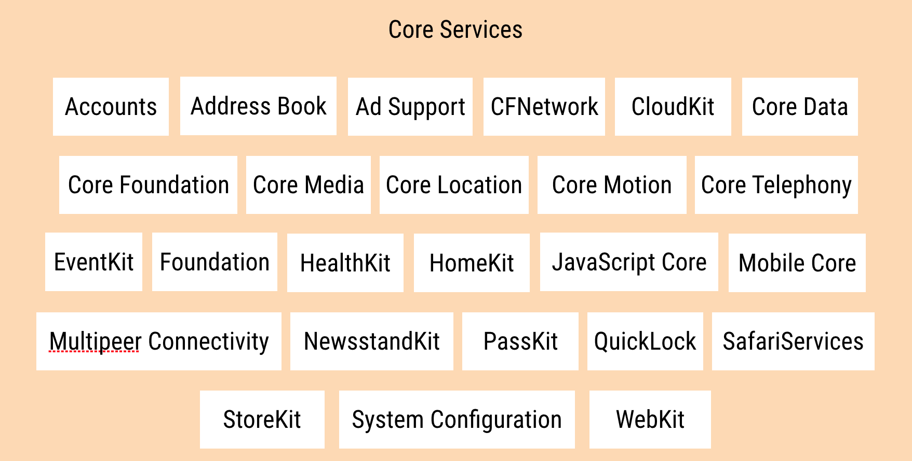
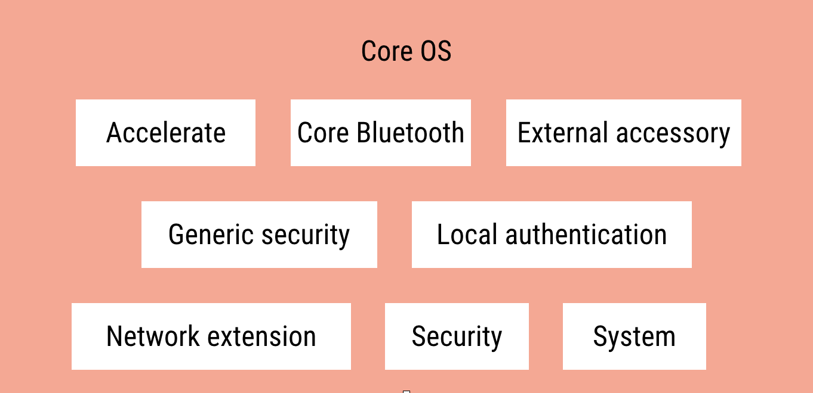

# 6.2 iOS son of Darwin? or is it iOS son of UNIX?
\(By Mario Linares-Vásquez\)

---

iOS is the operating system designed by Apple for its iPhone and iPad devices. watchOS is the OS for the Apple watch devices. iOS is a kind of brother of Mac OS X (the OS for the laptops) because both have as origin the Darwin OS -- an open source OS- -- that was derived from NextStep.  In reality, iOS is the same Mac OS X but with changes in memory management, kernel compilation, the system GUI, among others.  

> The first version of iOS was released in 2007.

The internals of iOS are very interesting and complex. The figure at the beginning of the section depicts two abstraction levels of the iOS stack where each one of the boxes to the right has is own set of subsystems. iOS is similar to Android because both have a software stack built on top of a kernel, however, the apps programming models are very different (from the point of view of the OS stack). For instance, in the case of Android, the apps use the Android API to invoke the services and managers in the Android Framework layer. In the case of iOS, the apps can use any of the "frameworks" available in the Application and Core frameworks layers (i.e., any framework in the Cocoa Touch, Media, Core Services, and Core OS layers). A **framework** in iOS is a bundle, i.e., a set of libraries and their corresponding files. For example, the Cocoa touch layer includes the [`UIKit`](https://developer.apple.com/documentation/uikit), [`EventKit`](https://developer.apple.com/documentation/eventkit)and [`GameKit`](https://developer.apple.com/documentation/gamekit) frameworks, and the Media layer has the [`SceneKit`](https://developer.apple.com/documentation/scenekit), [`SpriteKit`](https://developer.apple.com/documentation/spritekit), and [`CoreGraphics`](https://developer.apple.com/documentation/coregraphics) frameworks.

> If an iOS app can use any of the Application or Core frameworks, why are the sublayers (cocoa, media, services, core os) organized as a stack? Because each sublayer provides a different abstraction level, i.e., the upper in the stack, the higher the abstraction level provided to the developers and the lesser low-level programming is required; the lower in the stack, the closer to the hardware the API is. Some of the frameworks in the uppers layers rely on the frameworks in the lower layers. However, remember that a developer can use any of the frameworks, independently of how close it is to the top of the stack.

A brief description of the iOS layers are the following:

- **User experience:** is the iOS user interface and the applications the user interacts with. The dashboard, spotlight, spring board (i.e., the home screen manager) are components of this layer.

- **Cocoa touch**: contains the key frameworks required to build an iOS app. The frameworks are mostly written in Objective-C.

- **Media:** frameworks for graphics, audio and video. Provide multimedia-related capabilities to iOS apps. The Media layer includes libraries such as [`Quartz`](https://developer.apple.com/documentation/quartz), `OpenGL`, [`Metal`](https://developer.apple.com/documentation/metal), `Open AL`, and [`Media Player`](https://developer.apple.com/documentation/mediaplayer).

- **[Core Services](https://developer.apple.com/documentation/coreservices):** provide access to system services, low-level routines, models, collections and data types, and wrappers (e.g., the Foundation framework has wrappers for the Core Foundation framework).

- **Core OS - Frameworks:** low level features and services required by the upper layers, such as image processing, linear algebra, complex and big numbers, networking, memory management, file system, threads, authentication, sensors.

iOS has a hybrid open source kernel called XNU (X is Not Unix); XNU combines the Mach microkernel developed by Carnegie Mellon University (CMU) with components from the 4.3BSD monolitic kernel. The XNU kernel is part of the Darwin layer in iOS and MacOS X. It is worth noting here that Darwin is the only Open Source part of iOS.

>Dude, but what is micro-kernel and a momolithic one?

To understand the differences between monolithic and microkernels you must understand the difference between user and kernel modes/spaces first. Kernel space is the memory region where kernel processes run, and user space is the memory region when user processes run. In a monolithic kernel, user and kernel processes run in the same memory space and the kernel is a single static binary file; therefore, the kernel is bigger but faster because everything runs as a single large process in the the same address space (i.e., kernel space) . However, if there is a crash in a service then the entire system will fail. Note that it does not mean that the OS can not be extended because it is a static binary file; monolithic kernels are dinamycally extended with loadable kernel modules that implement interfaces in the kernel. This feature opens a door for security issues because dynamic modules (e.g., the ones created by OEMs) run in the kernel space with full access to the resources of the computer [^1]. LINUX and UNIX are examples of monolithic kernels.

In the case of microkernel, the different modules are executed in different space addresses; some of the modules are executed in kernel space, some others are executed in user mode. Because of the separation, the kernel is more robust and services can crash without taking down the whole system. Micokernels are more extensible than monolithic kernels because the modules running on user space can be modified without restarting the kernel [^1]. An example of micro-kernel is Mach.

If you are interested on going deeper into the internals of the Android OS and iOS, we recommend you to read the "Android Hacker's Handbook" by Drake et al. and the "Mac OS X and iOS Internals" book by Jonathan Levin.
>  Do you have a mac? Type the `uname -a`command in the terminal.

__

[^1]: Jean Bacon and Tim Harris. Operating Systems, concurrent and distributed software design. Addison Wesley, 2003
