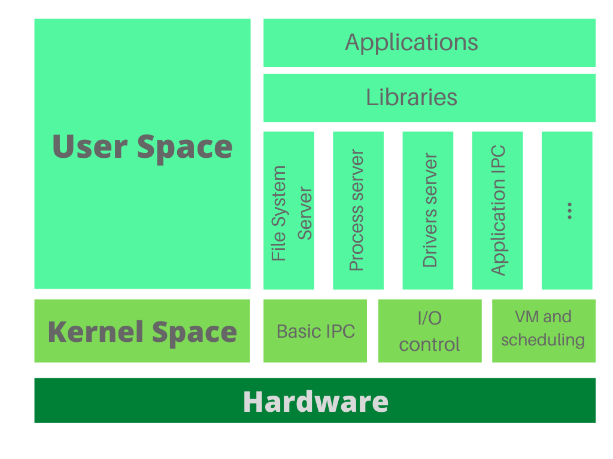

# 6.3 Kernels
\(By Juan David Vega and Mario Linares-Vásquez\)

---

As the core of an operating system, the kernel manages the most critical resources and works as a bridge between application software and the computer's hardware. Remember that a kernel is a program that can be written in one or several programming languages; for example, the Linux kernel is mostly written in C and assembler.

From a big picture perspective, an operating system defines two virtual memory spaces: the kernel space and the user space. This segregation is necessary to protect the system resources. As we will explain later, the segregation strategy (what goes under which space) depends on the architecture.

## Monolithic kernel

Currently, there are two main kernel architectures: monolithic kernel and microkernel. The older approach is the monolithic kernel that runs every management component in kernel space. As shown in the following image, a monolithic architecture is created in a layered fashion, from the fundamental process management at the bottom to the user applications at the top.

It is important to notice that, in this case, both user and kernel services are under the same address space. In fact, at the end of the day, a monolithic kernel is a single static binary file. However, we still have a clear inner segregation between kernel and user virtual spaces; for this reason, if a user service needs a kernel capability it has to make a special request: a system call (e.g. creating a new file on the hard drive). 

Having all the management components in a single place introduces several drawbacks. First, if you want to add new features or services, you have to carefully modify several —possibly interconnected— parts of the kernel source-code; and of course, you must recompile the whole kernel for every small change. Even worse than that, any service failure (user or kernel services included) can cause a complete system failure because, again, everything is running in a single address space.

Some examples of operating systems that follow the monolithic architecture are OpenVMS, Linux, BSD, SunOS, AIX, and XTS-400. At present, those operating systems allow dynamic loading of modules (without modifying its underlying architecture) to provide a more flexible way of extending their capabilities at runtime.

## Microkernel

At the end of the '80s, the concept of microkernel architecture appeared to overcome the mentioned issues of the monolithic approach. In particular, the limitations of extensibility and maintainability, the susceptibility of failure spreading, and the large size that comes with an all-in-one kind of system.

The microkernel approach aimed to reduce the kernel size and avoid the usage of the same address space for user and kernel services. Instead of having layers to take care of every management concern of the system, the kernel space was limited to some small fine-grained responsibilities. Specifically, basic process inter-communication, I/O control, virtual memory, and essential scheduling. The rest of the activities were put in user space in the form of regular processes (as so-called servers). There is a server for managing the file system, one server for drivers, another for application management, and so on. Since those tasks don´t run in kernel space anymore, the idea of context switching was introduced to allow user servers to enter privileged mode. 

Due to such improvements, the microkernel is easily extendible, the size reduced, and, if one server has a failure, it won't cause a generalized crash on the system. However, under this architecture, communication between components implies an overhead that diminishes the performance of the operating system.

Some examples of operating systems that follow the microkernel architecture are QNX, L4Linux, Mach, and Symbian.

## Comparison by implementation strategies

The following comparison criteria describe several differences between the two architectures.

| Criterion      | Monolithic kernel approach | Microkernel approach|
| ------------------- | -------------------------- | ------------------ |
| Inter-process Communication | 1. Signals: predefined numerical constants (e.g. KILL) sent to a process to notify specific events.   2. Sockets: endpoints to sending and receiving data. A process can bind to one or more sockets to listen or produce event messages (a protocol is needed so that they can understand the contents and produce the expected outcome)  | Message queues: priority queues to store all incoming messages. A process consumes from one or more queues and processes the messages to produce the expected outcome based on the underlying event |
| Memory management   | Everything runs in kernel space, so memory management is straightforward |The main privileges and memory control primitives are held in the kernel space, but the responsibility of memory allocation and management is passed to specific servers (so they must enter privileged mode to perform the corresponding actions)  |
| I/O communication   | Device drivers run inside the kernel space (hardware interrupts are handled directly). More advanced monolithic kernels admit the dynamic loading of driver components in the form of modules |The kernel space implementation only ensures communication with the hardware, but the actual drivers are managed by user space servers |
| Extensibility   | New features, bug fixing, or updating component implies the recompilation of the whole kernel  |High isolation of components. Only the affected parts are modified and the kernel space remains undisturbed (since the vast majority of changes are performed over the user space servers)|

## What about the new players? Where do they stand?

You have already studied the two big players in the mobile industry: Android and iOS. However, as you might know, the Huawei team presented a new operating system in 2019: the HarmonyOS. This OS is focused on highly interoperable capabilities because it was developed to work on a wide range of IoT devices (although it can support mobile and desktop devices as well). For this reason, they decided to use the microkernel approach as the foundation of the system. The rationale behind this decision is that a microkernel architecture facilitates the addition of user space servers while keeping a compact universal kernel space with the most basic control primitives. That opens the possibility of creating different servers/modules to manage specific features of the different IoT devices and including them as convenient, avoiding an unnecessarily large base kernel.

On the other hand, Xiaomi developed an Android-based operating system for mobile devices: the MIUI OS. The initial release was made in 2010. Since it is a fork of the Android OS, MIUI is a monolithic kernel, and its architecture follows the Android stack shown in the 6.1 section of this book.

Finally, another important operating system, presented in 2016, is Google's Fuchsia OS. It is focused on IoT devices (as HarmonyOS) and does not use the Linux kernel (unlike Android). Instead, Google developed a whole new kernel for Fuchsia, Zircon, that evolved from a microkernel called LittleKernel. However, as the [official site](https://fuchsia.dev/fuchsia-src/concepts) specifies, Fuchsia itself does not follow a microkernel approach:

> Although Fuchsia applies many of the concepts popularized by microkernels, Fuchsia does not strive for minimality. For example, Fuchsia has over 170 syscalls, which is vastly more than a typical microkernel. Instead of minimality, the system architecture is guided by practical concerns about security, privacy, and performance. As a result, Fuchsia has a pragmatic, message-passing kernel.