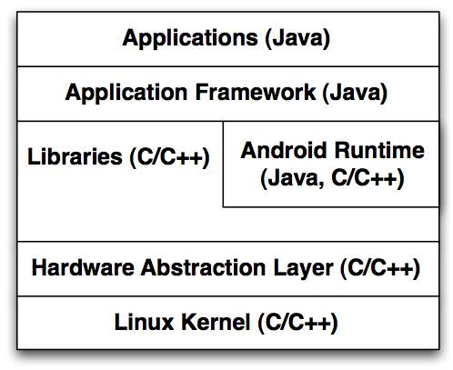

# 6.1 The Android OS ... son of LINUX
\(By Mario Linares-Vásquez\)

---

The Android OS is an open source mobile operative system developed by Google and based on the Linux Kernel. It is composed of a set of architectural layers following a software stack model (i.e., there is no communication between layers that are not neighbors in the stack), having the Linux Kernel as the foundation, and an Applications layer as the closest interaction point for the end users. The first version of Android was released in 2008 and as of today 29 versions of the OS have been released.

> The kernel is the core of an OS that provides main tasks such as process, device, and resources management. Kernels can follow a microkernel, monolithic, or hybrid architecture.  The latter one combines both, microkernel and monolithic architectures. The Linux kernel is a [monolithic kernel](https://en.wikipedia.org/wiki/Monolithic_kernel).

In the Android OS, each layer is composed of subsystems/components mostly implemented in Java and C/C++.

The Figure above depicts the Android OS software stack (including predominant implementation languages). Some of those components are developed by third-party contributors of the Android open source project (AOSP), such as original equipment manufacturers (OEM) and Linux contributors; for instance, the **Libraries layer** (a.k.a., native libraries) contains an Android’s standard C library named Bionic, and the **Runtime layer** includes an independent Java Library implementation (Apache harmony or an OpenJDK-based implementation for newer OS versions), both developed by third-party contributors.

The Android OS stack is composed of the following layers:

- **Applications:** this layer contains software running on the device that uses the Android APIs to implement specific features, like geo-localization. The components in this layer are the mobile “apps” (mostly developed by Google) that are shipped with the Android OS and we use daily such as Browser, Calendar, Telephony, Messaging, and Settings; these apps are mostly written in Java and the Android API, although some apps can include native C/C++ code.

- **Android Framework:** provides apps (and developers) with the building blocks and common tasks required for exposing/using device- and Android-specific features such as managing UI elements and sensors. The Android Framework contains the Android APIs used by Android apps, and the Android managers (a.k.a., services) that implement the services and features exposed by the APIs; examples of these services are the View System and the Activity Manager that are in charge of managing the different views and view groups available in the GUI, and of controlling applications life cycle and the activity/task stack, respectively. This layer is mostly implemented in Java.

- **Runtime:** contains the Virtual Machine (Dalvik/ART) and the core libraries required for the execution of apps and services on the device. The Runtime layer is required for ensuring apps portability across different devices. Examples of the core libraries in the Runtime layer are the independent implementation of Java used by Android
(e.g., Apache Harmony), and the Bouncy castle library for cryptography.

- **Native Libraries:** provide low level functionalities and computational intensive services required by the Android Framework and the Runtime, such as the Bionic
libc library, the WebKit browser engine, OpenGL, SSL, and the Media Framework.
The libraries are written in C/C++.

- **Hardware Abstraction Layer (HAL):** it is the bridge between the high level representations of the hardware used in the libraries, and low level representations used by the kernel. It is a set of interfaces for hardware-specific software that needs to be implemented by OEMs and hardware manufacturers. Components in the HAL are written in C/C++.

- **Linux Kernel:** it provides the Android OS with core OS systems infrastructure, a security model, networking, and memory and process management, among others. Android uses a modified version of Linux tailored to mobile devices; this tailored version includes changes/enhancements such as the Android Binder, Logger, ashmem, power management, wakelocks, and mechanisms for memory management (e.g., Android Low Memory Killer).

>If you wanna learn more about the Android OS architecture check the [Anatomy and Physiology of an Android ](https://sites.google.com/site/io/anatomy--physiology-of-an-android)video (Google IO 2008) and the [Platform Architecture ](https://developer.android.com/guide/platform/index. html)article. Also, more details of the Android-specific contributions added to the Linux kernel are described in the [Embedded Linux Wiki](https://elinux.org/Android_Kernel_Features).
