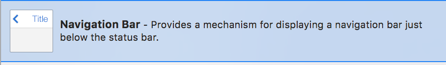
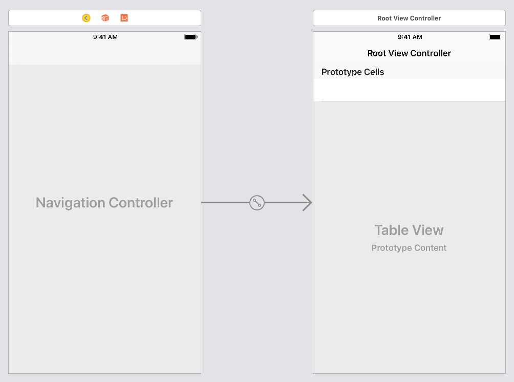
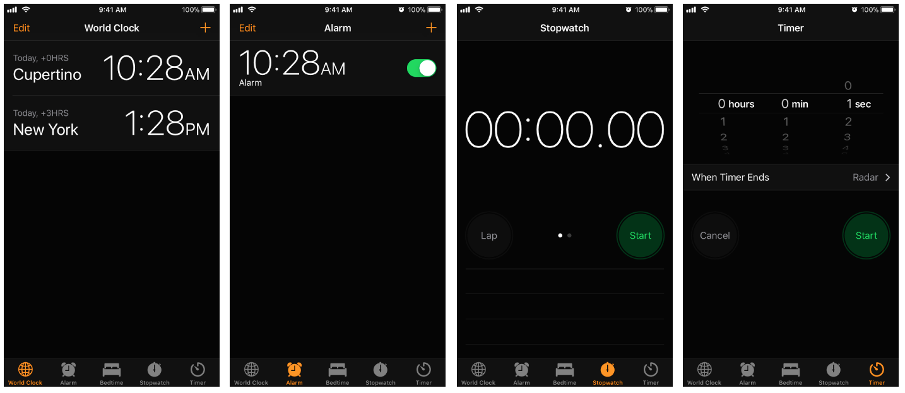
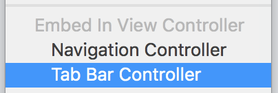
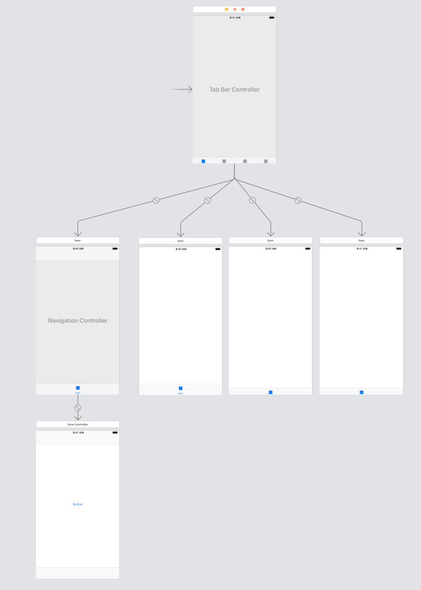
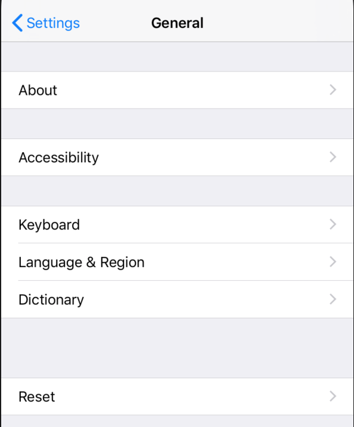

# 8.5 Controllers and more controllers
\(By Laura Bello-Jiménez\)

Have you seen the navigation bar in iOS apps? The one which lets you to go back? Or the tab bar at the bottom? Or maybe a grid filled with elements? Well, don't try to create them by yourself, it will be a chaos. Let the controllers do their magic!

**Navigation Controller**

As you can imagine, the navigation controller manages the navigation flow through views. It keeps a hierarchy of screens, every time you trigger a segue to show a view controller, the view will be added to the top of the navigation stack. Then, a 'Back' button will appear at the top and the user will be able to go back to the previous view, so the screen will be deleted from the stack. Since iOS devices don’t have a back button (as android devices do), navigation controller will improve the usability of your apps! 

There are two ways of implementing navigation in iOS:

1. Drag a navigation bar (UINavigationBar) to the storyboard - not recommended since you must manage by yourself the stack, keep in mind previous screens, add manually all the buttons and create methods to return to the correct view. What if you have an app with 50 screens? The storyboard and the code will have duplicated code and you will lose the control.

2. Select the views you want to add to the navigation flow and embed them in a navigation controller - recommended because it creates, configures and displays the navigation bar and keeps updated the navigation stack. When you embed a set of views inside a navigation controller, a root controller will be selected, the first one, so it will be at the bottom of the navigation stack and it won't have a back button.

You can create as many navigation controllers as you want but keep it simple, you don't want an unnecessary mess.

>  Check the UIKit documentation to learn more about the [Navigation Controllers](https://developer.apple.com/documentation/uikit/uinavigationcontroller).

**Tab Bar Controller**

This type of view controller will add a bottom bar but this one is used to show different modes of operation (display the same data set from different perspectives) or to separate the app in functional lines. The tab bar controller is responsible of the navigation between tabs and each tab can have its own hierarchy.
Remember the clock app, it has five tabs, all related with hours, but shown in different ways:

The tab bar controller will manage the tab bar and the child controllers, so you don't have to worry about. Here you have the same two ways:
1. Manually dragging a tab bar but you should work a lot, so next option.
2. Select the view controllers you want to use as tabs and embed them in a Tab Bar Controller. Then, you will be free of pain.

**Navigation Controller and Tab Bar Controller**

What if you want both view controllers? Well, everything is possible, just be careful.

As mentioned in the past section (tab bar controller), each tab can have a hierarchy, so each tab can be a navigation controller. Let's take a look:

The Tab Bar Controller will be the root, the manager, the brain and it will have tabs. Each tab will be a view, but maybe you want to implement more functionalities inside it, so instead of selecting a view as a tab, select a navigation controller (be careful, the navigation controller, not the root controller). And that's all, you will have a navigation stack for each tab.

**Table View Controller and Collection View Controller**

We have talked a lot of navigation, but what about displaying data? 
There are two controllers for displaying sets of data:

- Table View Controller: Displays a scrolling list of items (items can be grouped in sections). Each item/row is called Table View Cell and you can define the behavior and elements inside each row. Remember the settings of your phone, that is a table view:

- Collection View Controller: Displays a scrolling grid of items. Each item is called Collection View Cell and also, you can customize it. Think about your photo gallery, that's a collection view.

Both view controllers need a data source and a delegate to provide data and handle events:

- Data source: Returns the number of items to display and the item itself. It also creates each cell with the corresponding information. That information will come from your data model, so data source is the representation of the model.
- Delegate: As mentioned earlier on this book, the delegate will handle events such as row/cell selected, removed, etc. 

Collection views are more customizable than table views, keep it in mind. Table views restrict you to certain size, certain kind of elements, constraints are difficult to manage, so collection views are better if you want each cell display data in different ways.

There are also two ways of creating table views and collections views:
1. Drag the object on another view, but it won't fill all the screen with cells, only the section of the object.
2. Drag the view controller object (table view controller o collection view controller) and it wll fill all the screen with items. 

>  Check the UIKit documentation to learn more about the [Collection View Controller](https://developer.apple.com/documentation/uikit/uicollectionviewcontroller) and [Table View Controller](https://developer.apple.com/documentation/uikit/uitableviewcontroller). Also check this tutorial to [Create a table view](https://developer.apple.com/library/archive/referencelibrary/GettingStarted/DevelopiOSAppsSwift/CreateATableView.html). 