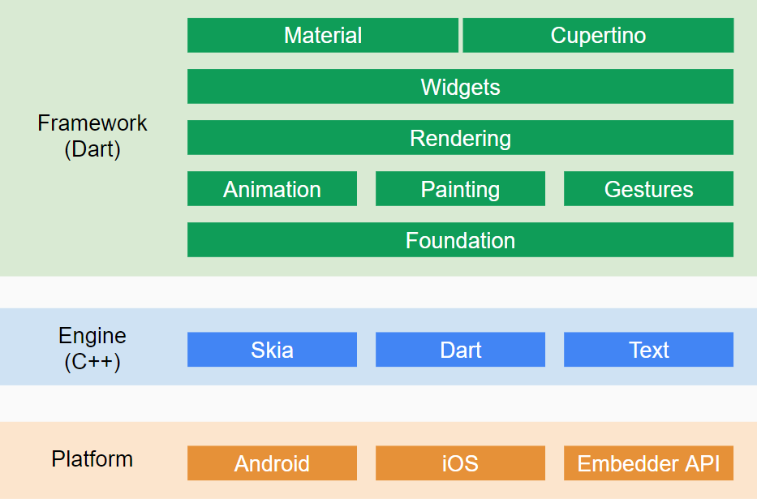
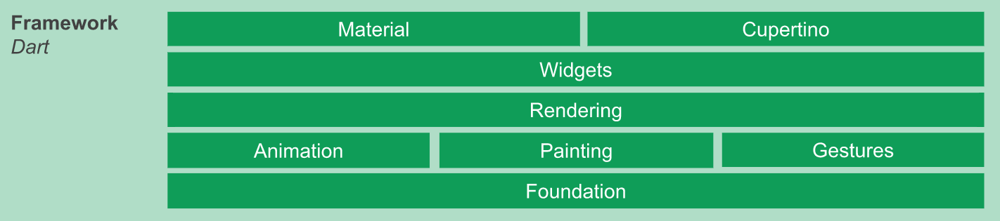
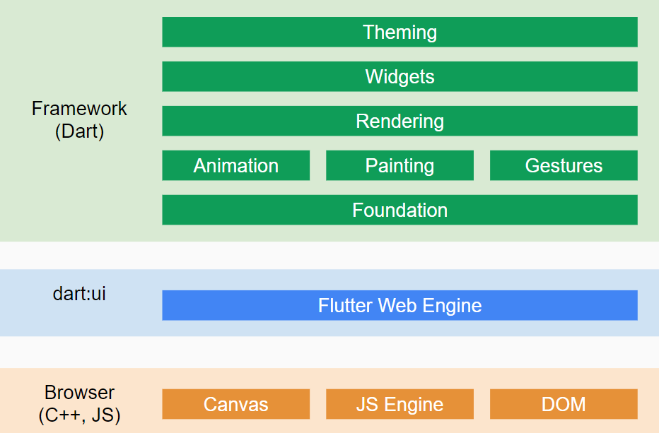

# 8.6 Flutter son of... simplicity.
\(By Rogelio García\)

---

Flutter is a powerful cross-platform mobile app development framework. It's an open-source project created by Google. Check out the [Flutter website](https://flutter.dev/). It's made to build beautiful and high-performant apps for both iOS and Android, by using Dart, a language that is quite friendly to start using.

The stack for Flutter is comprised of three main layers. The framework itself, implemented in Dart, the engine on which it runs, implemented mostly in C++, and the actual mobile platforms.

_Image based on this [article](https://medium.com/@ralfgehrer/how-flutter-works-under-the-hood-and-why-it-is-game-changing-2335954a5bfc) by Ralf Gehrer on Medium._

> The following detailed stack layer images are based on [the Flutter Github wiki article](https://github.com/flutter/flutter/wiki/The-Engine-architecture) about the engine architecture.

#### The framework layer

The Flutter framework itself and most of its system is built with Dart. It offers a variety of widgets and themes, means to composite your app, create and handle animations and gestures, etc. This part of Flutter can be edited by developers for more control and customizing. Flutter is also perfectly usable using it out of the box. This is what you'll be using for the most part

#### The engine layer

The Flutter engine is described as a thin C/C++ layer. It's a shell that includes Skia, Google's graphics rendering library, the Dart VM and other essential technologies. Ultimately, graphics are rendered in C++ in this layer. It also includes isolates (threading) implementation, Dart's runtime library and lifecycle logic.

The engine also defines the Platform-specific channels that allow Flutter devs to implement Dart code that communicates with the Android and iOS shells, bypassing the Flutter Engine. This is particularly useful in cases when something is very platform dependant (for example, Android's interactive notifications), or not implemented in Flutter yet.

_Image taken from the [official docs](https://flutter.dev/docs/development/platform-integration/platform-channels). You can check it out for more info on channels._

#### The embedder layer

The Embedder layer includes OS shells like Android and iOS (Darwin), however the project envisions other shells like Google's Fuchsia OS, Windows, GLFW (OpenGL) and Linux. You can see this in [Flutter's repo](https://github.com/flutter/engine/tree/0a2e28d797faf797f348e0338e6536791d279166/shell/platform).

You can even build Flutter outside of these platforms, using [the embedder API](https://github.com/flutter/flutter/wiki/Custom-Flutter-Engine-Embedders). Mind you, this is very advanced, and is not officially supported.

Also, there's an ongoing Flutter web project, but it has a slightly different stack and is being developed on a separate fork of the main Flutter repository. This is the stack for curiosity's sake:

_Image based on the [official docs](https://flutter.dev/web), and this [article](https://medium.com/flutter/hummingbird-building-flutter-for-the-web-e687c2a023a8) on Medium by Google's software engineer, Yegor Jbanov._
