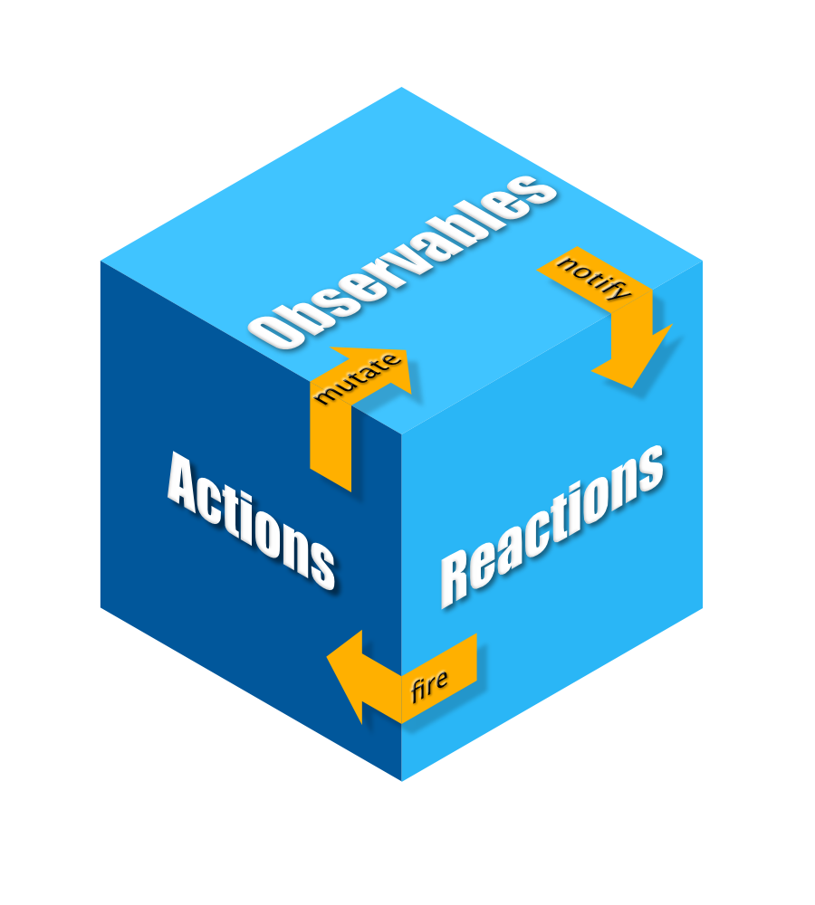

# 8.9 Flutter: State matters... Complex stuff ahead

\(By Sergio Guzmán and Juan David Vega\)

---

Similar to web development, Flutter also has state management techniques based on Flux Architecture and Async information gathering. Here we have two of the most famous ones from [the devs at Flutter](https://flutter.dev/docs/development/data-and-backend/state-mgmt/options)

## MobX

Just like its web counterpart, MobX on dart uses a Flux-like architecture



**_Taken from https://mobx.netlify.com/concepts_**

Let´s start looking at this triad by explaining the process of integrating a store with the avalable resources from [MobX dart](https://mobx.netlify.com/concepts)

### Store setup

```dart
import 'package:mobx/mobx.dart';

// Include generated file
part 'counter.g.dart';

// This is the class used by rest of your codebase
class Counter = _Counter with _$Counter;

// The store-class
abstract class _Counter with Store {
  @observable
  int value = 0;

  @action
  void increment() {
    value++;
  }
}
```

Simple enough, a store is defined by to parts:

- A codebase for the class with boilerplate code that supports the getters and setters of the values of the class (\$\_Counter)
- An abstract class where observables (values that can change over time) and actions (methods to change the state of observables) are defined.

When first creating this class, the Flutter compiler will wonder where this "counter.g.dart" file is located. You only have to run the following command on the terminal to generate the file using mobx:

```
flutter packages pub run build_runner build
```

### Connecting to the store

- You need to instantiate the store outside your widget definition. Since MobX will handle the state of your app, your widgets will be Stateless.
- Wherever you need the store data, put an Observer:

```dart
// Wrapping in the Observer will automatically re-render on changes to counter.value
Observer(
  builder: (_) => Text(
        '${counter.value}',
        style: Theme.of(context).textTheme.display1,
      ),
),
```

- If you need to call an action, just use it as a regular method on your widgets

```dart
floatingActionButton: FloatingActionButton(
  onPressed: counter.increment,
  tooltip: 'Increment',
  child: Icon(Icons.add),
),
```

### Other awesome things

- You can play with computed values (state derived from your observables):

```dart
import 'package:mobx/mobx.dart';

part 'counter.g.dart';

class Contact = ContactBase with _$Contact;

abstract class ContactBase with Store {
  @observable
  String firstName;

  @observable
  String lastName;

  @computed
  String get fullName => '$firstName, $lastName';

}
```

- You can also define reactions, that are event listener that get triggered when something happens to your observables. There are different flavors, like reacting to a specific value of the observable

```dart
import 'package:mobx/mobx.dart';

String greeting = Observable('Hello World');

final dispose = when((_) => greeting.value == 'Hello MobX', () => print('Someone greeted MobX'));

greeting.value = 'Hello MobX'; // Causes a change, runs effect and disposes


// Prints:
// Someone greeted MobX
```

## BLoC

This pattern makes use of Streams. You define a stream to _handle_ your state, and StreamBuilder widgets to _consume_ from your stream.

In reality you have to worry abouth the sinking and streaming


**_Taken from https://www.raywenderlich.com/4074597-getting-started-with-the-bloc-pattern_**

When using the BLoC pattern you need to take into account three things:

- Definition of a stream that can be consumed by other components. If you want to define a Stream we recommend you to create a StreamController of the specific type of object you want to consume and exposing the stream from the generated controller. Something like this:

```dart
  // 1
  final _myController = StreamController<MyClass>();

  // 2
  Stream<MyClass> get myClassStream => _myController.stream;
```

> - Always close the controller when you are done using the BLoC, meaning, `_myController.close()`

- Use the StreamBuilder widget to attach a stream to the widget tree. There are three important properties for a StreamBuilder:

  - stream: A stream to consume
  - initialData: Start data for the stream
  - builder: Given the data (stored in snapshot) and the context (variables depending on the screen or app flow) render a specific widget

It´s better for you to look at a concrete example:

```dart
StreamBuilder<List<Restaurant>>(
    stream: bloc.favoritesStream,
    initialData: bloc.favorites,
    builder: (context, snapshot) {
      List<Restaurant> favorites =
          (snapshot.connectionState == ConnectionState.waiting)
              ? bloc.favorites
              : snapshot.data;
      if (favorites == null || favorites.isEmpty) {
        return Center(
          child: Text('No Favorites'),
        );
      }

      return ListView.separated(
        itemCount: favorites.length,
        separatorBuilder: (context, index) => Divider(),
        itemBuilder: (context, index) {
          final restaurant = favorites[index];
          return RestaurantTile(restaurant: restaurant);
        },
      );
    },
  )
```

- Use sink when adding new data to the BLoC. This action will trigger a "data" event, meaning that something new was appended. This can be done easily from a StreamController

```dart
    //_myList is an array with ALL the data of your specific state of the BLoC
    _myController.sink.add(_myList);
```

Also, if you are using Firebase Realtime database, then you might consider an approach based on this, since these kinds of databases are ultimately streams you can attach a StreamBuilder to, [like so](https://inducesmile.com/google-flutter/how-to-use-streambuilder-with-firestore-in-flutter/). You can also do more sophisticated subscriptions/streams management [like this](https://medium.com/flutterpub/when-firebase-meets-bloc-pattern-fb5c405597e0).

## Some examples

[Flutter app architecture 101: Vanilla, Scoped Model, BLoC](https://medium.com/flutter-community/flutter-app-architecture-101-vanilla-scoped-model-bloc-7eff7b2baf7e). This provides sample code and comparison for the three patterns.

[When Firebase meets BLoC Pattern](https://medium.com/flutterpub/when-firebase-meets-bloc-pattern-fb5c405597e0). BLoC with Firestore.

[Flutter starting guide for BLoC](https://www.raywenderlich.com/4074597-getting-started-with-the-bloc-pattern) Brian Kayfitz showcases a way in which you can organize your architecture using interfaces and inheritances inside a handson Restaurants example.

[Building A Piano with Flutter](https://rodydavisjr.com/2019/03/12/making-a-piano/). Recipient of The Flutter Create code quality mention. You can check out this contest for [more inspiration](https://medium.com/flutter/the-flutter-create-winners-are-40980f2d20b3).

[Flutter with MobX simple review app](https://medium.com/flutterdevs/working-with-mobx-in-flutter-6a56dbff7027). Short explanation of what MobX is and an example using observables and actions
