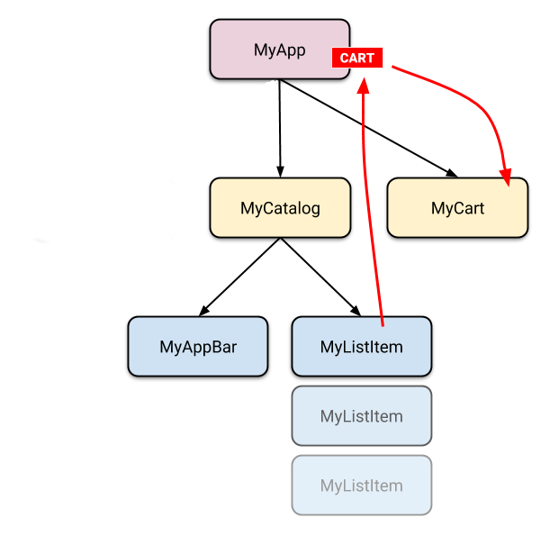
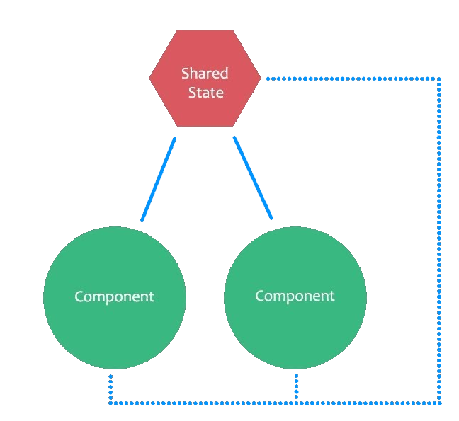
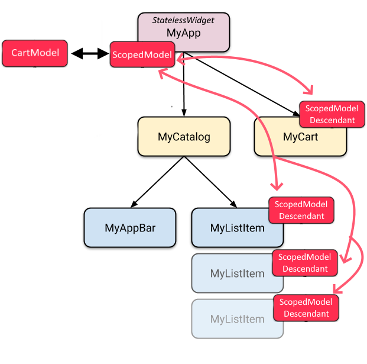

# 8.8 Flutter: State matters... Let´s start simple

\(By Sergio Guzmán and Juan David Vega\)

---

Although Flutter does not enforce a particular programming pattern, there´s something that can get a little bit tricky: the state of your app. The current state of your app (user sessions, senstivie data, variables, tabs, and so on) depends on many factors, including how much data you´ll handle, how often you communicate with external APIs or even how much you interact with your user. In some cases, simply calling the `setState` method is enough. However, in some situations, having a _vanilla_ state handling strategy will become difficult to maintain, for example if you have a complicated state management, or if you have several nested stateful widgets, where a parent widget needs to know the child's state, or where a child widget needs its parent to pass on a parameter... You get the idea.

There are several ways to handle state in a more organized (or efficient) manner. In this section we showcase the two most simple ones from [the devs at Flutter](https://flutter.dev/docs/development/data-and-backend/state-mgmt/options)

## Vanilla (setState)

The first thing you need to understand is that Flutter widgets take inspiration from React. This means that you have to think from a new perspective if you already developed mobile apps using imperative frameworks like Android SDK or iOS UIKit.

Flutter is declarative. This implies that, for example, if the user selects one restaurant from a list, after obtaining the info of that restaurant, instead of writing something like ```restaurantNameTxt.setText = "Tao"```, in Flutter you change the state and that triggers a rebuild of the UI. In this way, the UI is built to reflect the current state of the app.


By now, you might be wondering how to change the famous state we discussed. And thankfully, since they got inspired by React, there is a setState() method that will allow you to update the UI. For instance, if we have a bottom navigation bar and you want to update the currently selected item, all you have to do is update the index field, as shown below.

```dart
class MyHomepage extends StatefulWidget {
  @override
  _MyHomepageState createState() => _MyHomepageState();
}

class _MyHomepageState extends State<MyHomepage> {
  int _index = 0;

  @override
  Widget build(BuildContext context) {
    return BottomNavigationBar(
      currentIndex: _index,
      onTap: (newIndex) {
        setState(() {
          _index = newIndex;
        });
      },
      // ... items ...
    );
  }
}
```

### Lifting state up

The apps we usually develop are far much complex than updating an index, mainly because the state is shared between several widgets. Therefore, we have to ask ourselves where to put the state to make it accessible from every component that might need it. Since Flutter was not created to change the widgets imperatively **(please don't try to create methods that update your views)**, a common good practice is to keep the state above the widgets that use it. In other words, lifting state up.

Remember that every time the contents of a widget change, the widget is rebuilt. So lifting state up makes sense since you can only create new widgets in the build methods of their parents, and because of that, if the contents have to be updated, they should live in the widget's parent or above. In this way, you just have to pass the contents as a parameter of the widget's constructor and declare what to show for any given version of those contents.

For example, if you have a shopping app, the cart's state should be kept in the root widget since is the one that is above the catalog and the cart itself. By following this approach, the cart widget only has to worry about what to show depending on a given state. In consequence, if the state changes, the old cart widget just goes away and is entirely replaced by a new one that reflects the corresponding changes.



But how can I access the state? Well, there are plenty of ways to do this. The most simple solution is to create callbacks that can be called from the children widgets. However, if the state is modified in many places or with some extra complexity, the callbacks strategy starts to seem pretty messy. For this reason, Flutter provides several techniques like the [Inherited](https://api.flutter.dev/flutter/widgets/InheritedWidget-class.html) kind of widgets or the [provider package](https://pub.dev/packages/provider).

Finally, it's important to know that there are two types of state: **ephemeral state and app state**. The first one is the type that is associated with a single widget, that doesn't change in complex ways and that other components don't need to access. In this case, you can always use the vanilla approach. The second one is the state that is shared across different components and that changes in more tangled ways. For this type of state, you need to define a clear plan of attack considering the other stategies presented on this chapter.

**Resources taken from [State Management at Flutter](https://flutter.dev/docs/development/data-and-backend/state-mgmt)**

## ScopedModel

The Scoped Model is a third-party package that is described as follows by its designers:

> A set of utilities that allow you to easily pass a data Model from a parent Widget down to its descendants. In addition, it also rebuilds all of the children that use the model when the model is updated. This library was originally extracted from the Fuchsia codebase



**Taken from [Flutter State Management | Scoped Model](https://www.youtube.com/watch?v=Oql5bU-Uvso)**

In order to do this, the package provides different components that allow treating the state as an independent entity, so that the process of updating content and rebuilding the UI is achieved by listening to the changes of such entity.These components are:
*  The Model class. The one you extend to define your models (e.g. user, restaurant, cart, etc.)
*  The ScopedModel widget. Since you want your model to be available from a particular widget and its children, you have to wrap your model in a ScopedModel widget. In this way, you are telling to the components that they should listen to the changes of a certain model. 
*  The ScopedModelDescendant widget. It represents every child widget that depends on the model to update its view. The ScopedModelDescendant will find the appropriate ScopeModel that wraps the model you want to listen to. Remember that this widget will automatically rebuild when you perform any changes to the model.

Continuing with the shopping cart example, with this new approach, we would have to define:

*  A cart model that will contain all the information on a user's purchase. (item's list and maybe some taxes.)
*  A ScopedModel widget that wraps the CartModel. This will provide the model to the children that request it.
*  A ScopedModelDescendant for every child that needs access to the model. This widget will get the CartModel from the nearest ScopedModel defined. In the case of the list items, they are created as ScopeModelDescendant because they need to access the model to update the item’s list of the cart. As for the MyCart widget, it is created as ScopeModelDescendant because it will rebuild anytime the CartModel changes.



**Adapted from [State Management at Flutter](https://flutter.dev/docs/development/data-and-backend/state-mgmt)**

The CartModel notifies its changes using the notifyListeners() method that will trigger a rebuild of every associated descendant. By doing so, you won’t have to call the setState() method directly and won’t mess up using callbacks because you can access the model through the ScopedModelDescendant.

## Pragmatic State Management in Flutter (Google I/O'19)

From the 2019 Google I/O 2019 Sessions

>  Declarative UI frameworks eliminate whole classes of bugs. But they can also be a puzzle until you figure out how to structure your app logic around them. Walk through Flutter's app with live data and see how to structure content in a simple yet scalable way. You'll come out understanding the main approaches of state management in declarative frameworks and have a concrete applicable solution.

<iframe width="560" height="315" src="https://www.youtube.com/embed/d_m5csmrf7I?si=7Tc704iiX_DUvH0p" title="YouTube video player" frameborder="0" allow="accelerometer; autoplay; clipboard-write; encrypted-media; gyroscope; picture-in-picture; web-share" allowfullscreen></iframe>