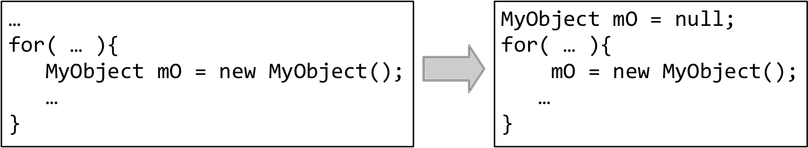

# 8.10 Never forget to micro-optimize
\(By Mario Linares-Vásquez\)

---

After having a taste of the mobile programming models, it is a good moment to learn about simple mobile programming practices that will save your... life when dealing with performance issues. These mobile practices are called **micro-optimization**.

A micro-optimization is a set of changes to the source code that (mostly at statement level) are intended to improve the performance on an app but are not intended to change the system design or architecture [^1].  It is possible you are already knoledgeable of micro-optimizations because they are widely promoted by linters and static analysis tools such as [SonarQube](https://www.sonarqube.org/) and [FindBugs](http://findbugs.sourceforge.net/); though, in those tools, micro-optimizations are called as code-smells or bugs in the performance-related categories.

A clear example of micro-optimization is **replacing String objects (in Java) with StringBuffers**. Another example is to **replace Collections with arrays of primitive types**. A micro-optimization aims at improving the resources consumption by reducing the overhead introduced by sub-optimal API usages, code idioms, or personal programming practices.

A key aspect of micro-optimizations is that their impact, in some cases, depends on the data load and context. It means, applying micro-optimizations could have a minimal impact on resources consumption, because the improvement  is only noticeable with certain amount of operations (or data) related to the statements that have the micro-optimization. This is the case of the String-related micro-optimizations, because the impact of the micro-optimizations depends on the size of the Strings and the amount of String operations.

There are also micro-optimizations that are proved to have a decent/noticeable impact independently of the work load. For example, **remove unused resources** is one of the MUST-DO micro-optimizations for mobile apps. The idea is to get rid not only of images, icons, files, you do not use in your app, but also strings that are defined in resources files (especially in the strings file of Android apps. **Declare objects outside of loops** is also a MUST-DO; this micro-optimization consist on avoiding declaring objects inside loops; objects should be declared outside loops and null-instantiated, so, the object instantiation is done in the loop (as in the image below).

Anyway, independently of the micro-optimization and its impact, it is always a very good idea to implement as many as you can, in particular, when coding mobile apps, because of the hardware constraints and the mobile OS policies. You can take advantage of existing linters and IDE features that automatically report to you micro-optimization opportunities. Micro-optimizations are a preventive way for dealing with potential performance issues.

> Check the [performance tips](https://developer.android.com/training/articles/perf-tips) proposed by Google, and the [The truth about Preventative Optimizations](https://medium.com/google-developers/the-truth-about-preventative-optimizations-ccebadfd3eb5) article by Colt McAnlis.

 
 

[^1:] Mario Linares-Vásquez, Christopher Vendome, Michele Tufano, Denys Poshyvanyk, How developers micro-optimize Android apps, Journal of Systems and Software, Volume 130, 2017, Pages 1-23, ISSN 0164-1212, https://doi.org/10.1016/j.jss.2017.04.018.
