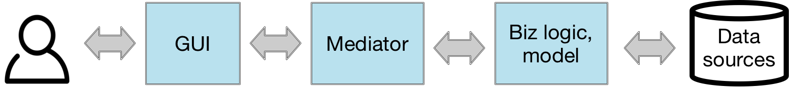
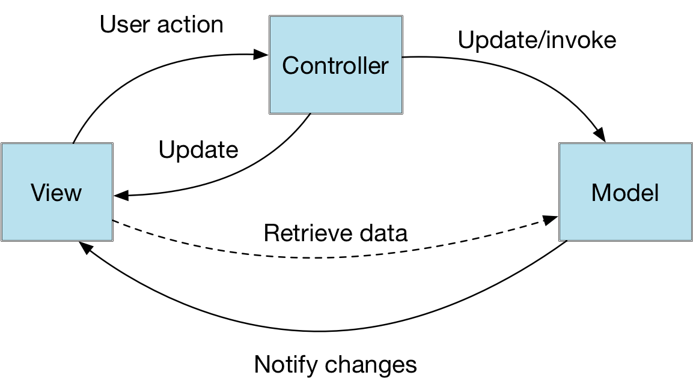
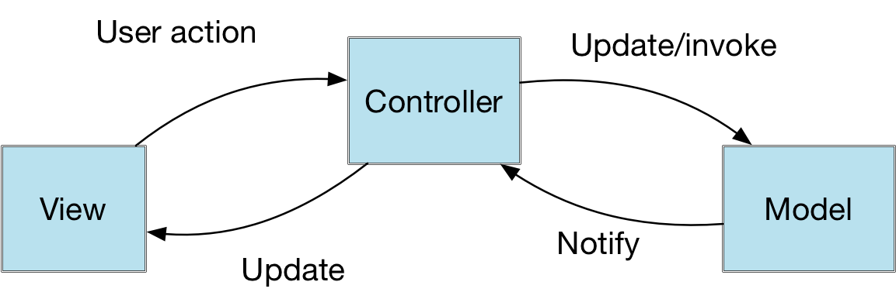
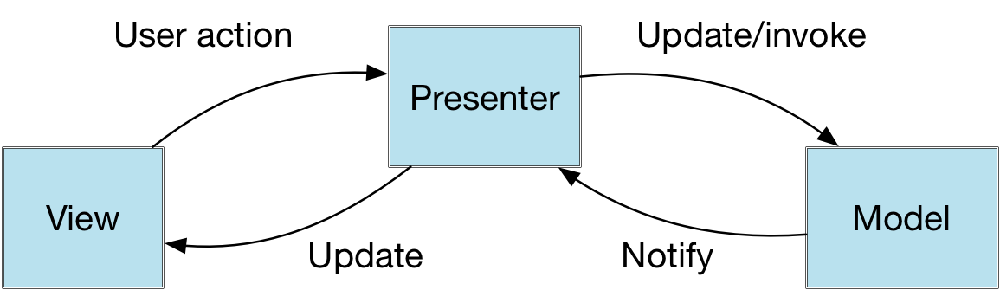
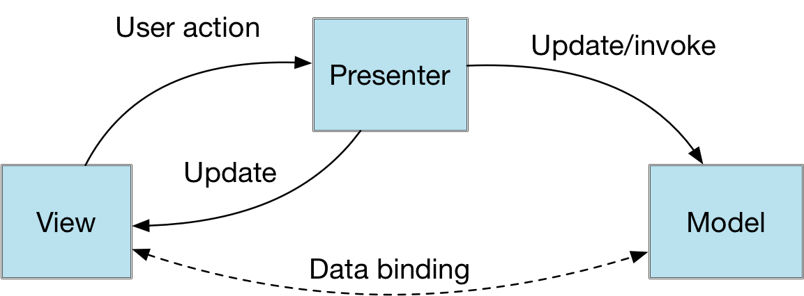
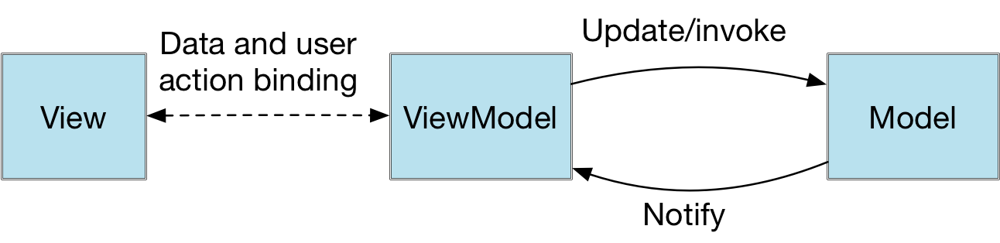

# 8.1 MVC, MVVM, MV*, MV...What?
\(By Mario Linares-Vásquez\)
___

There is a prolific list of architectural patterns that have been proposed for GUI-based apps that operate in a multi-tier mode.  The root of the mess is the classic MVC that suggests to separate apps' code in three different layers: Model, View, and Controller. But before explaining them (the layers and the patterns), let's use a different metaphor. One way of separating concerns in an app with GUI (mobile, web, desktop), is to put everything related to the GUI in one side, put everything related to the underlying data and model (including the logic that processes the data) on other side, and having something in the middle that mediates between the data and the GUI (let's call this part the mediator).

 We have just created a three-layer architectural pattern where the GUI is the closest one to the users, and the Biz logic/model is the one closest to the data sources. Note that the "data source" can be any remote or local data source (e.g., database, rest service, SOAP service, socket, etc.). It is also worth noting that the biz logic/model contains not only the methods/functions/commands that represent the core of the application domain (i.e., the implementation of the business logic) but also the entities that describe the domain (e.g., the Value Objects of your application). For simplicity let's call that layer as the "model" (hereinafter).  

 > So, there is already a MV* mess, and here is another fancy acronym for the list? Not really. The mediator is a generic name for the **Presenter**, **Controller**, or **ViewModel**, in the MV* patterns (i.e., the C in MVC, the P in MVP, and the VM in MVVM).

 

The three-layer pattern is a generic representation of the the MV* family. What makes any member of the family different are the concerns of the "Mediator" layer and the inter-layer communication mechanisms. In summary, each member of the  MV* architectural patterns is defined by:  

 1. The way the Mediator listens to events from the GUI.  
 2. The way the the GUI distributes (to the other layers) the data collected from the users.  
 3. The way changes in the model are notified to the other layers.   
 4. The way the methods/functions/commands in the biz logic/model layer are invoked.  

Now let us talk about each pattern:

**MVC (Model View Controller)**: This is the classic pattern that originated the mess. In this case, the mediator layer is called Controller, which listens for events in the GUI and invokes commands/functions/methods in the model (according to the GUI events). In the original MVC, both View and Controller have a reference to the Model. Note in the diagram that the controller updates/invokes the model but the view retrieves data from the model; the model is supposed to notify the view about the changes (as in the case of the observer pattern because the view is observing the model). The communication between controller -> view is when the view has to be redirected or modified in terms of the views that should be displayed in the GUI. There should be always a pair View-Controller; each widget is a view that notifies its controller about the events, and the controller changes the view when required.

(Original MVC)

>Read about the Original MVC [HERE](http://aspiringcraftsman.com/2007/08/25/interactive-application-architecture/)

 
There are different versions of the MVC pattern. In the case of mobile apps the most used version is the one used and promoted by iOS. In this case the view is a "Passive view" because the model does not notify the changes to the view. The communication between View and Model is always done through the Controller.

(iOS MVC)

 
**MVP (Model View Presenter)** In this case, the mediator is called "Presenter" and it has two flavors: MVP (Passive View) and MVP (Supervising Controller). The former is the same iOS MVC, the latter is very similar to the original MVC but with data binding between the View and Model:

(MVP - Passive View)

 

(MVP - Supervising Controller)

 

**MVVM (Model View ViewModel)**: The mediator in MVVM is a presenter with embedded data binding between the View and the ViewModel. In that sense the ViewModel is an abstraction of the view, because it has properties and commands/methods of the view, instead of having a reference to the view (as in the MVP-Passive view case). The communication View-ViewModel is done via a "Binder" that binds the View to properties and commands in the ViewModel to have a double-way communication (push and pull).

> If you are interested on the history of the different patterns in the MV* family (excluding MVVM), read the ["Interactive Application Architecture Patterns"](http://aspiringcraftsman.com/2007/08/25/interactive-application-architecture/) article by Derek Greer.
