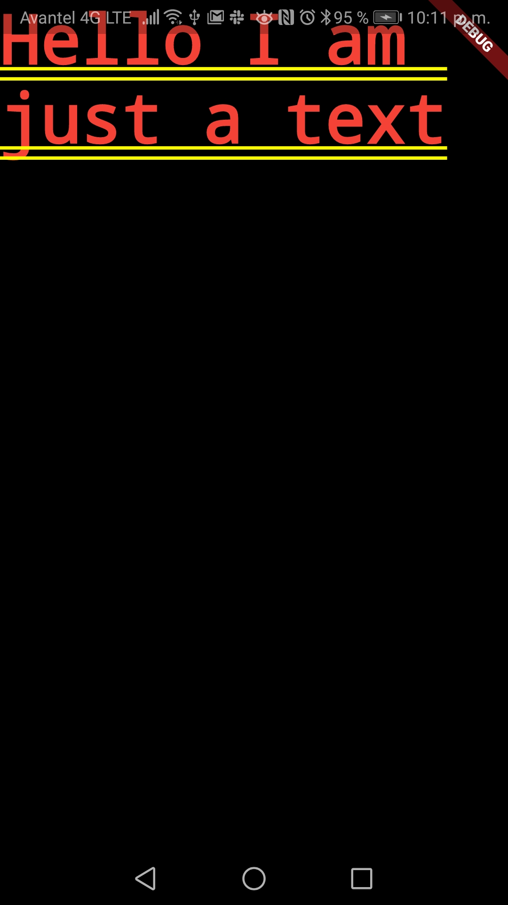
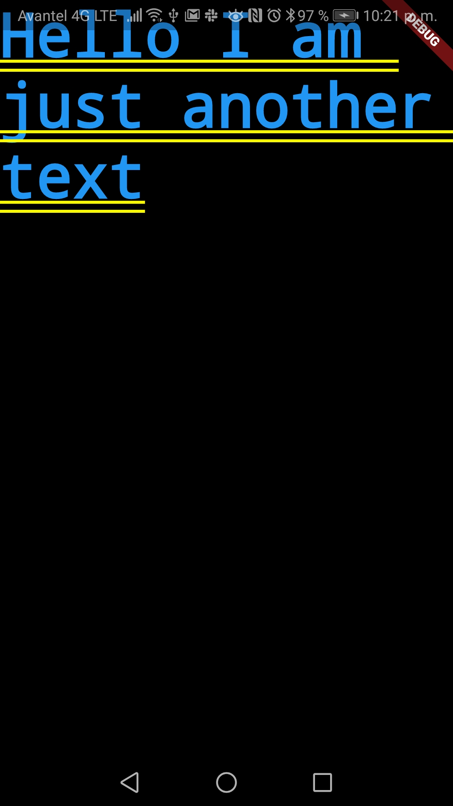
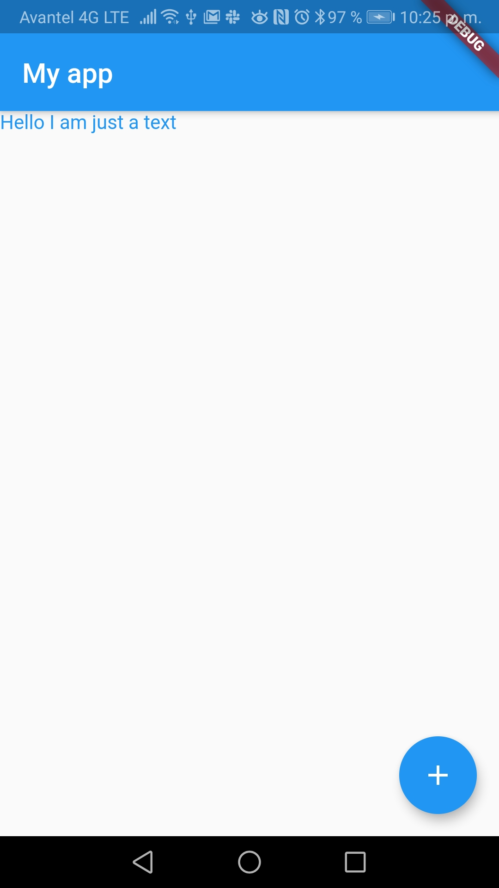
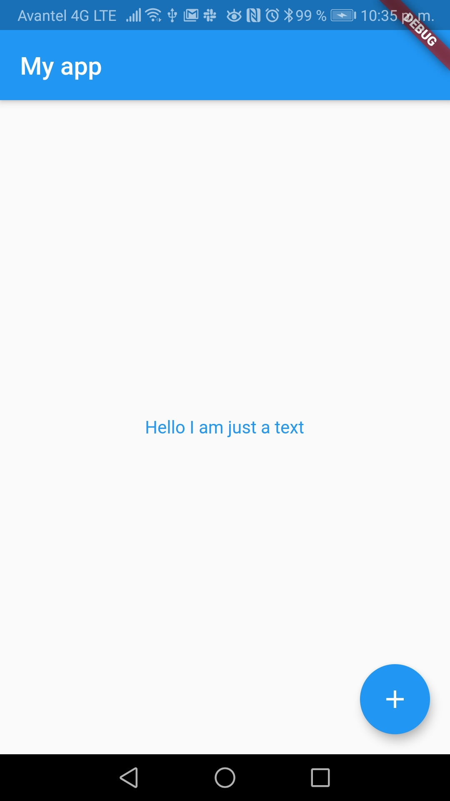
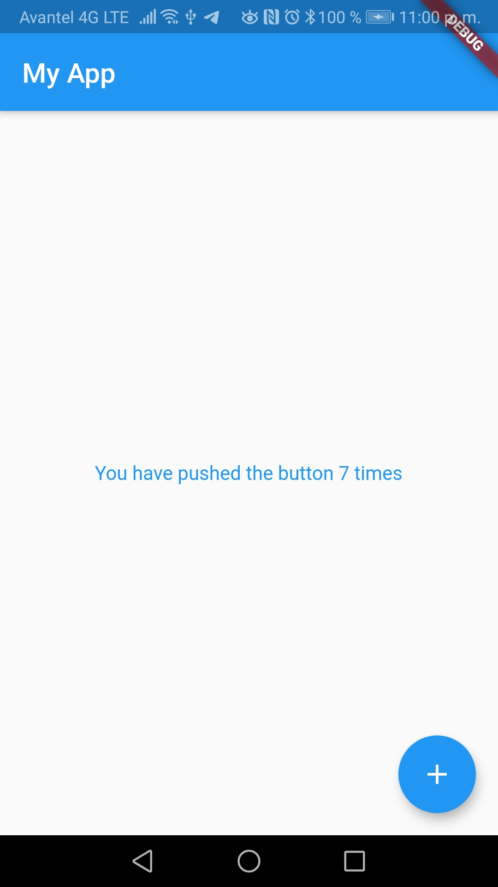

# 8.7 Programming models on Flutter?

\(By Sergio Guzmán\)

---

> This is based on the [official docs](https://flutter.dev/docs/resources/technical-overview).

## Everything is a widget

Flutter has one core principle: **everything is a widget**. There is a readily available widget for pretty much everything you will use in your app, including:

- Stylistic elements like fonts and colors
- Layout elements like margins and paddings
- Graphic components like buttons, lists, images, menus, etc
- And... animations, user interaction, etc

Lets take a look at a really simple example using the MaterialDesign dart library (just to have a `runApp` method implemented). This is our `main` method, that just renders a text:

```dart
import 'package:flutter/material.dart';

void main() => runApp(
      Text(
        'Hello I am just a text',
      ),
    );
```



We can encapsulate our text inside a layout widget (like MaterialApp for instance) to recognize that we have an available space on the screen and thusly change the style of the component:

```dart
import 'package:flutter/material.dart';

void main() => runApp(MaterialApp(
    title: 'Flutter Demo',
    theme: ThemeData(
      primarySwatch: Colors.blue,
    ),
    home: Text(
      'Hello I am just another text',
      style: TextStyle(
        color: Colors.amber.withOpacity(1.0),
      ),
    )));
```



Now let´s make it more beautiful by using a default Scaffold widget from the material design lib and adding a FloatingActionButton of course.

```dart
import 'package:flutter/material.dart';

void main() => runApp(MaterialApp(
      title: 'Flutter Demo',
      theme: ThemeData(
        primarySwatch: Colors.blue,
      ),
      home: Scaffold(
        appBar: AppBar(
          title: Text("My app"),
        ),
        body: Text(
          'Hello I am just a text',
          style: TextStyle(color: Colors.blue.withOpacity(1)),
        ),
        floatingActionButton: FloatingActionButton(
          child: Icon(Icons.add),
        ),
      ),
    ));
```



Finally, we´ll give it some layout order too by centering the text in a Container:

```dart
import 'package:flutter/material.dart';

void main() {
  return runApp(MaterialApp(
    title: 'Flutter Demo',
    theme: ThemeData(
      primarySwatch: Colors.blue,
    ),
    home: Scaffold(
      appBar: AppBar(
        title: Text("My app"),
      ),
      body: Container(
          child: Center(
              child: (Text(
        'Hello I am just a text',
        style: TextStyle(color: Colors.blue.withOpacity(1)),
      )))),
      floatingActionButton: FloatingActionButton(
        child: Icon(Icons.add),
      ),
    ),
  ));}
```



So yeah,everything is handled with a widget. Look at this [awesome catalog](https://flutter.dev/docs/development/ui/widgets) to get an idea of all the widgets you can use with Flutter.

The downside of using widgets is the nesting hell generated by encapsulating a widget, inside another widget, inside another widget, and so on... To make your code look a little bit nicer during this "widget composition", class-oriented programming comes to the rescue

> Nested hell is real, it's the reason why some devs dislike Flutter. Take a look at [this Reddit´s post](https://www.reddit.com/r/FlutterDev/comments/bkhuv7/i_gave_up_on_flutter_due_to_the_nested_hell/), and [this Github issue](https://github.com/flutter/flutter/issues/12706) to get an idea about it

## Your own widgets

There are two types of widgets you should look out for: StatelessWidget and StatefulWidget. When you define your own widgets, you will extend from one or the other, depending on your needs.

You want something static? The StatelessWidget is meant for static things, like text, images, fonts, paddings and so on.

```dart
import 'package:flutter/material.dart';

class MyView extends StatelessWidget {
  @override
  Widget build(BuildContext context) {
    return Scaffold();
  }
}
```

Your screen will be changing over time? Go with Stateful

```dart
import 'package:flutter/material.dart';

class MyView extends StatefulWidget {
  @override
  State<StatefulWidget> createState() => _MyViewState();
}

class _MyViewState extends State<MyView> {

  @override
  Widget build(BuildContext context) {
    return Scaffold();
  }
}
```

The StatefulWidget will likely be calling the setState method to repaint the widget tree, depending on the state of your widget. These widgets are used a lot for handling user interaction.

> When creating a custom widget, always override the build method, which returns a widget tree to be painted in your app.

So how would this look for our app? Let´s put the body of the MaterialApp widget inside a StatefulWidget and add a counter for the state.

```dart
import 'package:flutter/material.dart';

void main() => runApp(MyApp());

class MyApp extends StatelessWidget {
  @override
  Widget build(BuildContext context) {
    return MaterialApp(
      title: 'Flutter Demo',
      theme: ThemeData(
        primarySwatch: Colors.blue,
      ),
      home: MyHomePage(),
    );
  }
}

class MyHomePage extends StatefulWidget {
  @override
  _MyHomePageState createState() => _MyHomePageState();
}

class _MyHomePageState extends State<MyHomePage> {
  int _counter = 0;

  void _incrementCounter() {
    setState(() {
      _counter++;
    });
  }

  @override
  Widget build(BuildContext context) {
    return Scaffold(
      appBar: AppBar(
        title: Text('My App'),
      ),
      body: Center(
        child: Column(
          mainAxisAlignment: MainAxisAlignment.center,
          children: <Widget>[
            Text(
              'You have pushed the button $_counter times',
              style: TextStyle(color: Colors.blue.withOpacity(1)),
            ),
          ],
        ),
      ),
      floatingActionButton: FloatingActionButton(
        onPressed: _incrementCounter,
        tooltip: 'Increment',
        child: Icon(Icons.add),
      ),
    );
  }
}

```



If you notice, whenever we press the FAB button a new funtion is called (`_incrementCounter`), that modifies the counter variable.

State management can be tricky, and that´s why we have a whole new section dedicated for this coming up!

## Bonus: Expecting the future

Much like in JavaScript, Flutter has an implementation for creating asynchronous tasks and waiting for them: a future. A future is the result of an asynch task that has two possible states: uncompleted (the task is still in progress) and completed (the task ended). For a future to be fulfilled there are two possibilities:

- Completed with a value: `Future<T>` will return a value of type T
- Completed with error

Here´s an example from [the devs at Flutter](https://dart.dev/codelabs/async-await):

```dart
Future<String>  createOrderMessage() async {
  var order = await fetchUserOrder();
  return 'Your order is: $order';
}

Future<String>  fetchUserOrder() =>
    // Imagine that this function is
    // more complex and slow.
    Future.delayed(
      Duration(seconds: 2),
      () => 'Large Latte',
    );

Future<void>  main() async {
  print('Fetching user order...');
  print(await createOrderMessage());
}
```

Notice the use of `await` to wait for the result of a future and `async` to declare a function that will have `awaits` in its code. Without these two, when you call a future your code won´t wait for a result.

Also... for error handling use a try-catch

```dart
try {
  var order = await fetchUserOrder();
  print('Awaiting user order...');
} catch (err) {
  print('Caught error: $err');
}
```

Futures are important when doing blocking operations (I/O mostly) and making requests to external services (APIs)
