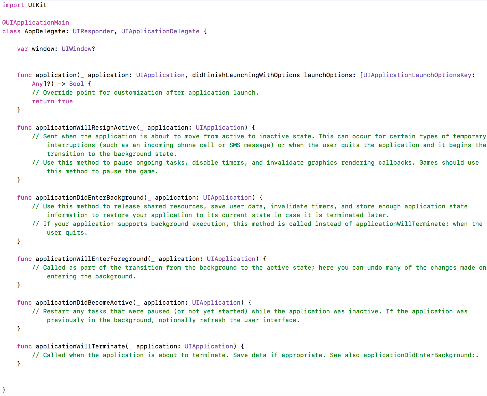

# 8.4 Programming models: the iOS side
\(By Mario Linares-Vásquez and Laura Bello-Jiménez\)

___

The iOS MVC pattern has been out there for a long time, therefore, it is the de-facto way for implementing iOS apps. The main components of the progamming model are:

- **Controllers:** Controllers are the central part in the iOS model because controllers act as mediators between view and model objects. iOS has different types of controllers such as [View Controller](https://developer.apple.com/documentation/uikit/uiviewcontroller), [Navigation Controller](https://developer.apple.com/documentation/uikit/uinavigationcontroller), [Table View Controller](https://developer.apple.com/documentation/uikit/uitableviewcontroller), [Collection View Controller](https://developer.apple.com/documentation/uikit/uicollectionviewcontroller), [Tab Bar Controller](https://developer.apple.com/documentation/uikit/uitabbarcontroller), among others. 

- **Views:** view objects are organized in screens (a.k.a., scenes). The screens and views are created via the storyboard editor in XCode. The editor allows developers to  (i) visualy design the UI by dragging and dropping components to the scenes, and (ii) set different interaction aspects. Views can interact with controllers via **outlets** and **actions**. An outlet is a reference variable created in a controller. Outlets act like view proxies in the controllers for programatically modifying appearence and behavior of view objects (directly in the controller). Actions are listener methods created in the controller; these methods are event handlers for events from the view objects.

> Check the [Build a basic UI](https://developer.apple.com/library/archive/referencelibrary/GettingStarted/DevelopiOSAppsSwift/BuildABasicUI.html) tutorial (by Apple) to understand how to build a UI and connect it to View Controllers:

- **Model**: object models are abstractions, of the domain model, that encapsulate the data and logic in the application.  In that sense, the model is also in charge of persisting data locally in an underlying sqlite database or local files. In the iOS MVC, there should not be connection between the model and the view, because the controller is in charge of (i) notifying the view objects about changes in the model, and  (ii) listening for view events and then invoking the model. The main elements to manage the data model are **Core Data** (to create and manage the model without using SQL queries), **NSUserDefaults** (to store info related with the user like name, email, preferences, etc), **Property Lists** or **plist** (to store small amount of data), **NSFileManager** (to examine and change content of the file system), **SQLite** (to store data through tables), among others.

> Check the [Define your data model](https://developer.apple.com/library/archive/referencelibrary/GettingStarted/DevelopiOSAppsSwift/DefineYourDataModel.html) tutorial (by Apple)

- **App Delegate**: There is only one app delegate per app. It is the component in charge of dealing with app lifecyle. As an app developer, you must implement the lifecycle methods in the app delegate in order to react to app state transitions, events and notifications. An app delegate looks like the one in the image bellow:  

>  Check the UIKit documentation to learn more about the [Application Delegate](https://developer.apple.com/documentation/uikit/uiapplicationdelegate).

- **Segue**: This component is in charge of presenting a new view controller and it can be created via storyboard. It can start with a gesture, button, table row or after a defined time and it can pass information between controllers. Every segue will have an identifier, which will be useful if there are multiple segues per view, also it is possible to perform it in code. There are different ways to present a new view controller (show, show detail, present modally and present) but you must choose the one that fits with your goals. The most used one is "show" because it pushes the selected view on the top of the navigation.

>  Check the UIKit documentation to learn more about [Implement Navigation](https://developer.apple.com/library/archive/referencelibrary/GettingStarted/DevelopiOSAppsSwift/ImplementNavigation.html).

#### Best practices

**Delegation pattern** is mostly used among iOS developers, because it allows objects to assign responsabilities (delegate) to another object, it doesn't matter if they have different types. The main behavior of this pattern is: the delegating object mantains a reference to the delegate, when an event occurs, the delegating object handles it and notifies the delegate to update the view or the state of another objects (execute its responsabilities).

As a result, objects inside an app keep coordinated even if changes occur in a distinct side of the app. What's more, objects can change behavior of different objects without inheriting from it.

Delegates are used commonly when a controller triggers a segue and a new view controller is launched. When the new controller finishes its tasks, it notifies and sends information back to its creator. Then the creator updates the view. 

Important: delegates are different from App Delegate. There are a lot of delegates but only one app delegate.

>  Check the documentation to learn more about [Delegates and Data Sources](https://developer.apple.com/library/archive/documentation/General/Conceptual/CocoaEncyclopedia/DelegatesandDataSources/DelegatesandDataSources.html).