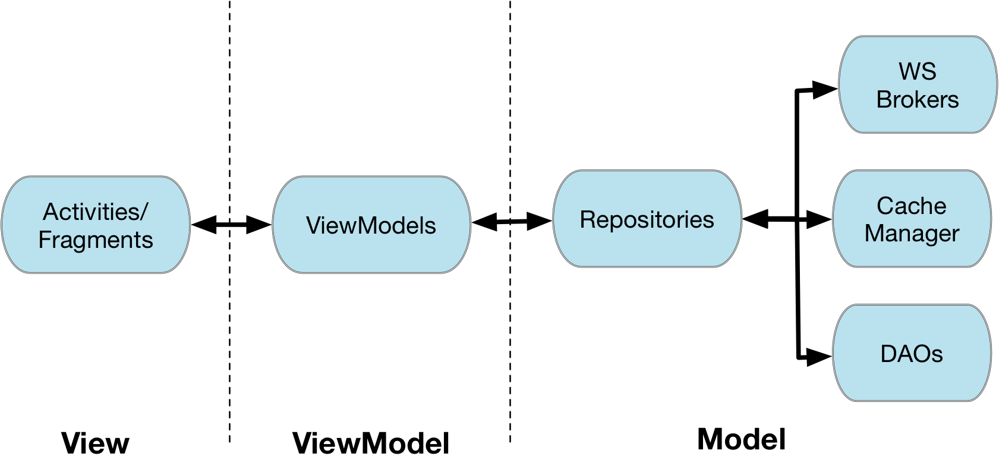

# 8.2 Programming models: the Android side
\(By Mario Linares-Vásquez\)

___

There is a clear distinction in how iOS and Android apps are programmed. In the case of iOS, mobile apps are implemented using the iOS MVC pattern and it is explicit in the programming model. In the case of Android, at the beginning there was no clear architectural pattern to follow, but with the release of the "[Android Jetpack](https://developer.android.com/topic/libraries/architecture/)" MVVM appears as the official guide to implement Android apps.

**Android Architecture Components** 

The image above depicts the MVVM approach for designing and implementing apps using the Android Architecture Components:  

- **[Activities and Fragments](https://developer.android.com/reference/android/app/Activity):** provide Android apps with a GUI. Both, activities and fragments, have a lifecycle with callback/lifecycle methods that should be carefully used to avoid bugs and performance issues. The layout and graphical components are declared in [layout files](https://developer.android.com/guide/topics/ui/declaring-layout) by using Android-specific XML tags.  

- **[ViewModels](https://developer.android.com/topic/libraries/architecture/viewmodel)**: these are the mediators between the GUI and the model layers. ViewModels invoke the business methods in the model side based on the View events and the  GUI lifecycle methods executions. ViewModels in Android apps should extend the `ViewModel` class from from the Android API (e.g., `public class MyViewModel extends ViewModel{...}`).

>Wait a second. MVVM requires data binding between the View and ViewModel layers. The figure does not show the binding mechanism. 

ViewModels MUST NOT have a reference to the view. The binding between the View and ViewModel layers is done via [`LiveData`](https://developer.android.com/topic/libraries/architecture/livedata) objects, which operate like observable data holders that automatically notifies the observer (e.g., an Activitiy) when the data in the holder changes. To this, the Activity/Fragment that wants to be notified when the data changes, registers itself as an observer of a ViewModel and has a reference to it in the Activity `onCreate` method. The definition of the behavior to be executed in the view, when there are changes on the live data,  is done via a lambda expression: 

`MyViewModel model =            ViewModelProviders.of(this).get(MyViewModel.class);`

`model.methodThatReturnsLiveData().observe(this, users -> {` 
`   // update the UI here`
`});`

Note that `methodThatReturnsLiveData` is a placeholder name for public methods you define in the ViewModel. More information about the data binding library in Android is available [here](https://developer.android.com/topic/libraries/data-binding/).

- **Repositories:** a repository is a [Facade](https://en.wikipedia.org/wiki/Facade_pattern) that encapsulates the business and data access logic. A repository is a plain helper class; it does not inherit from any Android API class. As shown in the figure, a repository encapsulates persistence and caching functions. A repository  class is expected to invoke methods from a web service (via a broker), local persistence methods (via a DAO), or cache and retrieve cached data with a plain cache manager. 

