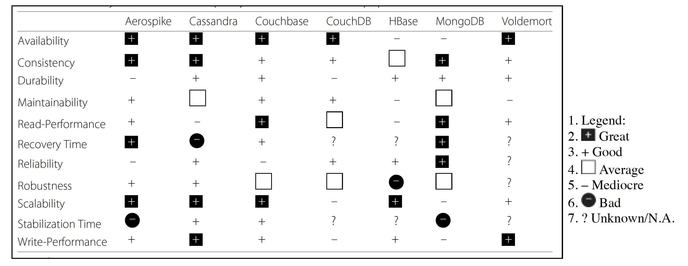

# 9.2 Data Storage types
___

As you probably learned in previous courses when we talk about data storage types, we have two main categories, relational databases and NoSQL collections (databases). But when we use each type, well we have to take into account some aspects to make these types of decisions.

### Relational databases

Nowadays exists many relational  databases, some of them are Oracle database, MySQL, MariaDB, Postgres, DB2, etc..,  

Some characteristics of these databases:

* These types of databases became popular in the 80's.
* They are grounded in a mathematical model (set theory).
* The language used to create structures and access to the data is a declarative and standardized language- Structured Query Language (SQL)
* These types of databases have a defined schema. The information is saved in relationships (tables), each table has attributes (columns) and tuples(rows).
* We can update, insert, remove data, and read from a single table data very efficiently, but joining information from multiple tables can cause overhead making this operation expensive and inefficient, which reduces scalability.
* These types of databases must have ACID properties.

>Remember that ACID stands for Atomicity, Consistency, Isolation, Durability.

### NOSQL
These types of databases emerged due to the low scalability of relational databases and also in response to some challenges of data such as volume, velocity, and variety. These types of databases support sharding, clusters, replication, and, in general, they do not meet ACID properties.

In NoSQL databases we have different types:

* Key-Value
* Graph
* Document
* Column Family

> Remember that NoSQL does not mean NO SQL it means Not Only SQL.

Some general characteristics:

* These types of databases are schema-less, meaning that the schema needs to be verified while reading the data (schema-on-read).
* High availability and fault-tolerance mechanisms.
* These types usually meet BASE properties, that stands for Basically Available, Soft State, Eventual consistency.
* Low cost.
* The data is accessed through an API.

**Key-Value** storages the data as a dictionary (an identifier called key and a respective value). You can read, insert and remove easily but you cannot partially update data.

 Some databases:
 
  * Aerospike
  * Cassandra
  * CouchDB
  * Redis
  * Riak

**Document** storages the data as nested pair key-value data. The group of key-value pairs elements are called a Document, each document can have a specific schema (flexible schema).The document can easily parsed to XML or JSon. You can insert, delete read and also update partially.

Some databases:

  * MongoDB
  * ArangoDB
  * RavenDB
  * Amazon DocumentDB
  * Firebase

**Column Family** they look some kind of similar to relational tables, but they contains columns of related data. It is composed as a key-value pair, where the key is mapped to a value, and the value is a set of columns. 

Some databases:

  * Cassandra
  * HBase
  * HyperTable
  * Amazon SimpleDB

**Graph** they are purpose-built to store and navigate relationships. They are composed with nodes and arcs. The nodes model entities while the arcs model the relationships between nodes.

Some databases:

  * Neo4J
  * OrientedDB
  * InfiniteGraph

### When selecting a db....

It is important to have in mind: 

|                     	|                                                                                                                                                           Appropiate                                                                                                                                                          	|                                                                                                                                      Not Appropiate                                                                                                                                     	|
|---------------------	|:-----------------------------------------------------------------------------------------------------------------------------------------------------------------------------------------------------------------------------------------------------------------------------------------------------------------------------:	|:---------------------------------------------------------------------------------------------------------------------------------------------------------------------------------------------------------------------------------------------------------------------------------------:	|
| Relational database 	| - Data has a defined table structure. - When you require ACID properties. - When you requiere referential integrity. - If your application is heavy duty transactional.                                                                                                                                              	| - When you have multiple media files.  - When your data is structured as a hierarchy or a graph.                                                                                                                                                                                     	|
| Key-value           	| - Non structured data - Need of a good performance in reading and writing- Identification of the value only by the key and not the content of the value - Key has a simple structure - Values are manipulated by an application and not the database                                                                 	| - The applications need to search or filter by the attributes of the value. - The application needs to update a bunch of keys in a single transaction - There are relations between two or more registers (key1-value1 with ke2-value2) - You need to update values partially  	|
| Document            	| - Non structured data - You have a need to store each record as a document with particular characteristics.                                                                                                                                                                                                                	| - There are relations between two or more documents (key1-value1 with ke2-value2) - When you need concurrency in a more granular level than document                                                                                                                                 	|
| Column-Family       	| - Random access for reading or writing in real time. - Data has a tabular structure- The schema can change through time - You have queries that search a group of attributes constantly together. - Efficient storage for sparse tables- You have a predefined pattern for insert, update, delete, select operations 	| - Data has a tabular schema and it needed to join data - ACID is needed- You need to store binary data (e.g.., yes/no) - You need to execute SQL queries - You do not have a predefined pattern in search queries, which make necessary to change the database schema          	|
| Graph               	| - Data has interconnected entities  - Queries that are mostly related to relationships (arcs) rather than attributes' entities - Search over interconnected groups - Calculate distance between two entities                                                                                                         	| - You need to constantly update a huge number of attributes in arcs and entities - Entities has many attributes or with nested attributes - Binary storage  - Queries based on node's and arcs's attributes                                                                    	|

*Bonus:* Here you can find a parallel quality attributes VS some of the NOSQL databases.

_(Image taken from Lourenço, J.R., Cabral, B., Carreiro, P. et al.
Choosing the right NoSQL database for the job: a quality attribute evaluation. Journal of Big Data 2, 18 (2015).)_
